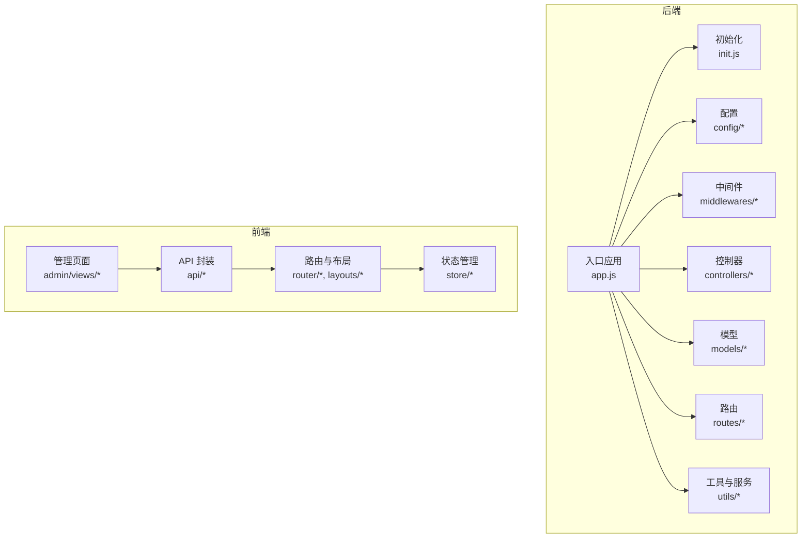
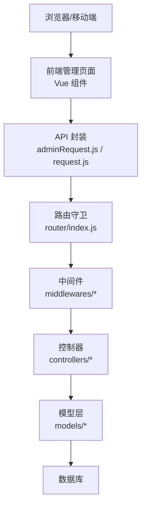
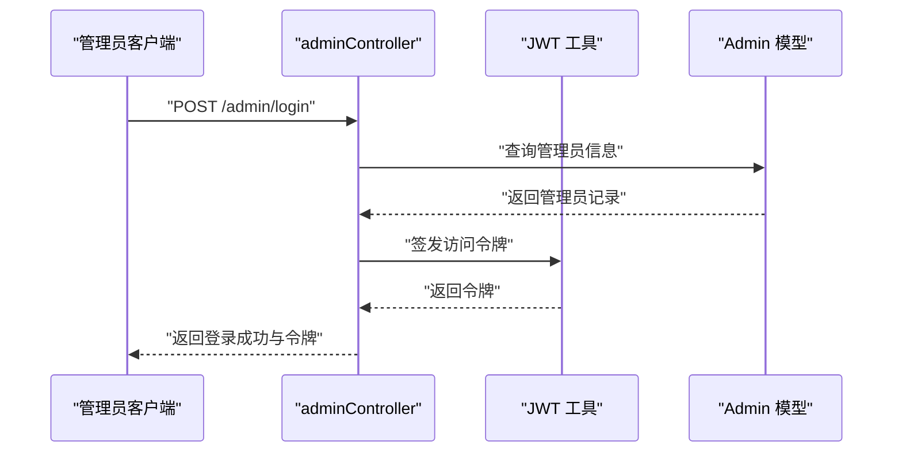
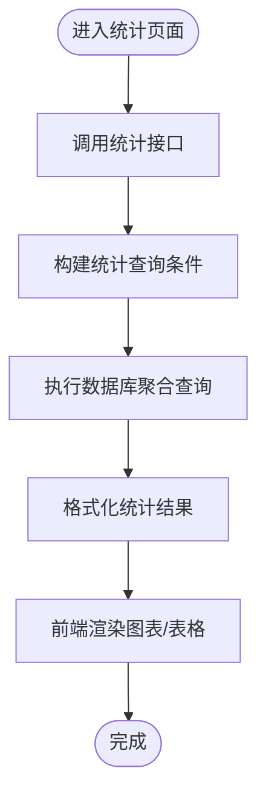
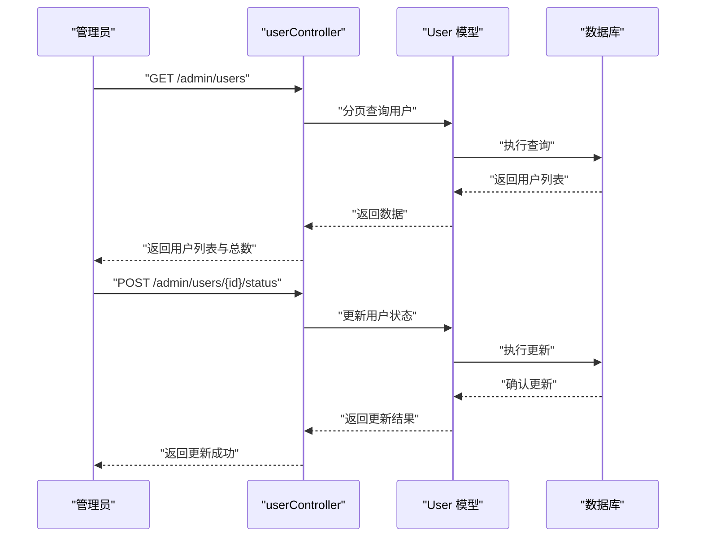
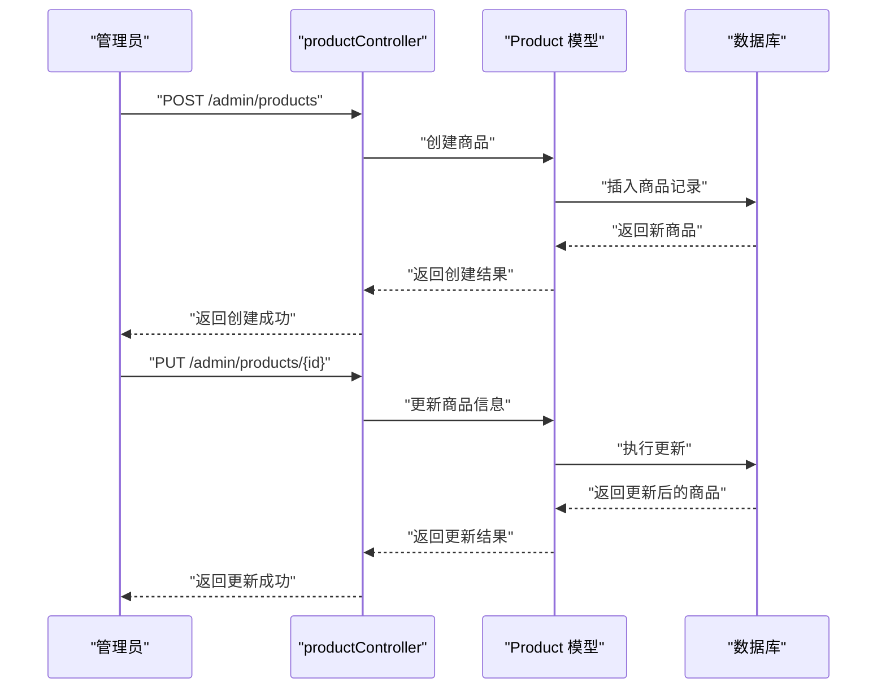
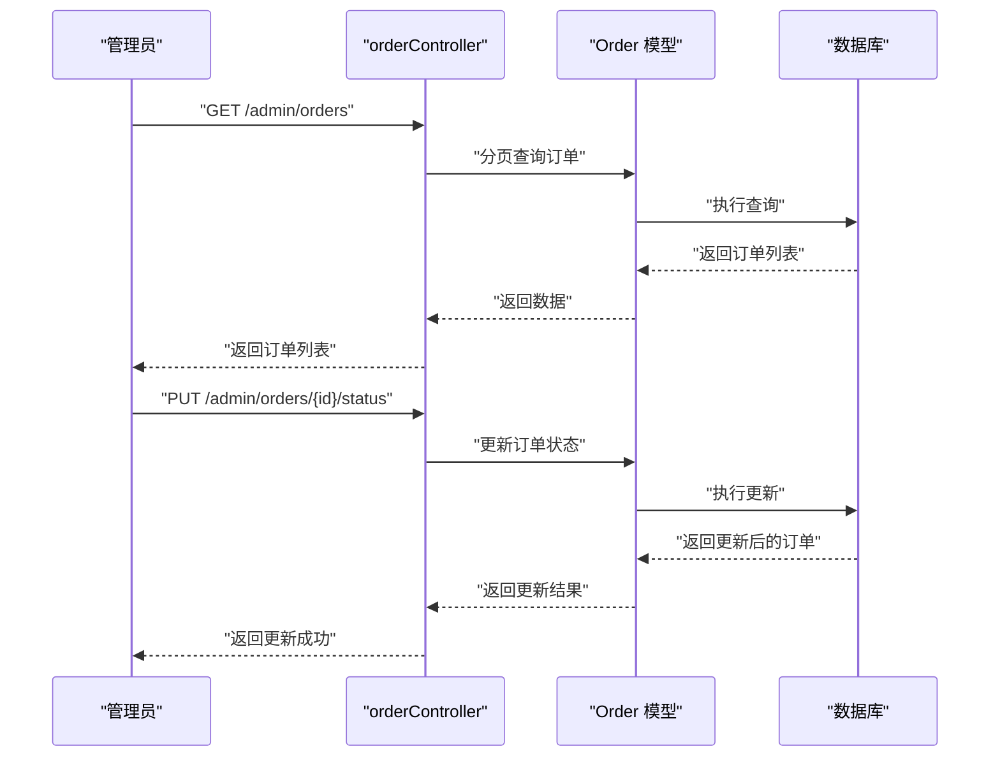
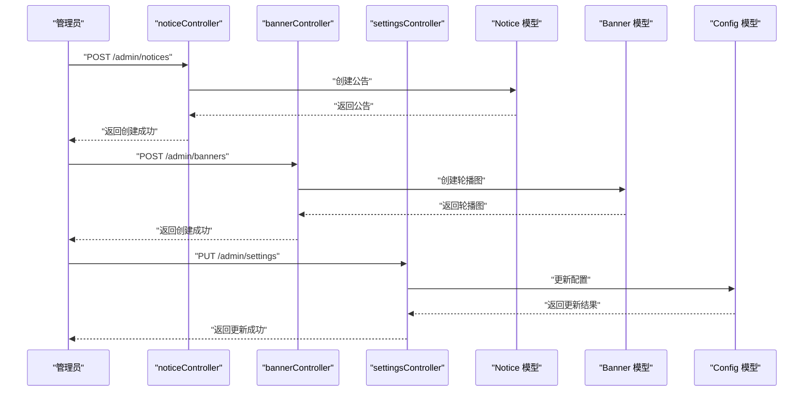
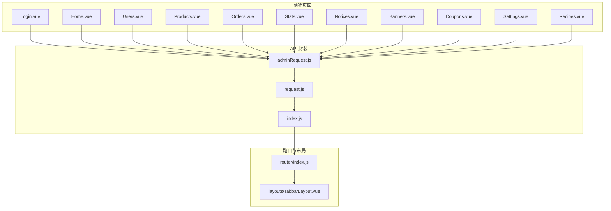
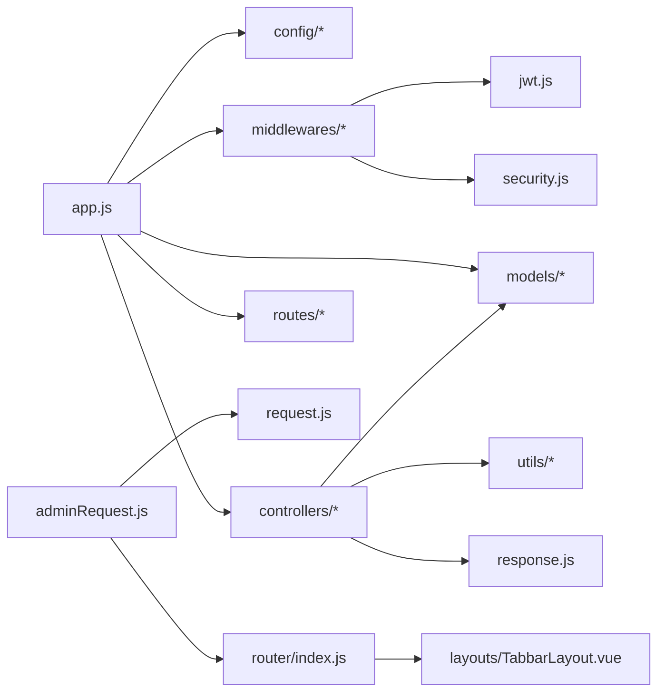

# 后台管理系统

<cite>
**本文引用的文件**
- [app.js](file://backend/src/app.js)
- [init.js](file://backend/src/init.js)
- [adminAuth.js](file://backend/src/middlewares/adminAuth.js)
- [auth.js](file://backend/src/middlewares/auth.js)
- [errorHandler.js](file://backend/src/middlewares/errorHandler.js)
- [constants.js](file://backend/src/config/constants.js)
- [jwt.js](file://backend/src/config/jwt.js)
- [logger.js](file://backend/src/config/logger.js)
- [Admin.js](file://backend/src/models/Admin.js)
- [AdminLog.js](file://backend/src/models/AdminLog.js)
- [Order.js](file://backend/src/models/Order.js)
- [Product.js](file://backend/src/models/Product.js)
- [User.js](file://backend/src/models/User.js)
- [Banner.js](file://backend/src/models/Banner.js)
- [Notice.js](file://backend/src/models/Notice.js)
- [Config.js](file://backend/src/models/Config.js)
- [adminController.js](file://backend/src/controllers/adminController.js)
- [orderController.js](file://backend/src/controllers/orderController.js)
- [productController.js](file://backend/src/controllers/productController.js)
- [userController.js](file://backend/src/controllers/userController.js)
- [bannerController.js](file://backend/src/controllers/bannerController.js)
- [noticeController.js](file://backend/src/controllers/noticeController.js)
- [settingsController.js](file://backend/src/controllers/settingsController.js)
- [adminRoutes.js](file://backend/src/routes/adminRoutes.js)
- [orderRoutes.js](file://backend/src/routes/orderRoutes.js)
- [productRoutes.js](file://backend/src/routes/productRoutes.js)
- [userRoutes.js](file://backend/src/routes/userRoutes.js)
- [homeRoutes.js](file://backend/src/routes/homeRoutes.js)
- [cartRoutes.js](file://backend/src/routes/cartRoutes.js)
- [recipeController.js](file://backend/src/controllers/recipeController.js)
- [couponController.js](file://backend/src/controllers/couponController.js)
- [homeController.js](file://backend/src/controllers/homeController.js)
- [cartController.js](file://backend/src/controllers/cartController.js)
- [recipeController.js](file://backend/src/controllers/recipeController.js)
- [couponController.js](file://backend/src/controllers/couponController.js)
- [homeController.js](file://backend/src/controllers/homeController.js)
- [cartController.js](file://backend/src/controllers/cartController.js)
- [AfterSale.js](file://backend/src/models/AfterSale.js)
- [Category.js](file://backend/src/models/Category.js)
- [Review.js](file://backend/src/models/Review.js)
- [ViewHistory.js](file://backend/src/models/ViewHistory.js)
- [Favorite.js](file://backend/src/models/Favorite.js)
- [UserAddress.js](file://backend/src/models/UserAddress.js)
- [UserCoupon.js](file://backend/src/models/UserCoupon.js)
- [Qualification.js](file://backend/src/models/Qualification.js)
- [Agreement.js](file://backend/src/models/Agreement.js)
- [Recipe.js](file://backend/src/models/Recipe.js)
- [Coupon.js](file://backend/src/models/Coupon.js)
- [OrderItem.js](file://backend/src/models/OrderItem.js)
- [database.js](file://backend/src/config/database.js)
- [response.js](file://backend/src/utils/response.js)
- [security.js](file://backend/src/utils/security.js)
- [order.js](file://backend/src/utils/order.js)
- [api.md](file://docs/api.md)
- [deploy.md](file://docs/deploy.md)
- [Login.vue](file://frontend/src/admin/views/Login.vue)
- [Home.vue](file://frontend/src/admin/views/Home.vue)
- [Users.vue](file://frontend/src/admin/views/Users.vue)
- [Products.vue](file://frontend/src/admin/views/Products.vue)
- [Orders.vue](file://frontend/src/admin/views/Orders.vue)
- [Stats.vue](file://frontend/src/admin/views/Stats.vue)
- [Notices.vue](file://frontend/src/admin/views/Notices.vue)
- [Banners.vue](file://frontend/src/admin/views/Banners.vue)
- [Coupons.vue](file://frontend/src/admin/views/Coupons.vue)
- [Settings.vue](file://frontend/src/admin/views/Settings.vue)
- [Recipes.vue](file://frontend/src/admin/views/Recipes.vue)
- [adminRequest.js](file://frontend/src/api/adminRequest.js)
- [index.js](file://frontend/src/api/index.js)
- [request.js](file://frontend/src/api/request.js)
- [TabbarLayout.vue](file://frontend/src/layouts/TabbarLayout.vue)
- [index.js](file://frontend/src/router/index.js)
- [cart.js](file://frontend/src/store/cart.js)
- [user.js](file://frontend/src/store/user.js)
- [schema.sql](file://database/schema.sql)
- [check_users.js](file://backend/scripts/check_users.js)
- [reset-admin-password.js](file://backend/scripts/reset-admin-password.js)
</cite>

## 目录
1. [简介](#简介)
2. [项目结构](#项目结构)
3. [核心组件](#核心组件)
4. [架构总览](#架构总览)
5. [详细组件分析](#详细组件分析)
6. [依赖关系分析](#依赖关系分析)
7. [性能考虑](#性能考虑)
8. [故障排查指南](#故障排查指南)
9. [结论](#结论)
10. [附录](#附录)

## 简介
本项目是一个基于 Node.js 的后台管理系统，覆盖管理员登录、权限控制、数据统计、用户管理、商品管理、订单处理、内容管理等核心模块。后端采用 Express 应用与 MVC 分层设计，结合 JWT 进行身份认证与权限校验；前端使用 Vue 3 构建管理页面，通过统一的 API 请求封装与路由守卫实现后台页面访问控制。

## 项目结构
后端采用分层组织：入口应用、配置、中间件、控制器、模型、路由、服务与工具。前端采用视图组件化管理，按功能模块划分页面，并通过 API 封装与状态管理进行数据交互。

**图表来源**
- [app.js](file://backend/src/app.js)
- [init.js](file://backend/src/init.js)
- [adminAuth.js](file://backend/src/middlewares/adminAuth.js)
- [adminController.js](file://backend/src/controllers/adminController.js)
- [Login.vue](file://frontend/src/admin/views/Login.vue)
- [adminRequest.js](file://frontend/src/api/adminRequest.js)

**章节来源**
- [app.js](file://backend/src/app.js)
- [init.js](file://backend/src/init.js)
- [adminAuth.js](file://backend/src/middlewares/adminAuth.js)
- [adminController.js](file://backend/src/controllers/adminController.js)
- [Login.vue](file://frontend/src/admin/views/Login.vue)
- [adminRequest.js](file://frontend/src/api/adminRequest.js)

## 核心组件
- 权限控制与认证
  - 管理员登录与 JWT 颁发：通过管理员控制器实现登录流程，签发与校验令牌。
  - 管理员中间件：对后台路由进行权限拦截，校验管理员身份与操作权限。
  - 操作日志：记录管理员关键操作，便于审计与追踪。
- 数据统计
  - 销售统计、用户增长、商品热度等指标由控制器聚合数据库查询结果生成。
- 用户管理
  - 查看用户信息、账户状态变更、违规处理等。
- 商品管理
  - 商品审核、上下架、库存调整、分类与详情管理。
- 订单处理
  - 订单状态修改、退款售后、客户服务支持。
- 内容管理
  - 公告发布、轮播图管理、系统配置维护。
- 前端管理页面
  - 登录页、首页、用户、商品、订单、统计、公告、轮播、优惠券、设置、食谱等页面。

**章节来源**
- [adminController.js](file://backend/src/controllers/adminController.js)
- [adminAuth.js](file://backend/src/middlewares/adminAuth.js)
- [AdminLog.js](file://backend/src/models/AdminLog.js)
- [orderController.js](file://backend/src/controllers/orderController.js)
- [productController.js](file://backend/src/controllers/productController.js)
- [userController.js](file://backend/src/controllers/userController.js)
- [noticeController.js](file://backend/src/controllers/noticeController.js)
- [bannerController.js](file://backend/src/controllers/bannerController.js)
- [settingsController.js](file://backend/src/controllers/settingsController.js)
- [Users.vue](file://frontend/src/admin/views/Users.vue)
- [Products.vue](file://frontend/src/admin/views/Products.vue)
- [Orders.vue](file://frontend/src/admin/views/Orders.vue)
- [Stats.vue](file://frontend/src/admin/views/Stats.vue)
- [Notices.vue](file://frontend/src/admin/views/Notices.vue)
- [Banners.vue](file://frontend/src/admin/views/Banners.vue)
- [Coupons.vue](file://frontend/src/admin/views/Coupons.vue)
- [Settings.vue](file://frontend/src/admin/views/Settings.vue)
- [Recipes.vue](file://frontend/src/admin/views/Recipes.vue)

## 架构总览
系统采用前后端分离架构，后端提供 RESTful API，前端通过统一请求封装调用。权限控制贯穿于路由与控制器层面，确保后台功能仅对授权管理员开放。

**图表来源**
- [adminRequest.js](file://frontend/src/api/adminRequest.js)
- [index.js](file://frontend/src/router/index.js)
- [adminAuth.js](file://backend/src/middlewares/adminAuth.js)
- [adminController.js](file://backend/src/controllers/adminController.js)
- [Admin.js](file://backend/src/models/Admin.js)
- [Order.js](file://backend/src/models/Order.js)
- [Product.js](file://backend/src/models/Product.js)
- [User.js](file://backend/src/models/User.js)

## 详细组件分析

### 权限控制与管理员登录
- 管理员登录
  - 控制器接收登录请求，校验凭据后签发 JWT。
  - 中间件负责在后台路由上校验令牌有效性与管理员身份。
- 操作日志
  - 记录管理员关键操作（如登录、修改订单、上下架商品等），用于审计。
- 路由保护
  - 后台路由在挂载时绑定管理员中间件，未授权访问将被拒绝。

**图表来源**
- [adminController.js](file://backend/src/controllers/adminController.js)
- [jwt.js](file://backend/src/config/jwt.js)
- [Admin.js](file://backend/src/models/Admin.js)

**章节来源**
- [adminController.js](file://backend/src/controllers/adminController.js)
- [adminAuth.js](file://backend/src/middlewares/adminAuth.js)
- [AdminLog.js](file://backend/src/models/AdminLog.js)
- [jwt.js](file://backend/src/config/jwt.js)
- [Admin.js](file://backend/src/models/Admin.js)

### 数据统计模块
- 统计维度
  - 销售统计：按时间区间统计订单金额、订单量、客单价等。
  - 用户增长：新增用户数、活跃用户趋势、留存率等。
  - 商品热度：销量排行、浏览量、收藏量等。
- 实现方式
  - 控制器聚合数据库查询，返回结构化指标数据。
  - 前端页面接收数据并渲染图表或表格。

**图表来源**
- [Stats.vue](file://frontend/src/admin/views/Stats.vue)
- [homeController.js](file://backend/src/controllers/homeController.js)

**章节来源**
- [Stats.vue](file://frontend/src/admin/views/Stats.vue)
- [homeController.js](file://backend/src/controllers/homeController.js)

### 用户管理模块
- 功能点
  - 查看用户列表与详情、修改账户状态（启用/禁用）、处理违规行为。
- 实现要点
  - 控制器提供分页查询、状态更新、违规标记等接口。
  - 前端页面支持搜索、筛选、批量操作。

**图表来源**
- [userController.js](file://backend/src/controllers/userController.js)
- [User.js](file://backend/src/models/User.js)
- [Users.vue](file://frontend/src/admin/views/Users.vue)

**章节来源**
- [userController.js](file://backend/src/controllers/userController.js)
- [User.js](file://backend/src/models/User.js)
- [Users.vue](file://frontend/src/admin/views/Users.vue)

### 商品管理模块
- 功能点
  - 商品审核、上下架、库存调整、分类管理、详情编辑。
- 实现要点
  - 控制器提供商品增删改查、状态切换、库存变更等接口。
  - 前端页面支持图片上传、富文本编辑、批量操作。

**图表来源**
- [productController.js](file://backend/src/controllers/productController.js)
- [Product.js](file://backend/src/models/Product.js)
- [Products.vue](file://frontend/src/admin/views/Products.vue)

**章节来源**
- [productController.js](file://backend/src/controllers/productController.js)
- [Product.js](file://backend/src/models/Product.js)
- [Products.vue](file://frontend/src/admin/views/Products.vue)

### 订单处理模块
- 功能点
  - 修改订单状态、处理退款与售后、查看订单详情与物流信息。
- 实现要点
  - 控制器提供状态更新、售后处理、订单导出等接口。
  - 前端页面支持订单筛选、批量处理、详情弹窗。

**图表来源**
- [orderController.js](file://backend/src/controllers/orderController.js)
- [Order.js](file://backend/src/models/Order.js)
- [Orders.vue](file://frontend/src/admin/views/Orders.vue)

**章节来源**
- [orderController.js](file://backend/src/controllers/orderController.js)
- [Order.js](file://backend/src/models/Order.js)
- [Orders.vue](file://frontend/src/admin/views/Orders.vue)

### 内容管理模块
- 公告管理
  - 发布、编辑、删除公告，支持富文本与附件。
- 轮播图管理
  - 图片上传、排序、开关展示。
- 系统配置
  - 平台参数、开关项、基础配置维护。

**图表来源**
- [noticeController.js](file://backend/src/controllers/noticeController.js)
- [bannerController.js](file://backend/src/controllers/bannerController.js)
- [settingsController.js](file://backend/src/controllers/settingsController.js)
- [Notice.js](file://backend/src/models/Notice.js)
- [Banner.js](file://backend/src/models/Banner.js)
- [Config.js](file://backend/src/models/Config.js)
- [Notices.vue](file://frontend/src/admin/views/Notices.vue)
- [Banners.vue](file://frontend/src/admin/views/Banners.vue)
- [Settings.vue](file://frontend/src/admin/views/Settings.vue)

**章节来源**
- [noticeController.js](file://backend/src/controllers/noticeController.js)
- [bannerController.js](file://backend/src/controllers/bannerController.js)
- [settingsController.js](file://backend/src/controllers/settingsController.js)
- [Notice.js](file://backend/src/models/Notice.js)
- [Banner.js](file://backend/src/models/Banner.js)
- [Config.js](file://backend/src/models/Config.js)
- [Notices.vue](file://frontend/src/admin/views/Notices.vue)
- [Banners.vue](file://frontend/src/admin/views/Banners.vue)
- [Settings.vue](file://frontend/src/admin/views/Settings.vue)

### 前端管理页面与 API 封装
- 页面组织
  - 登录、首页、用户、商品、订单、统计、公告、轮播、优惠券、设置、食谱等页面。
- API 封装
  - 统一的请求封装与错误处理，支持后台与前台接口区分。
- 路由与布局
  - 管理端路由守卫确保未登录无法访问后台页面；布局组件提供统一导航。

**图表来源**
- [Login.vue](file://frontend/src/admin/views/Login.vue)
- [Home.vue](file://frontend/src/admin/views/Home.vue)
- [Users.vue](file://frontend/src/admin/views/Users.vue)
- [Products.vue](file://frontend/src/admin/views/Products.vue)
- [Orders.vue](file://frontend/src/admin/views/Orders.vue)
- [Stats.vue](file://frontend/src/admin/views/Stats.vue)
- [Notices.vue](file://frontend/src/admin/views/Notices.vue)
- [Banners.vue](file://frontend/src/admin/views/Banners.vue)
- [Coupons.vue](file://frontend/src/admin/views/Coupons.vue)
- [Settings.vue](file://frontend/src/admin/views/Settings.vue)
- [Recipes.vue](file://frontend/src/admin/views/Recipes.vue)
- [adminRequest.js](file://frontend/src/api/adminRequest.js)
- [index.js](file://frontend/src/api/index.js)
- [request.js](file://frontend/src/api/request.js)
- [index.js](file://frontend/src/router/index.js)
- [TabbarLayout.vue](file://frontend/src/layouts/TabbarLayout.vue)

**章节来源**
- [Login.vue](file://frontend/src/admin/views/Login.vue)
- [Home.vue](file://frontend/src/admin/views/Home.vue)
- [Users.vue](file://frontend/src/admin/views/Users.vue)
- [Products.vue](file://frontend/src/admin/views/Products.vue)
- [Orders.vue](file://frontend/src/admin/views/Orders.vue)
- [Stats.vue](file://frontend/src/admin/views/Stats.vue)
- [Notices.vue](file://frontend/src/admin/views/Notices.vue)
- [Banners.vue](file://frontend/src/admin/views/Banners.vue)
- [Coupons.vue](file://frontend/src/admin/views/Coupons.vue)
- [Settings.vue](file://frontend/src/admin/views/Settings.vue)
- [Recipes.vue](file://frontend/src/admin/views/Recipes.vue)
- [adminRequest.js](file://frontend/src/api/adminRequest.js)
- [index.js](file://frontend/src/api/index.js)
- [request.js](file://frontend/src/api/request.js)
- [index.js](file://frontend/src/router/index.js)
- [TabbarLayout.vue](file://frontend/src/layouts/TabbarLayout.vue)

## 依赖关系分析
- 后端依赖
  - 应用入口依赖配置、中间件、控制器、模型与路由。
  - 控制器依赖模型与工具库，模型依赖数据库连接。
  - 中间件依赖 JWT 与安全工具，用于权限校验与错误处理。
- 前端依赖
  - 页面依赖 API 封装与路由守卫，API 封装依赖通用请求与环境配置。
  - 路由与布局组件提供全局导航与权限控制。

**图表来源**
- [app.js](file://backend/src/app.js)
- [jwt.js](file://backend/src/config/jwt.js)
- [security.js](file://backend/src/utils/security.js)
- [response.js](file://backend/src/utils/response.js)
- [adminRequest.js](file://frontend/src/api/adminRequest.js)
- [request.js](file://frontend/src/api/request.js)
- [index.js](file://frontend/src/router/index.js)
- [TabbarLayout.vue](file://frontend/src/layouts/TabbarLayout.vue)

**章节来源**
- [app.js](file://backend/src/app.js)
- [jwt.js](file://backend/src/config/jwt.js)
- [security.js](file://backend/src/utils/security.js)
- [response.js](file://backend/src/utils/response.js)
- [adminRequest.js](file://frontend/src/api/adminRequest.js)
- [request.js](file://frontend/src/api/request.js)
- [index.js](file://frontend/src/router/index.js)
- [TabbarLayout.vue](file://frontend/src/layouts/TabbarLayout.vue)

## 性能考虑
- 查询优化
  - 对高频统计接口使用索引字段与聚合查询，避免全表扫描。
  - 分页查询限制单页数量，防止大结果集导致内存压力。
- 缓存策略
  - 对不频繁变动的配置与静态内容使用缓存，降低数据库负载。
- 接口幂等
  - 关键写操作（如订单状态、库存调整）应具备幂等性与事务保障。
- 日志与监控
  - 记录慢查询与异常错误，结合操作日志进行性能分析与问题定位。

## 故障排查指南
- 登录失败
  - 检查管理员凭据是否正确，确认 JWT 签发与校验逻辑。
  - 参考脚本重置管理员密码以恢复访问。
- 权限不足
  - 确认管理员角色与权限范围，检查中间件是否正确拦截。
- 数据异常
  - 使用数据库脚本检查用户与数据一致性，必要时执行修复脚本。
- 接口报错
  - 查看统一错误处理中间件输出，结合日志定位具体控制器与模型问题。

**章节来源**
- [adminAuth.js](file://backend/src/middlewares/adminAuth.js)
- [errorHandler.js](file://backend/src/middlewares/errorHandler.js)
- [reset-admin-password.js](file://backend/scripts/reset-admin-password.js)
- [check_users.js](file://backend/scripts/check_users.js)

## 结论
该后台管理系统通过清晰的分层架构与完善的权限控制，实现了从登录认证到业务功能的完整闭环。前后端分离的设计提升了可维护性与扩展性，配合统一的 API 封装与前端页面组件化，能够高效支撑日常运营与管理工作。

## 附录
- API 文档与部署说明请参考以下文件：
  - [api.md](file://docs/api.md)
  - [deploy.md](file://docs/deploy.md)
- 数据库结构定义：
  - [schema.sql](file://database/schema.sql)