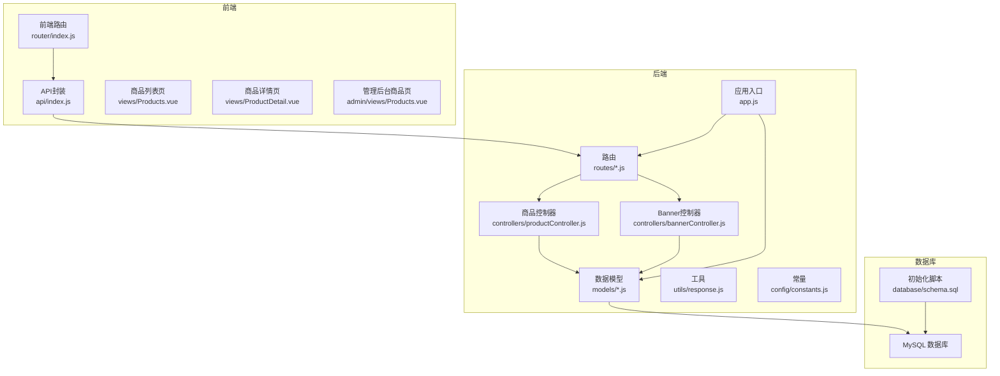
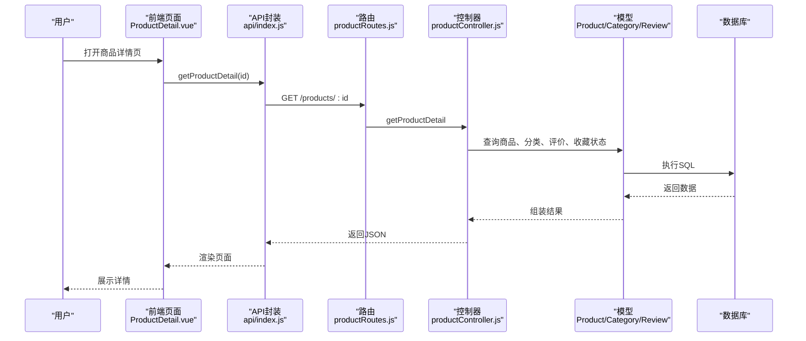
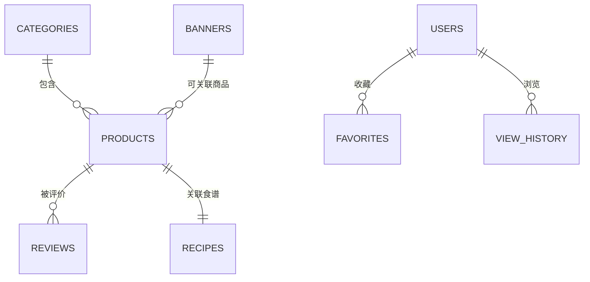
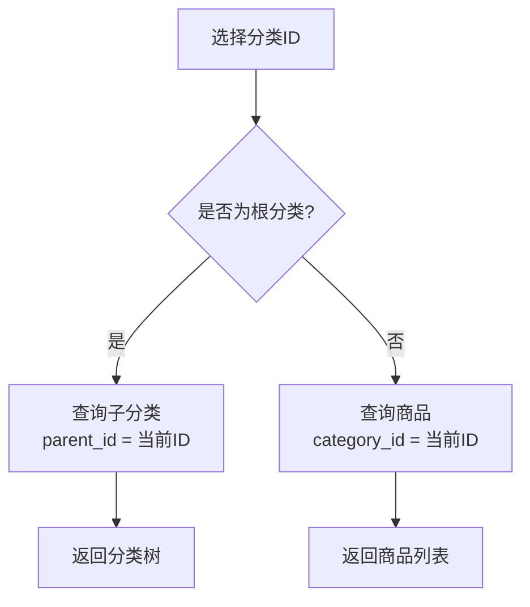
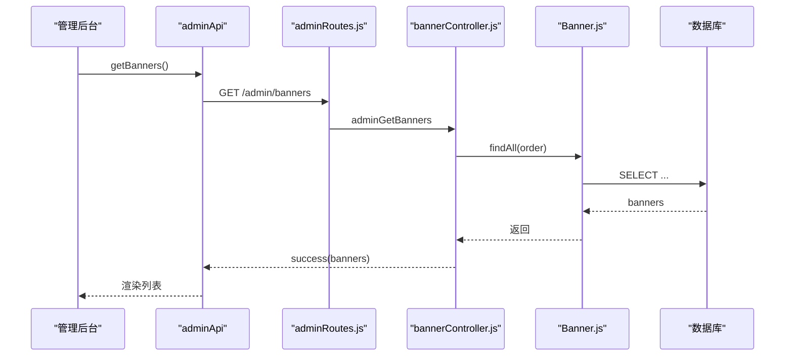
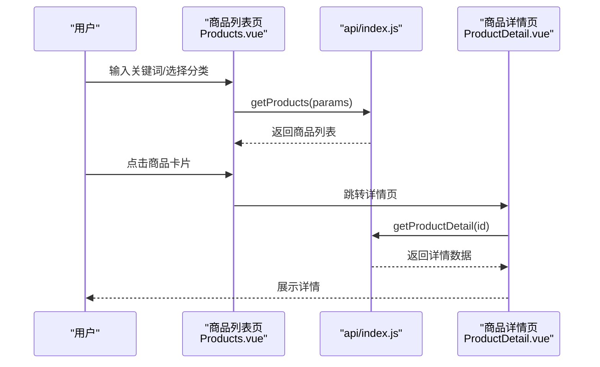
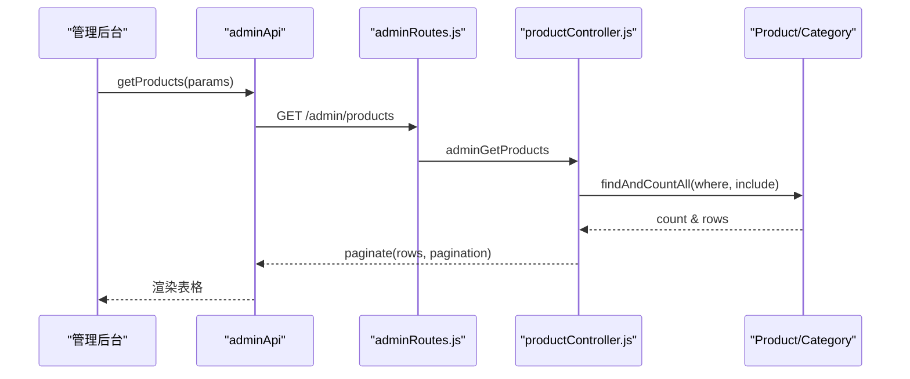
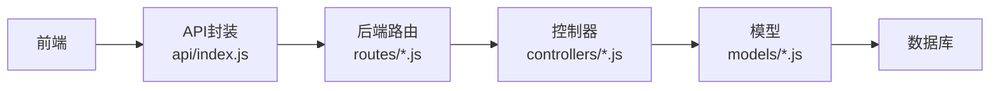

# 商品管理系统

<cite>
**本文档引用的文件**
- [Product.js](file://backend/src/models/Product.js)
- [Category.js](file://backend/src/models/Category.js)
- [Banner.js](file://backend/src/models/Banner.js)
- [productController.js](file://backend/src/controllers/productController.js)
- [bannerController.js](file://backend/src/controllers/bannerController.js)
- [productRoutes.js](file://backend/src/routes/productRoutes.js)
- [adminRoutes.js](file://backend/src/routes/adminRoutes.js)
- [Products.vue](file://frontend/src/views/Products.vue)
- [ProductDetail.vue](file://frontend/src/views/ProductDetail.vue)
- [Products.vue（管理后台）](file://frontend/admin/views/Products.vue)
- [constants.js](file://backend/src/config/constants.js)
- [response.js](file://backend/src/utils/response.js)
- [index.js（API封装）](file://frontend/src/api/index.js)
- [schema.sql](file://database/schema.sql)
- [app.js](file://backend/src/app.js)
- [index.js（路由）](file://frontend/src/router/index.js)
- [package.json（后端）](file://backend/package.json)
- [package.json（前端）](file://frontend/package.json)
</cite>

## 目录
1. [简介](#简介)
2. [项目结构](#项目结构)
3. [核心组件](#核心组件)
4. [架构总览](#架构总览)
5. [详细组件分析](#详细组件分析)
6. [依赖关系分析](#依赖关系分析)
7. [性能考虑](#性能考虑)
8. [故障排除指南](#故障排除指南)
9. [结论](#结论)
10. [附录](#附录)

## 简介
本项目是一个基于 Node.js + Express + Vue 的商品管理系统，涵盖商品展示、搜索、分类、详情查看、收藏、浏览历史、轮播图管理、管理后台商品维护等核心功能。系统采用前后端分离架构，后端使用 Sequelize ORM 连接 MySQL，前端使用 Vue 3 + Vant UI 实现移动端页面。

## 项目结构
- 后端
  - models：定义商品、分类、轮播图等数据模型
  - controllers：处理业务逻辑（商品列表、详情、分类、收藏、轮播图）
  - routes：RESTful 接口路由
  - config：常量、数据库、JWT、日志等配置
  - utils：统一响应格式工具
  - app.js：应用入口，中间件、静态资源、启动逻辑
- 前端
  - views：用户端页面（商品列表、详情等）
  - admin/views：管理后台页面（商品管理、Banner 管理等）
  - api：封装请求方法
  - router：前端路由配置
- 数据库
  - schema.sql：数据库初始化脚本，包含商品、分类、轮播图等表结构

**图表来源**
- [app.js:17-84](file://backend/src/app.js#L17-L84)
- [productRoutes.js:1-15](file://backend/src/routes/productRoutes.js#L1-L15)
- [adminRoutes.js:1-80](file://backend/src/routes/adminRoutes.js#L1-L80)
- [productController.js:1-527](file://backend/src/controllers/productController.js#L1-L527)
- [bannerController.js:1-86](file://backend/src/controllers/bannerController.js#L1-L86)
- [Product.js:1-190](file://backend/src/models/Product.js#L1-L190)
- [Category.js:1-56](file://backend/src/models/Category.js#L1-L56)
- [Banner.js:1-70](file://backend/src/models/Banner.js#L1-L70)
- [schema.sql:93-136](file://database/schema.sql#L93-L136)

**章节来源**
- [app.js:17-84](file://backend/src/app.js#L17-L84)
- [productRoutes.js:1-15](file://backend/src/routes/productRoutes.js#L1-L15)
- [adminRoutes.js:1-80](file://backend/src/routes/adminRoutes.js#L1-L80)
- [schema.sql:93-136](file://database/schema.sql#L93-L136)

## 核心组件
- 商品模型（Product）
  - 字段覆盖：基本信息（名称、副标题、主图、轮播图、视频）、价格体系（销售价、会员价、原价）、库存与销量、评分与评价数、适用人数、烹饪时长、难度、标签、产地、分装日期、保质期、储存条件、配料表、生产者信息、关联食谱、上下架状态、新品/热销/推荐标记、排序、软删除时间戳
  - 关系：与 Category 外键关联，与 Reviews、Favorites、ViewHistory 等存在一对多或多对多关系
- 分类模型（Category）
  - 字段：父分类ID、名称、图标、分类图、描述、排序、状态
  - 关系：自关联（parent_id），与 Product 一对多
- 轮播图模型（Banner）
  - 字段：位置、标题、图片、链接类型、链接地址、关联商品ID、排序、起止时间、启用状态
  - 关系：与 Product 可能存在关联
- 控制器
  - 商品控制器：商品列表、详情、分类、收藏切换、收藏列表、浏览历史、管理后台商品 CRUD、分类 CRUD
  - Banner 控制器：管理后台 Banner 列表、创建、更新、删除
- 前端组件
  - 商品列表页：搜索、分类筛选、分页加载、下拉刷新
  - 商品详情页：轮播图、价格对比、食材清单、烹饪步骤、用户评价、收藏与加购
  - 管理后台商品页：搜索、筛选、分页、批量修改库存/状态、新增/编辑/删除商品

**章节来源**
- [Product.js:4-187](file://backend/src/models/Product.js#L4-L187)
- [Category.js:4-53](file://backend/src/models/Category.js#L4-L53)
- [Banner.js:4-67](file://backend/src/models/Banner.js#L4-L67)
- [productController.js:6-527](file://backend/src/controllers/productController.js#L6-L527)
- [bannerController.js:4-86](file://backend/src/controllers/bannerController.js#L4-L86)
- [Products.vue:1-211](file://frontend/src/views/Products.vue#L1-L211)
- [ProductDetail.vue:1-560](file://frontend/src/views/ProductDetail.vue#L1-L560)
- [Products.vue（管理后台）:1-720](file://frontend/admin/views/Products.vue#L1-L720)

## 架构总览
系统采用前后端分离架构，后端提供 RESTful API，前端通过 axios 封装的 API 方法调用接口。数据库使用 MySQL，ORM 使用 Sequelize，支持软删除、索引优化与外键约束。

**图表来源**
- [ProductDetail.vue:195-210](file://frontend/src/views/ProductDetail.vue#L195-L210)
- [index.js（API封装）:32-42](file://frontend/src/api/index.js#L32-L42)
- [productRoutes.js:8-8](file://backend/src/routes/productRoutes.js#L8-L8)
- [productController.js:44-108](file://backend/src/controllers/productController.js#L44-L108)
- [Product.js:1-190](file://backend/src/models/Product.js#L1-L190)
- [Category.js:1-56](file://backend/src/models/Category.js#L1-L56)
- [schema.sql:93-136](file://database/schema.sql#L93-L136)

## 详细组件分析

### 商品模型设计与关系映射
- 字段设计
  - 基础信息：名称、副标题、主图、轮播图（JSON）、视频URL、描述
  - 价格与库存：price、member_price、original_price、stock、stock_type、sales
  - 评分与评价：rating、review_count
  - 食材与说明：serving_size、cooking_time、difficulty、tags、origin、shelf_life、storage_conditions、ingredient_list、producer_info
  - 关联与状态：recipe_id、is_on_sale、is_new、is_hot、is_recommend、sort_order、deleted_at
- 关系映射
  - Product.category_id -> Category.id（外键）
  - Product.id -> Review.product_id（一对多）
  - User.id -> Favorite.user_id（一对多）
  - User.id -> ViewHistory.user_id（一对多）

**图表来源**
- [Product.js:4-187](file://backend/src/models/Product.js#L4-L187)
- [Category.js:4-53](file://backend/src/models/Category.js#L4-L53)
- [Banner.js:4-67](file://backend/src/models/Banner.js#L4-L67)
- [schema.sql:93-136](file://database/schema.sql#L93-L136)

**章节来源**
- [Product.js:4-187](file://backend/src/models/Product.js#L4-L187)
- [Category.js:4-53](file://backend/src/models/Category.js#L4-L53)
- [Banner.js:4-67](file://backend/src/models/Banner.js#L4-L67)
- [schema.sql:93-136](file://database/schema.sql#L93-L136)

### 商品分类体系实现
- 分类层级与父子关系
  - parent_id 字段实现父子关系，支持多级分类
  - status 字段控制分类启用/禁用
  - sort_order 控制分类排序
- 商品与分类关联
  - Product.category_id -> Category.id
  - 查询时通过 include 关联获取分类名称

**图表来源**
- [Category.js:10-14](file://backend/src/models/Category.js#L10-L14)
- [productController.js:110-121](file://backend/src/controllers/productController.js#L110-L121)

**章节来源**
- [Category.js:10-47](file://backend/src/models/Category.js#L10-L47)
- [productController.js:110-121](file://backend/src/controllers/productController.js#L110-L121)

### 轮播图管理功能
- 功能点
  - 位置标识、标题、图片、链接类型与地址
  - 关联商品ID、排序、起止时间、启用状态
  - 管理后台支持列表、创建、更新、删除
- 展示逻辑
  - 按 sort_order 升序、创建时间倒序排列
  - 可根据 position 或启用状态筛选

**图表来源**
- [bannerController.js:4-15](file://backend/src/controllers/bannerController.js#L4-L15)
- [adminRoutes.js:66-69](file://backend/src/routes/adminRoutes.js#L66-L69)
- [Banner.js:4-67](file://backend/src/models/Banner.js#L4-L67)
- [schema.sql:552-569](file://database/schema.sql#L552-L569)

**章节来源**
- [bannerController.js:4-86](file://backend/src/controllers/bannerController.js#L4-L86)
- [adminRoutes.js:66-69](file://backend/src/routes/adminRoutes.js#L66-L69)
- [Banner.js:4-67](file://backend/src/models/Banner.js#L4-L67)

### 前端商品列表与详情实现
- 商品列表页（用户端）
  - 搜索关键词、分类筛选、分页加载、下拉刷新
  - 使用 van-card 展示商品主图、名称、价格、标签
  - 点击进入详情页
- 商品详情页（用户端）
  - 轮播图展示主图与轮播图
  - 价格对比、适用人数、烹饪时长、评分与评价数
  - 食材清单、产品说明、食材信息、烹饪步骤
  - 用户评价列表、收藏与加购
- 管理后台商品页
  - 搜索、分类筛选、状态筛选、分页
  - 表格展示图片、名称、价格、库存、销量、状态
  - 批量修改库存与上下架状态
  - 新增/编辑/删除商品弹窗

**图表来源**
- [Products.vue:91-130](file://frontend/src/views/Products.vue#L91-L130)
- [ProductDetail.vue:195-210](file://frontend/src/views/ProductDetail.vue#L195-L210)
- [index.js（API封装）:32-42](file://frontend/src/api/index.js#L32-L42)

**章节来源**
- [Products.vue:1-211](file://frontend/src/views/Products.vue#L1-L211)
- [ProductDetail.vue:1-560](file://frontend/src/views/ProductDetail.vue#L1-L560)
- [index.js（API封装）:32-42](file://frontend/src/api/index.js#L32-L42)

### 商品管理API接口文档
- 商品查询
  - GET /products
  - 查询参数：page、pageSize、category_id、keyword、is_new、is_hot、is_recommend
  - 返回：分页后的商品列表与分页信息
- 商品详情
  - GET /products/:id（可选认证）
  - 返回：商品详情、收藏状态、评价列表、合规文案
- 商品分类
  - GET /products/categories
  - 返回：启用状态的分类列表（按排序）
- 收藏与历史
  - POST /products/favorites/toggle（需要认证）
  - GET /products/favorites/list（需要认证）
  - GET /products/history/view（需要认证）
- 管理后台
  - GET /admin/products、POST /admin/products、PUT /admin/products/:id、DELETE /admin/products/:id
  - GET /admin/products/:id、PUT /admin/products/:id/sale、PUT /admin/products/:id/stock
  - GET/POST/PUT/DELETE /admin/categories
  - GET/POST/PUT/DELETE /admin/banners

**图表来源**
- [adminRoutes.js:32-42](file://backend/src/routes/adminRoutes.js#L32-L42)
- [productController.js:210-244](file://backend/src/controllers/productController.js#L210-L244)
- [Product.js:1-190](file://backend/src/models/Product.js#L1-L190)
- [Category.js:1-56](file://backend/src/models/Category.js#L1-L56)

**章节来源**
- [productRoutes.js:6-12](file://backend/src/routes/productRoutes.js#L6-L12)
- [adminRoutes.js:32-42](file://backend/src/routes/adminRoutes.js#L32-L42)
- [productController.js:6-527](file://backend/src/controllers/productController.js#L6-L527)

### 商品推荐算法与热门统计（实现思路）
- 热门商品统计
  - 基于销量（sales）与评分（rating）综合排序
  - 可结合近期购买频次与浏览历史权重
- 推荐算法思路
  - 协同过滤：相似用户偏好匹配
  - 内容推荐：基于分类、标签、适用人数、烹饪时长相似度
  - 混合策略：加权融合销量、热度、相似度与个性化偏好
- 实施建议
  - 后端定时任务统计热门榜单，缓存至 Redis
  - 前端首页轮播与推荐位展示

[本节为概念性内容，不直接分析具体文件]

## 依赖关系分析
- 后端依赖
  - express、sequelize、mysql2、helmet、cors、express-rate-limit、morgan、winston、dotenv
- 前端依赖
  - vue、vue-router、pinia、axios、vant、dayjs
- 关键耦合点
  - 路由与控制器解耦，控制器与模型解耦
  - 前端 API 封装与后端接口一一对应

**图表来源**
- [index.js（API封装）:32-135](file://frontend/src/api/index.js#L32-L135)
- [productRoutes.js:1-15](file://backend/src/routes/productRoutes.js#L1-L15)
- [adminRoutes.js:1-80](file://backend/src/routes/adminRoutes.js#L1-L80)
- [productController.js:1-527](file://backend/src/controllers/productController.js#L1-L527)
- [Product.js:1-190](file://backend/src/models/Product.js#L1-L190)

**章节来源**
- [package.json（后端）:18-39](file://backend/package.json#L18-L39)
- [package.json（前端）:10-24](file://frontend/package.json#L10-L24)

## 性能考虑
- 数据库层面
  - 为商品表的 category_id、is_on_sale、is_new、is_hot、sales、sort_order 建立索引，提升查询与排序性能
  - 使用软删除（deleted_at）避免物理删除，便于恢复与审计
- 应用层面
  - 分页查询（page、pageSize）限制单页大小，避免一次性返回大量数据
  - 控制器中使用 include 关联查询时注意 N+1 问题，必要时使用预加载
  - 前端分页与懒加载，减少首屏压力
- 缓存策略
  - 热门商品、分类列表、Banner 等静态或低频变更数据可缓存
  - Redis 存储热点数据，降低数据库压力
- 安全与稳定性
  - 使用 helmet、cors、xss-clean、express-rate-limit 等中间件增强安全
  - 日志记录与错误处理统一规范化

[本节提供通用建议，不直接分析具体文件]

## 故障排除指南
- 常见错误与处理
  - 参数校验失败：检查必填字段与数据类型（价格、分类ID等）
  - 外键约束错误：确认分类是否存在，商品删除前检查是否有订单关联
  - 数据库错误：查看日志与数据库连接状态
  - 401/403 权限问题：确认用户/管理员 Token 是否存在且有效
- 前端调试
  - 在 API 调用处打印参数与响应，定位请求问题
  - 检查路由守卫与本地存储中的 Token/用户信息

**章节来源**
- [productController.js:266-346](file://backend/src/controllers/productController.js#L266-L346)
- [productController.js:348-395](file://backend/src/controllers/productController.js#L348-L395)
- [productController.js:416-432](file://backend/src/controllers/productController.js#L416-L432)
- [ProductDetail.vue:212-234](file://frontend/src/views/ProductDetail.vue#L212-L234)
- [index.js（路由）:155-191](file://frontend/src/router/index.js#L155-L191)

## 结论
本系统围绕商品管理构建了完整的前后端能力，覆盖商品展示、搜索、分类、详情、收藏、浏览历史、轮播图管理与管理后台商品维护。通过清晰的数据模型、规范的 API 设计与前端组件化实现，能够支撑日常电商运营需求。建议后续引入缓存、推荐与监控体系，持续优化性能与用户体验。

## 附录
- 数据库初始化脚本包含商品、分类、轮播图等核心表结构，确保系统启动后具备基础数据结构
- 常量与文案集中管理，便于统一维护品牌信息与页面提示

**章节来源**
- [schema.sql:93-136](file://database/schema.sql#L93-L136)
- [constants.js:78-123](file://backend/src/config/constants.js#L78-L123)