# 核心功能模块

<cite>
**本文引用的文件**
- [README.md](file://README.md)
- [backend/src/app.js](file://backend/src/app.js)
- [backend/src/init.js](file://backend/src/init.js)
- [backend/src/config/constants.js](file://backend/src/config/constants.js)
- [backend/src/config/database.js](file://backend/src/config/database.js)
- [backend/src/config/jwt.js](file://backend/src/config/jwt.js)
- [backend/src/controllers/userController.js](file://backend/src/controllers/userController.js)
- [backend/src/controllers/productController.js](file://backend/src/controllers/productController.js)
- [backend/src/controllers/cartController.js](file://backend/src/controllers/cartController.js)
- [backend/src/controllers/orderController.js](file://backend/src/controllers/orderController.js)
- [backend/src/controllers/recipeController.js](file://backend/src/controllers/recipeController.js)
- [backend/src/controllers/couponController.js](file://backend/src/controllers/couponController.js)
- [backend/src/controllers/adminController.js](file://backend/src/controllers/adminController.js)
- [backend/src/middlewares/auth.js](file://backend/src/middlewares/auth.js)
- [backend/src/middlewares/adminAuth.js](file://backend/src/middlewares/adminAuth.js)
- [backend/src/middlewares/errorHandler.js](file://backend/src/middlewares/errorHandler.js)
- [backend/src/models/User.js](file://backend/src/models/User.js)
- [backend/src/models/Product.js](file://backend/src/models/Product.js)
- [backend/src/models/Cart.js](file://backend/src/models/Cart.js)
- [backend/src/models/Order.js](file://backend/src/models/Order.js)
- [backend/src/models/OrderItem.js](file://backend/src/models/OrderItem.js)
- [backend/src/models/Recipe.js](file://backend/src/models/Recipe.js)
- [backend/src/models/Coupon.js](file://backend/src/models/Coupon.js)
- [backend/src/models/Admin.js](file://backend/src/models/Admin.js)
- [backend/src/routes/index.js](file://backend/src/routes/index.js)
- [backend/src/routes/userRoutes.js](file://backend/src/routes/userRoutes.js)
- [backend/src/routes/productRoutes.js](file://backend/src/routes/productRoutes.js)
- [backend/src/routes/cartRoutes.js](file://backend/src/routes/cartRoutes.js)
- [backend/src/routes/orderRoutes.js](file://backend/src/routes/orderRoutes.js)
- [backend/src/routes/adminRoutes.js](file://backend/src/routes/adminRoutes.js)
- [backend/src/utils/order.js](file://backend/src/utils/order.js)
- [backend/src/utils/response.js](file://backend/src/utils/response.js)
- [backend/src/utils/security.js](file://backend/src/utils/security.js)
- [frontend/src/main.js](file://frontend/src/main.js)
- [frontend/src/router/index.js](file://frontend/src/router/index.js)
- [frontend/src/store/user.js](file://frontend/src/store/user.js)
- [frontend/src/store/cart.js](file://frontend/src/store/cart.js)
- [frontend/src/views/Home.vue](file://frontend/src/views/Home.vue)
- [frontend/src/views/Login.vue](file://frontend/src/views/Login.vue)
- [frontend/src/views/Register.vue](file://frontend/src/views/Register.vue)
- [frontend/src/views/Products.vue](file://frontend/src/views/Products.vue)
- [frontend/src/views/ProductDetail.vue](file://frontend/src/views/ProductDetail.vue)
- [frontend/src/views/Cart.vue](file://frontend/src/views/Cart.vue)
- [frontend/src/views/Checkout.vue](file://frontend/src/views/Checkout.vue)
- [frontend/src/views/Orders.vue](file://frontend/src/views/Orders.vue)
- [frontend/src/views/OrderDetail.vue](file://frontend/src/views/OrderDetail.vue)
- [frontend/src/views/Recipes.vue](file://frontend/src/views/Recipes.vue)
- [frontend/src/views/RecipeDetail.vue](file://frontend/src/views/RecipeDetail.vue)
- [frontend/src/views/Favorites.vue](file://frontend/src/views/Favorites.vue)
- [frontend/src/views/Profile.vue](file://frontend/src/views/Profile.vue)
- [frontend/src/admin/views/Home.vue](file://frontend/src/admin/views/Home.vue)
- [frontend/src/admin/views/Products.vue](file://frontend/src/admin/views/Products.vue)
- [frontend/src/admin/views/Orders.vue](file://frontend/src/admin/views/Orders.vue)
- [frontend/src/admin/views/Users.vue](file://frontend/src/admin/views/Users.vue)
- [frontend/src/admin/views/Coupons.vue](file://frontend/src/admin/views/Coupons.vue)
- [frontend/src/admin/views/Stats.vue](file://frontend/src/admin/views/Stats.vue)
- [frontend/src/api/request.js](file://frontend/src/api/request.js)
- [frontend/src/api/adminRequest.js](file://frontend/src/api/adminRequest.js)
- [database/schema.sql](file://database/schema.sql)
- [docs/api.md](file://docs/api.md)
- [docs/deploy.md](file://docs/deploy.md)
</cite>

## 目录
1. [简介](#简介)
2. [项目结构](#项目结构)
3. [核心组件](#核心组件)
4. [架构总览](#架构总览)
5. [详细组件分析](#详细组件分析)
6. [依赖分析](#依赖分析)
7. [性能考虑](#性能考虑)
8. [故障排查指南](#故障排查指南)
9. [结论](#结论)
10. [附录](#附录)

## 简介
本文件面向产品经理与开发者，系统梳理“趣配鲜”项目的核心功能模块：用户管理、商品管理、购物车与订单、食谱管理、营销（优惠券）、后台管理与数据统计。文档覆盖后端控制器、中间件、模型、路由与前端页面、状态管理、API 请求封装及数据库模型设计，并通过流程图与类图展示模块间交互关系与数据流向。

## 项目结构
项目采用前后端分离架构：
- 后端基于 Node.js + Express，采用 MVC 分层：controllers 控制器、models 模型、routes 路由、middlewares 中间件、utils 工具、config 配置。
- 前端基于 Vue 3 + Vite，采用路由 + Vuex/Pinia 状态管理，按功能页面组织视图与 API 封装。
- 数据库脚本位于 database/schema.sql；API 文档与部署说明位于 docs。

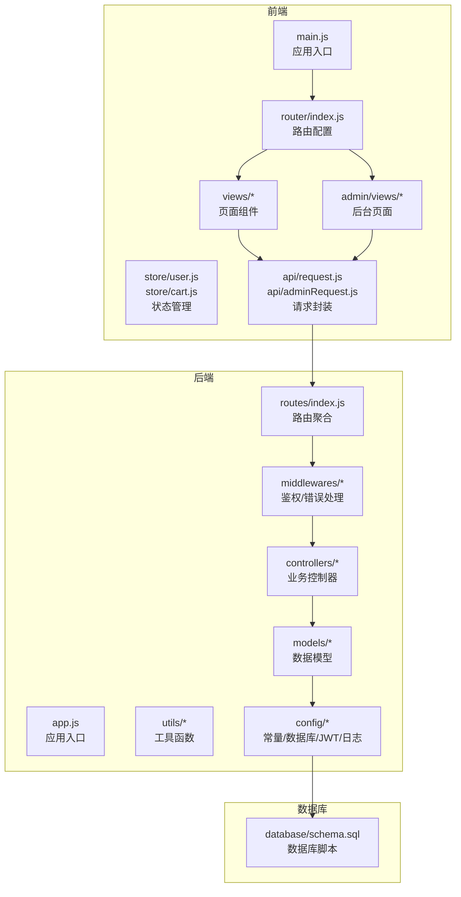

图表来源
- [backend/src/app.js:1-200](file://backend/src/app.js#L1-L200)
- [backend/src/routes/index.js:1-200](file://backend/src/routes/index.js#L1-L200)
- [backend/src/middlewares/auth.js:1-200](file://backend/src/middlewares/auth.js#L1-L200)
- [backend/src/controllers/userController.js:1-200](file://backend/src/controllers/userController.js#L1-L200)
- [backend/src/models/User.js:1-200](file://backend/src/models/User.js#L1-L200)
- [frontend/src/main.js:1-200](file://frontend/src/main.js#L1-L200)
- [frontend/src/router/index.js:1-200](file://frontend/src/router/index.js#L1-L200)
- [frontend/src/store/user.js:1-200](file://frontend/src/store/user.js#L1-L200)
- [frontend/src/store/cart.js:1-200](file://frontend/src/store/cart.js#L1-L200)
- [frontend/src/api/request.js:1-200](file://frontend/src/api/request.js#L1-L200)
- [database/schema.sql:1-200](file://database/schema.sql#L1-L200)

章节来源
- [backend/src/app.js:1-200](file://backend/src/app.js#L1-L200)
- [backend/src/routes/index.js:1-200](file://backend/src/routes/index.js#L1-L200)
- [frontend/src/main.js:1-200](file://frontend/src/main.js#L1-L200)
- [frontend/src/router/index.js:1-200](file://frontend/src/router/index.js#L1-L200)
- [database/schema.sql:1-200](file://database/schema.sql#L1-L200)

## 核心组件
- 用户管理：注册、登录、个人信息、收货地址、协议与资质、收藏与浏览历史。
- 商品管理：分类、列表、详情、库存与价格、评价与销量。
- 购物车：加入、修改数量、删除、下单前预处理。
- 订单管理：创建、支付、状态流转、售后。
- 食谱管理：食谱列表、详情、食材购买、收藏与分享。
- 营销：优惠券发放、使用规则、促销活动。
- 后台管理：商品/订单/用户管理、公告/轮播/优惠券维护、数据统计。
- 安全与日志：JWT 鉴权、管理员鉴权、统一错误处理、日志记录。

章节来源
- [backend/src/controllers/userController.js:1-200](file://backend/src/controllers/userController.js#L1-L200)
- [backend/src/controllers/productController.js:1-200](file://backend/src/controllers/productController.js#L1-L200)
- [backend/src/controllers/cartController.js:1-200](file://backend/src/controllers/cartController.js#L1-L200)
- [backend/src/controllers/orderController.js:1-200](file://backend/src/controllers/orderController.js#L1-L200)
- [backend/src/controllers/recipeController.js:1-200](file://backend/src/controllers/recipeController.js#L1-L200)
- [backend/src/controllers/couponController.js:1-200](file://backend/src/controllers/couponController.js#L1-L200)
- [backend/src/controllers/adminController.js:1-200](file://backend/src/controllers/adminController.js#L1-L200)
- [backend/src/middlewares/auth.js:1-200](file://backend/src/middlewares/auth.js#L1-L200)
- [backend/src/middlewares/adminAuth.js:1-200](file://backend/src/middlewares/adminAuth.js#L1-L200)
- [backend/src/middlewares/errorHandler.js:1-200](file://backend/src/middlewares/errorHandler.js#L1-L200)

## 架构总览
后端通过路由聚合各模块控制器，控制器调用模型进行数据持久化，中间件负责鉴权与异常处理。前端通过 API 封装与后端交互，状态管理协调用户态与购物车数据。

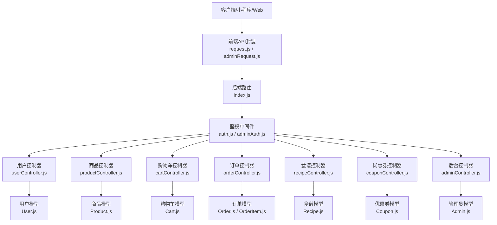

图表来源
- [backend/src/routes/index.js:1-200](file://backend/src/routes/index.js#L1-L200)
- [backend/src/middlewares/auth.js:1-200](file://backend/src/middlewares/auth.js#L1-L200)
- [backend/src/middlewares/adminAuth.js:1-200](file://backend/src/middlewares/adminAuth.js#L1-L200)
- [backend/src/controllers/userController.js:1-200](file://backend/src/controllers/userController.js#L1-L200)
- [backend/src/controllers/productController.js:1-200](file://backend/src/controllers/productController.js#L1-L200)
- [backend/src/controllers/cartController.js:1-200](file://backend/src/controllers/cartController.js#L1-L200)
- [backend/src/controllers/orderController.js:1-200](file://backend/src/controllers/orderController.js#L1-L200)
- [backend/src/controllers/recipeController.js:1-200](file://backend/src/controllers/recipeController.js#L1-L200)
- [backend/src/controllers/couponController.js:1-200](file://backend/src/controllers/couponController.js#L1-L200)
- [backend/src/controllers/adminController.js:1-200](file://backend/src/controllers/adminController.js#L1-L200)
- [backend/src/models/User.js:1-200](file://backend/src/models/User.js#L1-L200)
- [backend/src/models/Product.js:1-200](file://backend/src/models/Product.js#L1-L200)
- [backend/src/models/Cart.js:1-200](file://backend/src/models/Cart.js#L1-L200)
- [backend/src/models/Order.js:1-200](file://backend/src/models/Order.js#L1-L200)
- [backend/src/models/OrderItem.js:1-200](file://backend/src/models/OrderItem.js#L1-L200)
- [backend/src/models/Recipe.js:1-200](file://backend/src/models/Recipe.js#L1-L200)
- [backend/src/models/Coupon.js:1-200](file://backend/src/models/Coupon.js#L1-L200)
- [backend/src/models/Admin.js:1-200](file://backend/src/models/Admin.js#L1-L200)

## 详细组件分析

### 用户管理系统
- 功能点：注册、登录、个人信息、收货地址、协议与资质、收藏与浏览历史。
- 关键控制器与模型：userController.js、User.js、UserAddress.js、Favorite.js、ViewHistory.js、Agreement.js、Qualification.js。
- 鉴权：auth.js 中间件保护受保护路由；JWT 令牌签发与校验在 jwt.js。
- 前端：Login.vue、Register.vue、Profile.vue、Addresses.vue、AddressEdit.vue、Favorites.vue、Qualifications.vue。

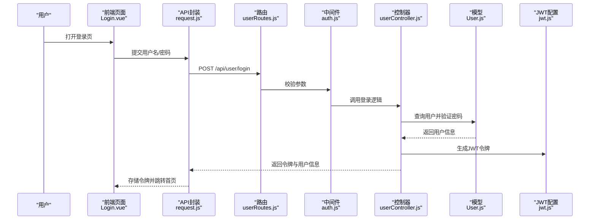

图表来源
- [backend/src/routes/userRoutes.js:1-200](file://backend/src/routes/userRoutes.js#L1-L200)
- [backend/src/middlewares/auth.js:1-200](file://backend/src/middlewares/auth.js#L1-L200)
- [backend/src/controllers/userController.js:1-200](file://backend/src/controllers/userController.js#L1-L200)
- [backend/src/models/User.js:1-200](file://backend/src/models/User.js#L1-L200)
- [backend/src/config/jwt.js:1-200](file://backend/src/config/jwt.js#L1-L200)
- [frontend/src/views/Login.vue:1-200](file://frontend/src/views/Login.vue#L1-L200)
- [frontend/src/api/request.js:1-200](file://frontend/src/api/request.js#L1-L200)

章节来源
- [backend/src/controllers/userController.js:1-200](file://backend/src/controllers/userController.js#L1-L200)
- [backend/src/middlewares/auth.js:1-200](file://backend/src/middlewares/auth.js#L1-L200)
- [backend/src/models/User.js:1-200](file://backend/src/models/User.js#L1-L200)
- [backend/src/models/UserAddress.js:1-200](file://backend/src/models/UserAddress.js#L1-L200)
- [backend/src/models/Favorite.js:1-200](file://backend/src/models/Favorite.js#L1-L200)
- [backend/src/models/ViewHistory.js:1-200](file://backend/src/models/ViewHistory.js#L1-L200)
- [backend/src/models/Agreement.js:1-200](file://backend/src/models/Agreement.js#L1-L200)
- [backend/src/models/Qualification.js:1-200](file://backend/src/models/Qualification.js#L1-L200)
- [frontend/src/views/Login.vue:1-200](file://frontend/src/views/Login.vue#L1-L200)
- [frontend/src/views/Register.vue:1-200](file://frontend/src/views/Register.vue#L1-L200)
- [frontend/src/views/Profile.vue:1-200](file://frontend/src/views/Profile.vue#L1-L200)
- [frontend/src/views/Addresses.vue:1-200](file://frontend/src/views/Addresses.vue#L1-L200)
- [frontend/src/views/AddressEdit.vue:1-200](file://frontend/src/views/AddressEdit.vue#L1-L200)
- [frontend/src/views/Favorites.vue:1-200](file://frontend/src/views/Favorites.vue#L1-L200)
- [frontend/src/views/Qualifications.vue:1-200](file://frontend/src/views/Qualifications.vue#L1-L200)

### 商品管理系统
- 功能点：商品列表、详情、分类筛选、价格与库存、评价与销量统计。
- 关键控制器与模型：productController.js、Product.js、Category.js、Review.js。
- 前端：Products.vue、ProductDetail.vue。

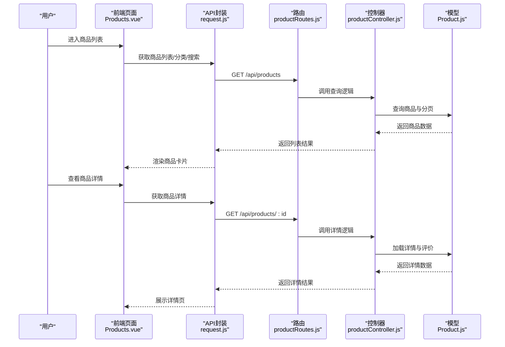

图表来源
- [backend/src/routes/productRoutes.js:1-200](file://backend/src/routes/productRoutes.js#L1-L200)
- [backend/src/controllers/productController.js:1-200](file://backend/src/controllers/productController.js#L1-L200)
- [backend/src/models/Product.js:1-200](file://backend/src/models/Product.js#L1-L200)
- [backend/src/models/Category.js:1-200](file://backend/src/models/Category.js#L1-L200)
- [backend/src/models/Review.js:1-200](file://backend/src/models/Review.js#L1-L200)
- [frontend/src/views/Products.vue:1-200](file://frontend/src/views/Products.vue#L1-L200)
- [frontend/src/views/ProductDetail.vue:1-200](file://frontend/src/views/ProductDetail.vue#L1-L200)
- [frontend/src/api/request.js:1-200](file://frontend/src/api/request.js#L1-L200)

章节来源
- [backend/src/controllers/productController.js:1-200](file://backend/src/controllers/productController.js#L1-L200)
- [backend/src/models/Product.js:1-200](file://backend/src/models/Product.js#L1-L200)
- [backend/src/models/Category.js:1-200](file://backend/src/models/Category.js#L1-L200)
- [backend/src/models/Review.js:1-200](file://backend/src/models/Review.js#L1-L200)
- [frontend/src/views/Products.vue:1-200](file://frontend/src/views/Products.vue#L1-L200)
- [frontend/src/views/ProductDetail.vue:1-200](file://frontend/src/views/ProductDetail.vue#L1-L200)

### 购物车管理
- 功能点：加入购物车、修改数量、删除、结算前校验。
- 关键控制器与模型：cartController.js、Cart.js。
- 前端：Cart.vue、Checkout.vue。

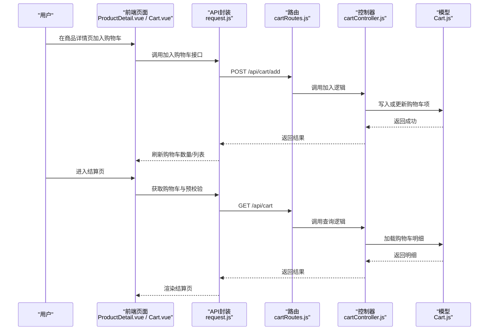

图表来源
- [backend/src/routes/cartRoutes.js:1-200](file://backend/src/routes/cartRoutes.js#L1-L200)
- [backend/src/controllers/cartController.js:1-200](file://backend/src/controllers/cartController.js#L1-L200)
- [backend/src/models/Cart.js:1-200](file://backend/src/models/Cart.js#L1-L200)
- [frontend/src/views/ProductDetail.vue:1-200](file://frontend/src/views/ProductDetail.vue#L1-L200)
- [frontend/src/views/Cart.vue:1-200](file://frontend/src/views/Cart.vue#L1-L200)
- [frontend/src/views/Checkout.vue:1-200](file://frontend/src/views/Checkout.vue#L1-L200)
- [frontend/src/api/request.js:1-200](file://frontend/src/api/request.js#L1-L200)

章节来源
- [backend/src/controllers/cartController.js:1-200](file://backend/src/controllers/cartController.js#L1-L200)
- [backend/src/models/Cart.js:1-200](file://backend/src/models/Cart.js#L1-L200)
- [frontend/src/views/Cart.vue:1-200](file://frontend/src/views/Cart.vue#L1-L200)
- [frontend/src/views/Checkout.vue:1-200](file://frontend/src/views/Checkout.vue#L1-L200)

### 订单管理
- 功能点：创建订单、支付处理、状态跟踪、售后申请与处理。
- 关键控制器与模型：orderController.js、Order.js、OrderItem.js、AfterSale.js。
- 工具：order.js 处理订单状态与金额计算；response.js 统一响应格式；security.js 安全校验。
- 前端：Orders.vue、OrderDetail.vue、AfterSales.vue。

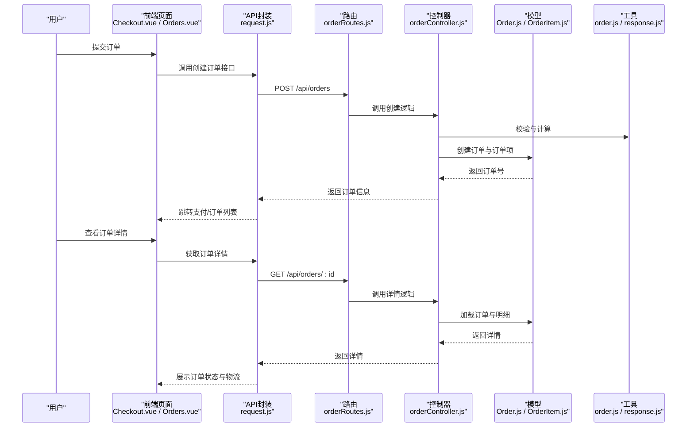

图表来源
- [backend/src/routes/orderRoutes.js:1-200](file://backend/src/routes/orderRoutes.js#L1-L200)
- [backend/src/controllers/orderController.js:1-200](file://backend/src/controllers/orderController.js#L1-L200)
- [backend/src/models/Order.js:1-200](file://backend/src/models/Order.js#L1-L200)
- [backend/src/models/OrderItem.js:1-200](file://backend/src/models/OrderItem.js#L1-L200)
- [backend/src/utils/order.js:1-200](file://backend/src/utils/order.js#L1-L200)
- [backend/src/utils/response.js:1-200](file://backend/src/utils/response.js#L1-L200)
- [frontend/src/views/Checkout.vue:1-200](file://frontend/src/views/Checkout.vue#L1-L200)
- [frontend/src/views/Orders.vue:1-200](file://frontend/src/views/Orders.vue#L1-L200)
- [frontend/src/views/OrderDetail.vue:1-200](file://frontend/src/views/OrderDetail.vue#L1-L200)
- [frontend/src/api/request.js:1-200](file://frontend/src/api/request.js#L1-L200)

章节来源
- [backend/src/controllers/orderController.js:1-200](file://backend/src/controllers/orderController.js#L1-L200)
- [backend/src/models/Order.js:1-200](file://backend/src/models/Order.js#L1-L200)
- [backend/src/models/OrderItem.js:1-200](file://backend/src/models/OrderItem.js#L1-L200)
- [backend/src/models/AfterSale.js:1-200](file://backend/src/models/AfterSale.js#L1-L200)
- [backend/src/utils/order.js:1-200](file://backend/src/utils/order.js#L1-L200)
- [backend/src/utils/response.js:1-200](file://backend/src/utils/response.js#L1-L200)
- [frontend/src/views/Orders.vue:1-200](file://frontend/src/views/Orders.vue#L1-L200)
- [frontend/src/views/OrderDetail.vue:1-200](file://frontend/src/views/OrderDetail.vue#L1-L200)
- [frontend/src/views/AfterSales.vue:1-200](file://frontend/src/views/AfterSales.vue#L1-L200)

### 食谱管理
- 功能点：食谱列表、详情、食材购买、收藏与分享。
- 关键控制器与模型：recipeController.js、Recipe.js、Favorite.js。
- 前端：Recipes.vue、RecipeDetail.vue。

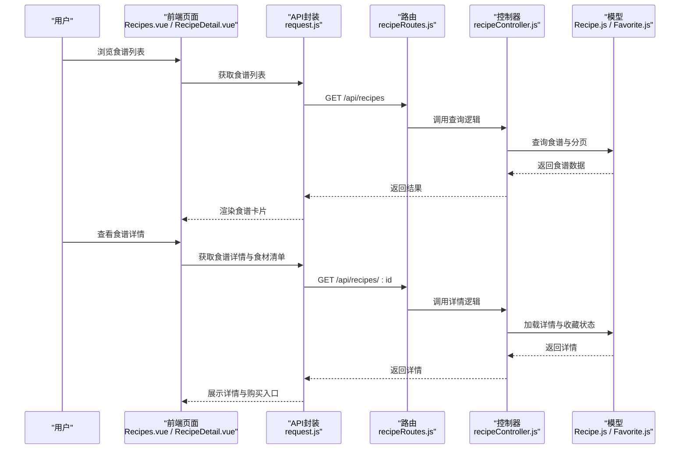

图表来源
- [backend/src/controllers/recipeController.js:1-200](file://backend/src/controllers/recipeController.js#L1-L200)
- [backend/src/models/Recipe.js:1-200](file://backend/src/models/Recipe.js#L1-L200)
- [backend/src/models/Favorite.js:1-200](file://backend/src/models/Favorite.js#L1-L200)
- [frontend/src/views/Recipes.vue:1-200](file://frontend/src/views/Recipes.vue#L1-L200)
- [frontend/src/views/RecipeDetail.vue:1-200](file://frontend/src/views/RecipeDetail.vue#L1-L200)
- [frontend/src/api/request.js:1-200](file://frontend/src/api/request.js#L1-L200)

章节来源
- [backend/src/controllers/recipeController.js:1-200](file://backend/src/controllers/recipeController.js#L1-L200)
- [backend/src/models/Recipe.js:1-200](file://backend/src/models/Recipe.js#L1-L200)
- [backend/src/models/Favorite.js:1-200](file://backend/src/models/Favorite.js#L1-L200)
- [frontend/src/views/Recipes.vue:1-200](file://frontend/src/views/Recipes.vue#L1-L200)
- [frontend/src/views/RecipeDetail.vue:1-200](file://frontend/src/views/RecipeDetail.vue#L1-L200)

### 营销功能（优惠券）
- 功能点：优惠券发放、绑定用户、使用规则（满减/折扣）、失效与核销。
- 关键控制器与模型：couponController.js、Coupon.js、UserCoupon.js。
- 前端：Coupons.vue（用户端）、Coupons.vue（后台）。

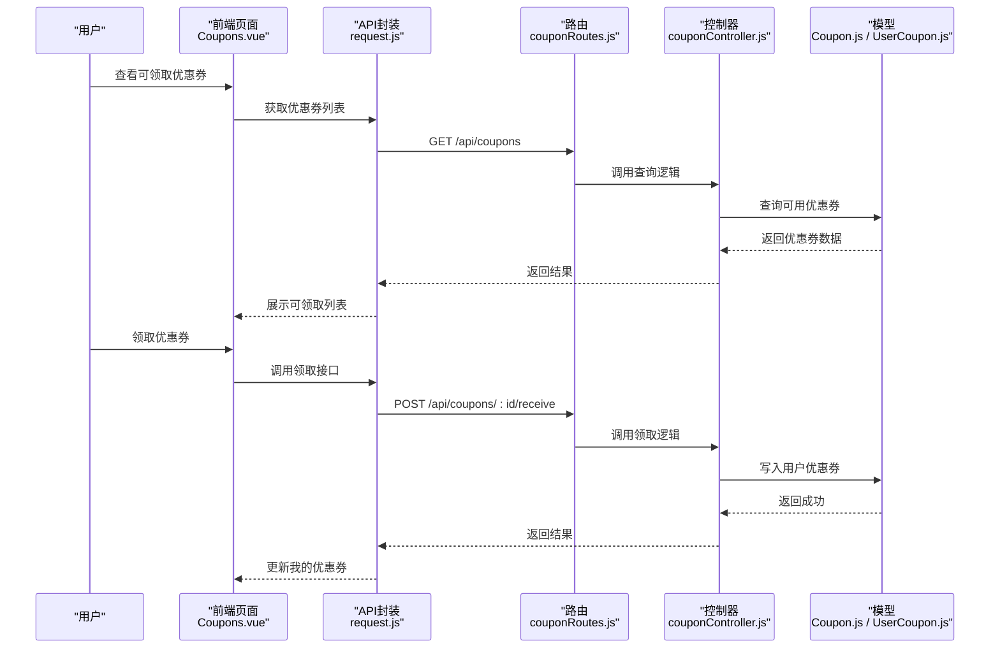

图表来源
- [backend/src/controllers/couponController.js:1-200](file://backend/src/controllers/couponController.js#L1-L200)
- [backend/src/models/Coupon.js:1-200](file://backend/src/models/Coupon.js#L1-L200)
- [backend/src/models/UserCoupon.js:1-200](file://backend/src/models/UserCoupon.js#L1-L200)
- [frontend/src/views/Coupons.vue:1-200](file://frontend/src/views/Coupons.vue#L1-L200)
- [frontend/src/api/request.js:1-200](file://frontend/src/api/request.js#L1-L200)

章节来源
- [backend/src/controllers/couponController.js:1-200](file://backend/src/controllers/couponController.js#L1-L200)
- [backend/src/models/Coupon.js:1-200](file://backend/src/models/Coupon.js#L1-L200)
- [backend/src/models/UserCoupon.js:1-200](file://backend/src/models/UserCoupon.js#L1-L200)
- [frontend/src/views/Coupons.vue:1-200](file://frontend/src/views/Coupons.vue#L1-L200)

### 后台管理
- 功能点：商品管理、订单处理、用户管理、公告/轮播/优惠券维护、数据统计。
- 关键控制器与模型：adminController.js、Admin.js、AdminLog.js。
- 鉴权：adminAuth.js 管理员专用中间件。
- 前端：Home.vue、Products.vue、Orders.vue、Users.vue、Coupons.vue、Stats.vue、Login.vue。

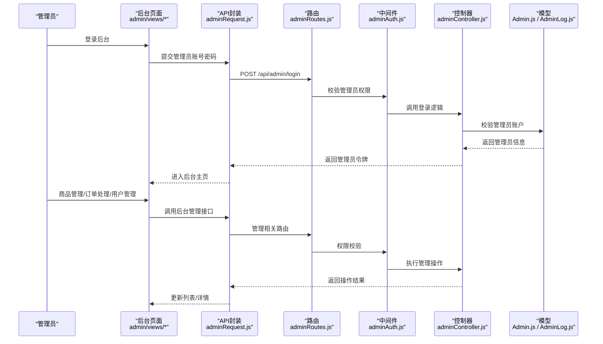

图表来源
- [backend/src/routes/adminRoutes.js:1-200](file://backend/src/routes/adminRoutes.js#L1-L200)
- [backend/src/middlewares/adminAuth.js:1-200](file://backend/src/middlewares/adminAuth.js#L1-L200)
- [backend/src/controllers/adminController.js:1-200](file://backend/src/controllers/adminController.js#L1-L200)
- [backend/src/models/Admin.js:1-200](file://backend/src/models/Admin.js#L1-L200)
- [backend/src/models/AdminLog.js:1-200](file://backend/src/models/AdminLog.js#L1-L200)
- [frontend/src/admin/views/Home.vue:1-200](file://frontend/src/admin/views/Home.vue#L1-L200)
- [frontend/src/admin/views/Products.vue:1-200](file://frontend/src/admin/views/Products.vue#L1-L200)
- [frontend/src/admin/views/Orders.vue:1-200](file://frontend/src/admin/views/Orders.vue#L1-L200)
- [frontend/src/admin/views/Users.vue:1-200](file://frontend/src/admin/views/Users.vue#L1-L200)
- [frontend/src/admin/views/Coupons.vue:1-200](file://frontend/src/admin/views/Coupons.vue#L1-L200)
- [frontend/src/admin/views/Stats.vue:1-200](file://frontend/src/admin/views/Stats.vue#L1-L200)
- [frontend/src/admin/views/Login.vue:1-200](file://frontend/src/admin/views/Login.vue#L1-L200)
- [frontend/src/api/adminRequest.js:1-200](file://frontend/src/api/adminRequest.js#L1-L200)

章节来源
- [backend/src/controllers/adminController.js:1-200](file://backend/src/controllers/adminController.js#L1-L200)
- [backend/src/middlewares/adminAuth.js:1-200](file://backend/src/middlewares/adminAuth.js#L1-L200)
- [backend/src/models/Admin.js:1-200](file://backend/src/models/Admin.js#L1-L200)
- [backend/src/models/AdminLog.js:1-200](file://backend/src/models/AdminLog.js#L1-L200)
- [frontend/src/admin/views/Home.vue:1-200](file://frontend/src/admin/views/Home.vue#L1-L200)
- [frontend/src/admin/views/Products.vue:1-200](file://frontend/src/admin/views/Products.vue#L1-L200)
- [frontend/src/admin/views/Orders.vue:1-200](file://frontend/src/admin/views/Orders.vue#L1-L200)
- [frontend/src/admin/views/Users.vue:1-200](file://frontend/src/admin/views/Users.vue#L1-L200)
- [frontend/src/admin/views/Coupons.vue:1-200](file://frontend/src/admin/views/Coupons.vue#L1-L200)
- [frontend/src/admin/views/Stats.vue:1-200](file://frontend/src/admin/views/Stats.vue#L1-L200)
- [frontend/src/admin/views/Login.vue:1-200](file://frontend/src/admin/views/Login.vue#L1-L200)

## 依赖分析
- 路由聚合：routes/index.js 将各模块路由集中注册，避免分散耦合。
- 中间件：auth.js 与 adminAuth.js 分别处理普通用户与管理员鉴权，errorHandler.js 统一异常处理。
- 模块内聚：控制器仅编排业务，模型专注数据访问，工具函数独立复用。
- 前后端解耦：前端通过 API 封装与后端通信，路由与控制器职责清晰。

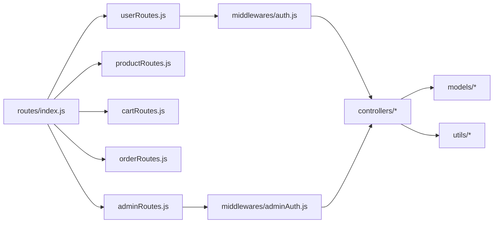

图表来源
- [backend/src/routes/index.js:1-200](file://backend/src/routes/index.js#L1-L200)
- [backend/src/routes/userRoutes.js:1-200](file://backend/src/routes/userRoutes.js#L1-L200)
- [backend/src/routes/productRoutes.js:1-200](file://backend/src/routes/productRoutes.js#L1-L200)
- [backend/src/routes/cartRoutes.js:1-200](file://backend/src/routes/cartRoutes.js#L1-L200)
- [backend/src/routes/orderRoutes.js:1-200](file://backend/src/routes/orderRoutes.js#L1-L200)
- [backend/src/routes/adminRoutes.js:1-200](file://backend/src/routes/adminRoutes.js#L1-L200)
- [backend/src/middlewares/auth.js:1-200](file://backend/src/middlewares/auth.js#L1-L200)
- [backend/src/middlewares/adminAuth.js:1-200](file://backend/src/middlewares/adminAuth.js#L1-L200)

章节来源
- [backend/src/routes/index.js:1-200](file://backend/src/routes/index.js#L1-L200)
- [backend/src/middlewares/errorHandler.js:1-200](file://backend/src/middlewares/errorHandler.js#L1-L200)

## 性能考虑
- 缓存策略：购物车与商品详情建议引入缓存（如 Redis），减少重复查询。
- 分页与索引：商品列表与订单列表需合理分页与数据库索引优化。
- 并发控制：优惠券领取与库存扣减需分布式锁或数据库级约束保证一致性。
- 日志与监控：统一错误处理与日志记录，便于定位性能瓶颈与异常。

## 故障排查指南
- 鉴权失败：检查 auth.js 与 adminAuth.js 的 JWT 校验与权限范围。
- 接口报错：统一通过 errorHandler.js 输出结构化错误，前端据此提示。
- 数据不一致：核对 order.js 的状态机与事务边界，确保订单创建与库存扣减原子性。
- 文件上传：确认后端上传目录权限与前端上传组件配置。

章节来源
- [backend/src/middlewares/errorHandler.js:1-200](file://backend/src/middlewares/errorHandler.js#L1-L200)
- [backend/src/utils/order.js:1-200](file://backend/src/utils/order.js#L1-L200)

## 结论
本项目以清晰的 MVC 分层与前后端分离架构实现了用户、商品、购物车、订单、食谱、营销与后台管理等核心功能。通过统一的中间件与工具函数，保障了安全性与可维护性。建议后续完善缓存与并发控制，持续优化数据库索引与接口性能。

## 附录

### 数据库模型设计（ER 图）
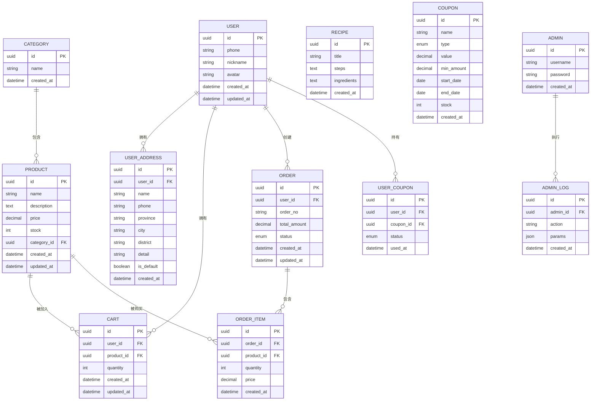

图表来源
- [database/schema.sql:1-200](file://database/schema.sql#L1-L200)

章节来源
- [database/schema.sql:1-200](file://database/schema.sql#L1-L200)

### API 接口文档（概览）
- 用户模块：登录、注册、个人信息、收货地址、收藏、浏览历史、协议与资质。
- 商品模块：列表、详情、分类、评价。
- 购物车模块：加入、修改数量、删除、查询。
- 订单模块：创建、支付、状态查询、详情、售后。
- 食谱模块：列表、详情、收藏。
- 营销模块：优惠券列表、领取、使用。
- 后台模块：商品/订单/用户管理、公告/轮播/优惠券维护、统计报表。

章节来源
- [docs/api.md:1-200](file://docs/api.md#L1-L200)

### 部署与运行
- 后端启动：参考 docs/deploy.md 与项目根目录启动脚本。
- 前端构建：Vite 构建产物位于 frontend/dist，静态资源部署至 Nginx 或 CDN。

章节来源
- [docs/deploy.md:1-200](file://docs/deploy.md#L1-L200)