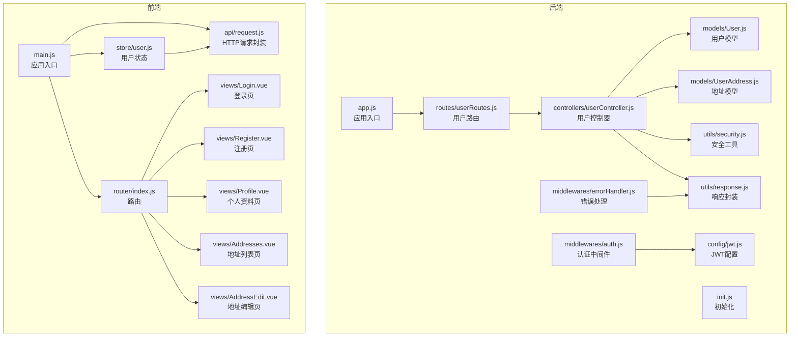
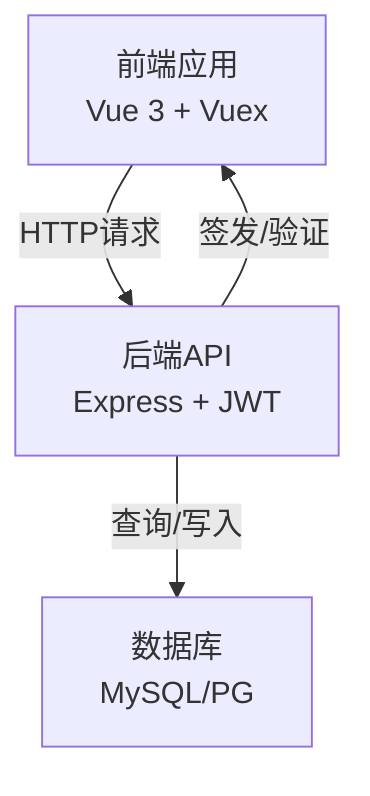
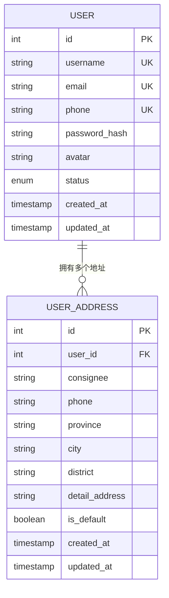
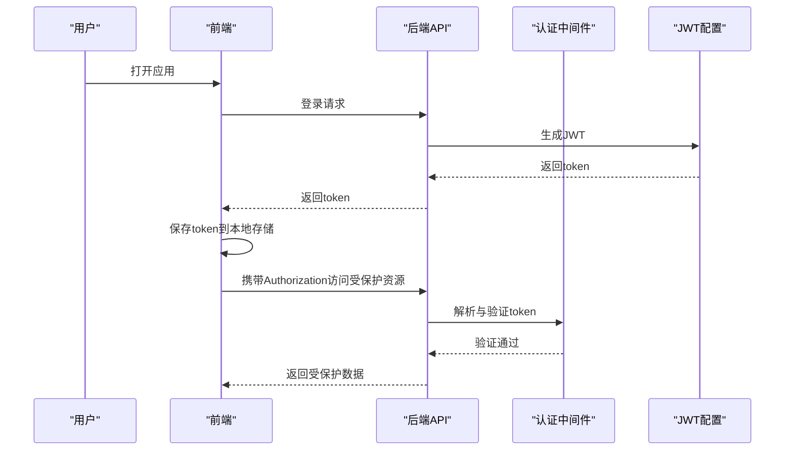
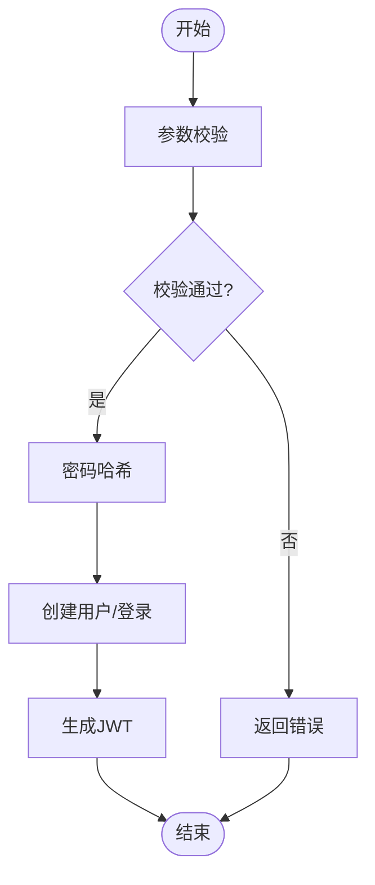
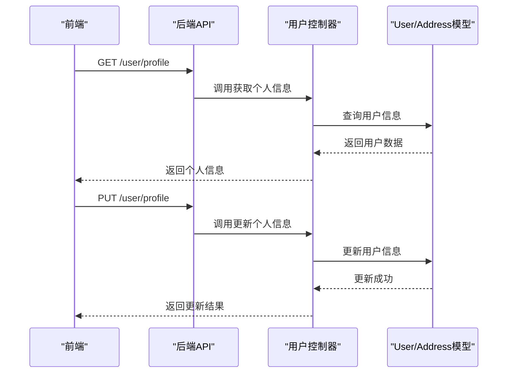
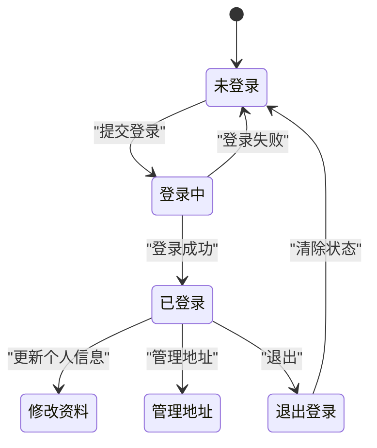
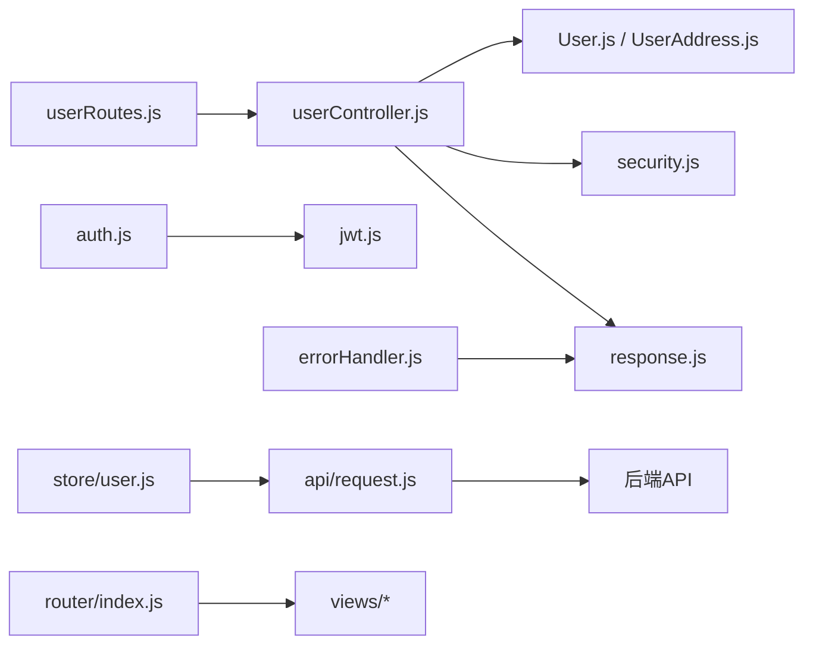

# 用户管理系统

<cite>
**本文引用的文件**
- [README.md](file://README.md)
- [backend/src/app.js](file://backend/src/app.js)
- [backend/src/init.js](file://backend/src/init.js)
- [backend/src/config/constants.js](file://backend/src/config/constants.js)
- [backend/src/config/jwt.js](file://backend/src/config/jwt.js)
- [backend/src/models/User.js](file://backend/src/models/User.js)
- [backend/src/models/UserAddress.js](file://backend/src/models/UserAddress.js)
- [backend/src/controllers/userController.js](file://backend/src/controllers/userController.js)
- [backend/src/middlewares/auth.js](file://backend/src/middlewares/auth.js)
- [backend/src/middlewares/errorHandler.js](file://backend/src/middlewares/errorHandler.js)
- [backend/src/routes/userRoutes.js](file://backend/src/routes/userRoutes.js)
- [backend/src/utils/security.js](file://backend/src/utils/security.js)
- [backend/src/utils/response.js](file://backend/src/utils/response.js)
- [frontend/src/store/user.js](file://frontend/src/store/user.js)
- [frontend/src/api/request.js](file://frontend/src/api/request.js)
- [frontend/src/views/Login.vue](file://frontend/src/views/Login.vue)
- [frontend/src/views/Register.vue](file://frontend/src/views/Register.vue)
- [frontend/src/views/Profile.vue](file://frontend/src/views/Profile.vue)
- [frontend/src/views/Addresses.vue](file://frontend/src/views/Addresses.vue)
- [frontend/src/views/AddressEdit.vue](file://frontend/src/views/AddressEdit.vue)
- [frontend/src/router/index.js](file://frontend/src/router/index.js)
</cite>

## 目录
1. [简介](#简介)
2. [项目结构](#项目结构)
3. [核心组件](#核心组件)
4. [架构总览](#架构总览)
5. [详细组件分析](#详细组件分析)
6. [依赖分析](#依赖分析)
7. [性能考虑](#性能考虑)
8. [故障排查指南](#故障排查指南)
9. [结论](#结论)
10. [附录](#附录)

## 简介
本项目是一个前后端分离的用户管理系统，后端基于 Node.js + Express，采用 JWT 进行认证授权；前端使用 Vue 3 + Vite 构建，通过 Vuex Store 管理用户状态与本地持久化。系统提供用户注册、登录、个人信息管理、地址管理等核心功能，并内置完善的错误处理、安全策略与响应封装。

## 项目结构
后端采用分层架构：配置(config)、模型(models)、控制器(controllers)、中间件(middlewares)、路由(routes)、工具(utils)、入口(app.js)与初始化(init.js)。前端采用模块化目录：views 视图、store 状态管理、router 路由、api 接口封装、layouts 布局等。

**图表来源**
- [backend/src/app.js](file://backend/src/app.js)
- [backend/src/init.js](file://backend/src/init.js)
- [backend/src/routes/userRoutes.js](file://backend/src/routes/userRoutes.js)
- [backend/src/controllers/userController.js](file://backend/src/controllers/userController.js)
- [backend/src/models/User.js](file://backend/src/models/User.js)
- [backend/src/models/UserAddress.js](file://backend/src/models/UserAddress.js)
- [backend/src/middlewares/auth.js](file://backend/src/middlewares/auth.js)
- [backend/src/middlewares/errorHandler.js](file://backend/src/middlewares/errorHandler.js)
- [backend/src/config/jwt.js](file://backend/src/config/jwt.js)
- [backend/src/utils/security.js](file://backend/src/utils/security.js)
- [backend/src/utils/response.js](file://backend/src/utils/response.js)
- [frontend/src/main.js](file://frontend/src/main.js)
- [frontend/src/router/index.js](file://frontend/src/router/index.js)
- [frontend/src/store/user.js](file://frontend/src/store/user.js)
- [frontend/src/api/request.js](file://frontend/src/api/request.js)
- [frontend/src/views/Login.vue](file://frontend/src/views/Login.vue)
- [frontend/src/views/Register.vue](file://frontend/src/views/Register.vue)
- [frontend/src/views/Profile.vue](file://frontend/src/views/Profile.vue)
- [frontend/src/views/Addresses.vue](file://frontend/src/views/Addresses.vue)
- [frontend/src/views/AddressEdit.vue](file://frontend/src/views/AddressEdit.vue)

**章节来源**
- [README.md](file://README.md)
- [backend/src/app.js](file://backend/src/app.js)
- [backend/src/init.js](file://backend/src/init.js)
- [frontend/src/main.js](file://frontend/src/main.js)

## 核心组件
- 后端核心组件
  - 应用入口与初始化：负责加载环境、连接数据库、挂载路由与中间件。
  - 用户路由与控制器：统一暴露注册、登录、获取/更新用户信息、地址增删改查等接口。
  - 模型层：User 与 UserAddress 定义数据结构与约束；配合校验器与服务层完成业务逻辑。
  - 认证中间件与 JWT 配置：拦截受保护路由，解析与验证 token。
  - 错误处理与响应封装：标准化错误与成功响应格式。
  - 安全工具：密码哈希、盐值生成、敏感信息脱敏等。
- 前端核心组件
  - 路由与视图：登录、注册、个人资料、地址管理等页面。
  - 用户状态管理：Vuex store 统一管理用户登录态、信息与本地持久化。
  - 请求封装：统一封装 API 调用、鉴权头注入与错误处理。

**章节来源**
- [backend/src/app.js](file://backend/src/app.js)
- [backend/src/init.js](file://backend/src/init.js)
- [backend/src/routes/userRoutes.js](file://backend/src/routes/userRoutes.js)
- [backend/src/controllers/userController.js](file://backend/src/controllers/userController.js)
- [backend/src/middlewares/auth.js](file://backend/src/middlewares/auth.js)
- [backend/src/config/jwt.js](file://backend/src/config/jwt.js)
- [backend/src/utils/security.js](file://backend/src/utils/security.js)
- [backend/src/utils/response.js](file://backend/src/utils/response.js)
- [frontend/src/router/index.js](file://frontend/src/router/index.js)
- [frontend/src/store/user.js](file://frontend/src/store/user.js)
- [frontend/src/api/request.js](file://frontend/src/api/request.js)

## 架构总览
系统采用前后端分离架构，后端以 RESTful 风格提供 API，前端通过 Axios 封装进行调用。认证采用 JWT，登录成功后将 token 存入本地存储并在后续请求中自动携带。用户状态在前端 Vuex 中集中管理，支持跨组件共享与持久化。

**图表来源**
- [backend/src/config/jwt.js](file://backend/src/config/jwt.js)
- [frontend/src/api/request.js](file://frontend/src/api/request.js)
- [frontend/src/store/user.js](file://frontend/src/store/user.js)

## 详细组件分析

### 用户模型与数据结构
- User 模型
  - 字段：用户标识、用户名、邮箱、手机号、密码哈希、头像、状态、创建/更新时间等。
  - 约束：唯一索引（用户名、邮箱、手机号），非空字段校验，长度与格式限制。
  - 业务规则：密码必须加密存储；状态枚举（启用/禁用）；默认头像与注册时间。
- UserAddress 模型
  - 字段：用户ID、姓名、电话、省市区、详细地址、是否默认地址、创建/更新时间。
  - 约束：默认地址唯一性（同一用户仅一个默认地址）；必填字段校验。
  - 业务规则：默认地址切换时需原子性更新旧默认地址。

**图表来源**
- [backend/src/models/User.js](file://backend/src/models/User.js)
- [backend/src/models/UserAddress.js](file://backend/src/models/UserAddress.js)

**章节来源**
- [backend/src/models/User.js](file://backend/src/models/User.js)
- [backend/src/models/UserAddress.js](file://backend/src/models/UserAddress.js)

### JWT 认证机制
- 生成：登录成功后，后端根据用户信息生成 JWT，设置过期时间（如 7 天），返回给前端。
- 验证：受保护路由通过认证中间件解析 Authorization 头，验证签名与过期时间。
- 刷新：建议前端在 token 即将过期时发起刷新接口或在失败时重新登录。
- 存储：前端将 token 存入本地存储并在每次请求头中携带 Authorization: Bearer token。

**图表来源**
- [backend/src/middlewares/auth.js](file://backend/src/middlewares/auth.js)
- [backend/src/config/jwt.js](file://backend/src/config/jwt.js)
- [frontend/src/api/request.js](file://frontend/src/api/request.js)

**章节来源**
- [backend/src/middlewares/auth.js](file://backend/src/middlewares/auth.js)
- [backend/src/config/jwt.js](file://backend/src/config/jwt.js)
- [frontend/src/api/request.js](file://frontend/src/api/request.js)

### 用户注册与登录流程
- 注册
  - 参数校验：用户名、邮箱、手机号、密码等格式与唯一性检查。
  - 密码加密：使用安全工具对明文密码进行哈希处理。
  - 创建用户：写入数据库，返回基础用户信息（不含敏感字段）。
- 登录
  - 参数校验：邮箱/用户名与密码。
  - 密码验证：从数据库取出哈希值进行比对。
  - 签发令牌：通过 JWT 配置生成 token 并返回。

**图表来源**
- [backend/src/controllers/userController.js](file://backend/src/controllers/userController.js)
- [backend/src/utils/security.js](file://backend/src/utils/security.js)
- [backend/src/config/jwt.js](file://backend/src/config/jwt.js)

**章节来源**
- [backend/src/controllers/userController.js](file://backend/src/controllers/userController.js)
- [backend/src/utils/security.js](file://backend/src/utils/security.js)
- [backend/src/config/jwt.js](file://backend/src/config/jwt.js)

### 个人信息与地址管理
- 获取/更新个人信息
  - 受保护接口，需携带有效 token。
  - 更新时进行字段白名单与格式校验，避免越权修改。
- 地址管理
  - 新增/编辑：校验必填字段与默认地址唯一性。
  - 删除：确保非默认地址可删除，若删除默认地址需指定新的默认地址。
  - 设置默认：切换默认地址时原子性更新旧默认地址。

**图表来源**
- [backend/src/controllers/userController.js](file://backend/src/controllers/userController.js)
- [backend/src/models/User.js](file://backend/src/models/User.js)
- [backend/src/models/UserAddress.js](file://backend/src/models/UserAddress.js)

**章节来源**
- [backend/src/controllers/userController.js](file://backend/src/controllers/userController.js)
- [backend/src/models/User.js](file://backend/src/models/User.js)
- [backend/src/models/UserAddress.js](file://backend/src/models/UserAddress.js)

### 前端用户状态管理（Vuex）
- 状态结构
  - 用户信息：id、username、email、phone、avatar、status。
  - 登录态：isAuthenticated、token。
  - 加载状态：loading、error。
- 持久化策略
  - 使用本地存储保存 token 与用户信息，应用启动时恢复状态。
  - 在路由守卫中根据 token 决定是否放行。
- 状态同步
  - 登录成功后更新用户信息与 token。
  - 退出登录时清除状态与本地存储。

**图表来源**
- [frontend/src/store/user.js](file://frontend/src/store/user.js)
- [frontend/src/router/index.js](file://frontend/src/router/index.js)

**章节来源**
- [frontend/src/store/user.js](file://frontend/src/store/user.js)
- [frontend/src/router/index.js](file://frontend/src/router/index.js)

### API 接口文档
以下为用户相关接口的定义（参数、返回值、错误处理概要）。具体实现请参考对应控制器与路由文件。

- 注册
  - 方法与路径：POST /api/auth/register
  - 请求体字段：用户名、邮箱、手机号、密码
  - 成功响应：返回用户基础信息（不含敏感字段）
  - 常见错误：参数缺失/格式错误、唯一性冲突、内部错误
- 登录
  - 方法与路径：POST /api/auth/login
  - 请求体字段：邮箱/用户名、密码
  - 成功响应：返回 token 与用户基础信息
  - 常见错误：账号不存在、密码错误、状态异常、内部错误
- 获取用户信息
  - 方法与路径：GET /api/user/profile
  - 鉴权：Bearer token
  - 成功响应：返回完整用户信息
  - 常见错误：未登录、token无效、内部错误
- 更新用户信息
  - 方法与路径：PUT /api/user/profile
  - 鉴权：Bearer token
  - 请求体字段：允许更新的字段（如昵称、头像等）
  - 成功响应：返回更新后的用户信息
  - 常见错误：参数校验失败、未授权、内部错误
- 获取地址列表
  - 方法与路径：GET /api/user/addresses
  - 鉴权：Bearer token
  - 成功响应：返回地址数组
  - 常见错误：未登录、内部错误
- 新增地址
  - 方法与路径：POST /api/user/addresses
  - 鉴权：Bearer token
  - 请求体字段：收货人、电话、省市区、详细地址、是否默认
  - 成功响应：返回新增地址
  - 常见错误：参数校验失败、默认地址唯一性冲突、内部错误
- 更新地址
  - 方法与路径：PUT /api/user/addresses/:id
  - 鉴权：Bearer token
  - 请求体字段：允许更新的字段
  - 成功响应：返回更新后的地址
  - 常见错误：未找到、越权、参数校验失败、内部错误
- 删除地址
  - 方法与路径：DELETE /api/user/addresses/:id
  - 鉴权：Bearer token
  - 成功响应：返回删除成功
  - 常见错误：未找到、越权、内部错误
- 设置默认地址
  - 方法与路径：PATCH /api/user/addresses/:id/default
  - 鉴权：Bearer token
  - 成功响应：返回设置结果
  - 常见错误：未找到、越权、内部错误

**章节来源**
- [backend/src/routes/userRoutes.js](file://backend/src/routes/userRoutes.js)
- [backend/src/controllers/userController.js](file://backend/src/controllers/userController.js)
- [backend/src/utils/response.js](file://backend/src/utils/response.js)
- [backend/src/middlewares/errorHandler.js](file://backend/src/middlewares/errorHandler.js)

### 安全与最佳实践
- 密码加密存储
  - 使用安全工具对密码进行哈希处理，盐值随机生成，不可逆存储。
- 会话与令牌
  - JWT 设置合理过期时间；建议实现刷新 token 流程；避免在客户端存储敏感信息。
- 输入校验与防护
  - 对所有输入进行严格校验；对 SQL 注入、XSS 等进行防护；对敏感字段进行脱敏。
- 权限控制
  - 受保护接口必须通过认证中间件；对资源操作进行越权检查。
- 错误处理
  - 统一响应格式；对敏感错误信息进行脱敏；记录日志便于追踪。

**章节来源**
- [backend/src/utils/security.js](file://backend/src/utils/security.js)
- [backend/src/middlewares/auth.js](file://backend/src/middlewares/auth.js)
- [backend/src/utils/response.js](file://backend/src/utils/response.js)
- [backend/src/middlewares/errorHandler.js](file://backend/src/middlewares/errorHandler.js)

## 依赖分析
后端依赖关系清晰：路由 -> 控制器 -> 模型/服务 -> 数据库；中间件贯穿于请求生命周期。前端通过 API 封装与后端交互，路由与状态管理解耦视图层。

**图表来源**
- [backend/src/routes/userRoutes.js](file://backend/src/routes/userRoutes.js)
- [backend/src/controllers/userController.js](file://backend/src/controllers/userController.js)
- [backend/src/models/User.js](file://backend/src/models/User.js)
- [backend/src/models/UserAddress.js](file://backend/src/models/UserAddress.js)
- [backend/src/utils/security.js](file://backend/src/utils/security.js)
- [backend/src/utils/response.js](file://backend/src/utils/response.js)
- [backend/src/middlewares/auth.js](file://backend/src/middlewares/auth.js)
- [backend/src/config/jwt.js](file://backend/src/config/jwt.js)
- [backend/src/middlewares/errorHandler.js](file://backend/src/middlewares/errorHandler.js)
- [frontend/src/api/request.js](file://frontend/src/api/request.js)
- [frontend/src/store/user.js](file://frontend/src/store/user.js)
- [frontend/src/router/index.js](file://frontend/src/router/index.js)

**章节来源**
- [backend/src/routes/userRoutes.js](file://backend/src/routes/userRoutes.js)
- [backend/src/controllers/userController.js](file://backend/src/controllers/userController.js)
- [backend/src/middlewares/auth.js](file://backend/src/middlewares/auth.js)
- [backend/src/middlewares/errorHandler.js](file://backend/src/middlewares/errorHandler.js)
- [frontend/src/api/request.js](file://frontend/src/api/request.js)
- [frontend/src/store/user.js](file://frontend/src/store/user.js)
- [frontend/src/router/index.js](file://frontend/src/router/index.js)

## 性能考虑
- 数据库优化
  - 为常用查询字段建立索引（用户名、邮箱、手机号、用户ID）。
  - 分页查询与 LIMIT 限制，避免一次性返回大量数据。
- 缓存策略
  - 对热点数据（如用户基本信息）进行缓存，降低数据库压力。
- 响应优化
  - 统一返回结构，避免多余字段；对大对象进行懒加载。
- 并发控制
  - 对高并发场景下的地址默认项更新使用事务或锁机制保证一致性。

## 故障排查指南
- 登录失败
  - 检查用户名/邮箱与密码是否正确；确认账户状态正常；查看后端错误日志。
- token 无效
  - 确认前端是否正确携带 Authorization 头；检查 token 是否过期；核对签名算法与密钥。
- 更新信息失败
  - 检查请求参数是否符合校验规则；确认当前用户是否为资源所有者。
- 地址管理异常
  - 默认地址唯一性冲突；删除非默认地址；更新越权问题。
- 前端状态不同步
  - 检查本地存储是否被清理；确认路由守卫逻辑；核对 Vuex 状态更新流程。

**章节来源**
- [backend/src/middlewares/errorHandler.js](file://backend/src/middlewares/errorHandler.js)
- [backend/src/utils/response.js](file://backend/src/utils/response.js)
- [frontend/src/store/user.js](file://frontend/src/store/user.js)

## 结论
本系统通过清晰的分层架构、严格的输入校验与安全策略、以及前后端协同的状态管理，实现了稳定可靠的用户管理能力。JWT 认证与受保护路由确保了接口安全性；Vuex 状态管理提升了用户体验与开发效率。建议持续完善 token 刷新机制、引入速率限制与审计日志，进一步提升系统的健壮性与可观测性。

## 附录
- 开发与部署
  - 后端启动脚本与环境变量配置；数据库初始化脚本；日志输出位置。
- 前端构建与运行
  - 依赖安装、开发服务器启动、生产打包与静态资源部署。

**章节来源**
- [README.md](file://README.md)
- [backend/src/init.js](file://backend/src/init.js)
- [frontend/package.json](file://frontend/package.json)