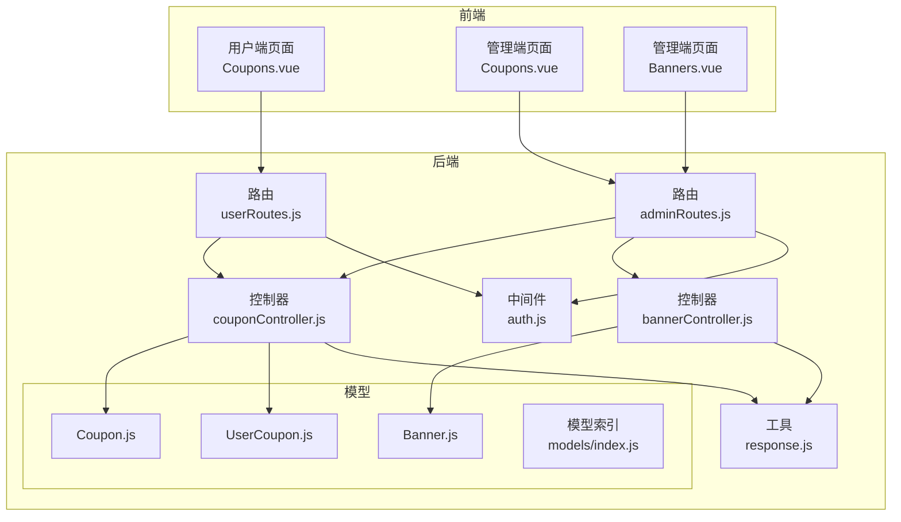
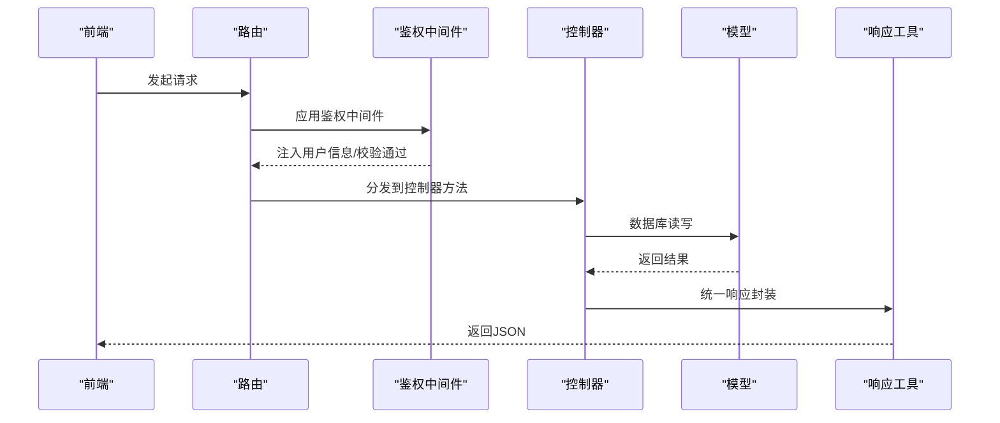
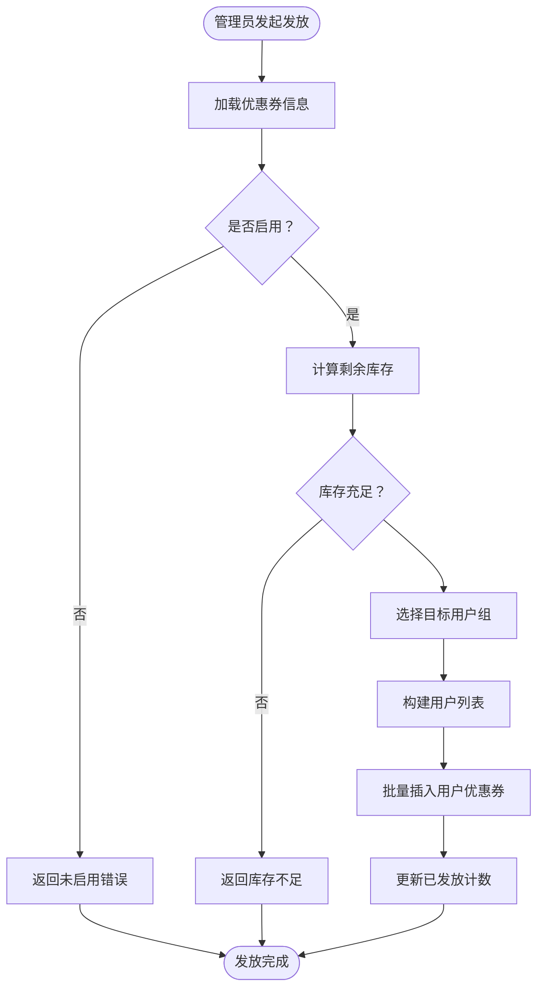
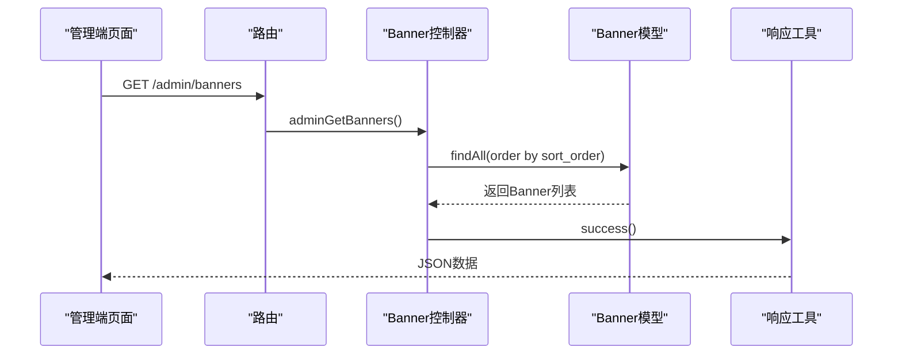
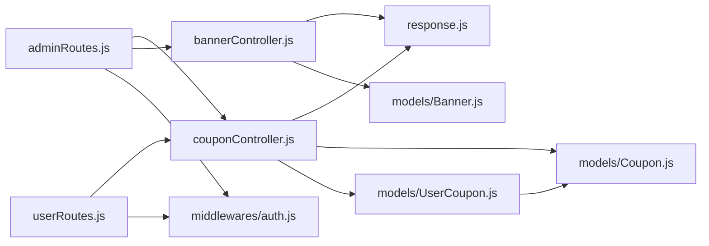

# 营销推广系统

<cite>
**本文引用的文件**
- [Coupon.js](file://backend/src/models/Coupon.js)
- [UserCoupon.js](file://backend/src/models/UserCoupon.js)
- [Banner.js](file://backend/src/models/Banner.js)
- [couponController.js](file://backend/src/controllers/couponController.js)
- [bannerController.js](file://backend/src/controllers/bannerController.js)
- [adminRoutes.js](file://backend/src/routes/adminRoutes.js)
- [userRoutes.js](file://backend/src/routes/userRoutes.js)
- [auth.js](file://backend/src/middlewares/auth.js)
- [response.js](file://backend/src/utils/response.js)
- [index.js（模型索引）](file://backend/src/models/index.js)
- [Coupons.vue（前端用户页）](file://frontend/src/views/Coupons.vue)
- [Coupons.vue（前端管理页）](file://frontend/src/admin/views/Coupons.vue)
- [Banners.vue（前端管理页）](file://frontend/src/admin/views/Banners.vue)
</cite>

## 目录
1. [简介](#简介)
2. [项目结构](#项目结构)
3. [核心组件](#核心组件)
4. [架构总览](#架构总览)
5. [详细组件分析](#详细组件分析)
6. [依赖分析](#依赖分析)
7. [性能考虑](#性能考虑)
8. [故障排查指南](#故障排查指南)
9. [结论](#结论)
10. [附录：营销管理API接口文档](#附录营销管理api接口文档)

## 简介
本技术文档面向“营销推广系统”，聚焦于优惠券系统、促销活动（概念性说明）、轮播图管理等营销功能的实现与扩展建议。文档从数据库模型设计、后端控制器与路由、前端页面与交互、到API接口定义与错误处理进行全面梳理，并提供架构图、流程图与类图帮助理解与维护。

## 项目结构
后端采用Express + Sequelize架构，按职责分层组织：路由层、中间件层、控制器层、模型层、工具层；前端采用Vue 3 + Vant移动端UI框架，分别提供用户端与管理端页面。

图表来源
- [adminRoutes.js:1-82](file://backend/src/routes/adminRoutes.js#L1-L82)
- [userRoutes.js:1-25](file://backend/src/routes/userRoutes.js#L1-L25)
- [auth.js:1-181](file://backend/src/middlewares/auth.js#L1-L181)
- [couponController.js:1-243](file://backend/src/controllers/couponController.js#L1-L243)
- [bannerController.js:1-86](file://backend/src/controllers/bannerController.js#L1-L86)
- [Coupon.js:1-105](file://backend/src/models/Coupon.js#L1-L105)
- [UserCoupon.js:1-55](file://backend/src/models/UserCoupon.js#L1-L55)
- [Banner.js:1-70](file://backend/src/models/Banner.js#L1-L70)
- [index.js（模型索引）:1-92](file://backend/src/models/index.js#L1-L92)

章节来源
- [adminRoutes.js:1-82](file://backend/src/routes/adminRoutes.js#L1-L82)
- [userRoutes.js:1-25](file://backend/src/routes/userRoutes.js#L1-L25)
- [auth.js:1-181](file://backend/src/middlewares/auth.js#L1-L181)
- [couponController.js:1-243](file://backend/src/controllers/couponController.js#L1-L243)
- [bannerController.js:1-86](file://backend/src/controllers/bannerController.js#L1-L86)
- [Coupon.js:1-105](file://backend/src/models/Coupon.js#L1-L105)
- [UserCoupon.js:1-55](file://backend/src/models/UserCoupon.js#L1-L55)
- [Banner.js:1-70](file://backend/src/models/Banner.js#L1-L70)
- [index.js（模型索引）:1-92](file://backend/src/models/index.js#L1-L92)

## 核心组件
- 优惠券模型：定义优惠券基础属性与有效期策略，支持按分类/商品限定与新人限制。
- 用户优惠券模型：记录用户领取、状态、使用与过期时间，支撑用户侧优惠券管理。
- 轮播图模型：管理Banner的位置、图片、链接、排序与上架状态。
- 控制器：提供优惠券与Banner的增删改查、发放、状态切换等业务逻辑。
- 路由：暴露管理端与用户端接口，绑定鉴权中间件。
- 响应工具：统一返回格式，简化错误处理。
- 鉴权中间件：解析JWT，校验用户状态与权限。

章节来源
- [Coupon.js:1-105](file://backend/src/models/Coupon.js#L1-L105)
- [UserCoupon.js:1-55](file://backend/src/models/UserCoupon.js#L1-L55)
- [Banner.js:1-70](file://backend/src/models/Banner.js#L1-L70)
- [couponController.js:1-243](file://backend/src/controllers/couponController.js#L1-L243)
- [bannerController.js:1-86](file://backend/src/controllers/bannerController.js#L1-L86)
- [adminRoutes.js:1-82](file://backend/src/routes/adminRoutes.js#L1-L82)
- [userRoutes.js:1-25](file://backend/src/routes/userRoutes.js#L1-L25)
- [response.js:1-32](file://backend/src/utils/response.js#L1-L32)
- [auth.js:1-181](file://backend/src/middlewares/auth.js#L1-L181)

## 架构总览
后端采用MVC分层与模块化设计，前端通过API与后端交互，管理端与用户端分别对应不同路由与控制器。

图表来源
- [adminRoutes.js:1-82](file://backend/src/routes/adminRoutes.js#L1-L82)
- [userRoutes.js:1-25](file://backend/src/routes/userRoutes.js#L1-L25)
- [auth.js:1-181](file://backend/src/middlewares/auth.js#L1-L181)
- [couponController.js:1-243](file://backend/src/controllers/couponController.js#L1-L243)
- [bannerController.js:1-86](file://backend/src/controllers/bannerController.js#L1-L86)
- [response.js:1-32](file://backend/src/utils/response.js#L1-L32)

## 详细组件分析

### 优惠券系统（模型与业务）
- 模型设计要点
  - 优惠券基础字段：名称、类型、面额、最低消费、最大优惠、发放总量、每人限领、有效期类型与天数、起止时间、适用范围（分类/商品）、是否仅限新人、启用状态。
  - 用户优惠券字段：用户ID、优惠券ID、状态、使用订单ID、领取时间、过期时间。
  - 关联关系：用户与用户优惠券一对多；用户优惠券与优惠券多对一。
- 业务逻辑
  - 管理端：分页查询、创建、更新、启停、删除、发放（按全部/新用户/VIP/指定用户）。
  - 用户端：查询个人优惠券列表（含状态与有效期过滤）。
- 关键流程示意

图表来源
- [couponController.js:128-199](file://backend/src/controllers/couponController.js#L128-L199)
- [Coupon.js:1-105](file://backend/src/models/Coupon.js#L1-L105)
- [UserCoupon.js:1-55](file://backend/src/models/UserCoupon.js#L1-L55)

章节来源
- [Coupon.js:1-105](file://backend/src/models/Coupon.js#L1-L105)
- [UserCoupon.js:1-55](file://backend/src/models/UserCoupon.js#L1-L55)
- [couponController.js:1-243](file://backend/src/controllers/couponController.js#L1-L243)
- [index.js（模型索引）:51-53](file://backend/src/models/index.js#L51-L53)

### 轮播图管理（Banner）
- 模型设计要点
  - 字段：位置、标题、图片、链接类型与URL、关联商品ID、排序、展示起止时间、启用状态。
- 管理端能力
  - 列表、创建、更新、删除、上/下架、排序调整。
- 前端交互
  - 管理端页面支持新增/编辑、开关状态、上下移动排序、删除确认。
  - 用户端可直接通过接口获取Banner列表（此处为概念说明，具体接口需在路由中补充）。

图表来源
- [adminRoutes.js:68-71](file://backend/src/routes/adminRoutes.js#L68-L71)
- [bannerController.js:4-15](file://backend/src/controllers/bannerController.js#L4-L15)
- [Banner.js:1-70](file://backend/src/models/Banner.js#L1-L70)
- [response.js:1-32](file://backend/src/utils/response.js#L1-L32)

章节来源
- [Banner.js:1-70](file://backend/src/models/Banner.js#L1-L70)
- [bannerController.js:1-86](file://backend/src/controllers/bannerController.js#L1-L86)
- [adminRoutes.js:68-71](file://backend/src/routes/adminRoutes.js#L68-L71)

### 前端营销页面实现
- 用户端优惠券页
  - 支持“可使用/已使用/已过期”三类筛选，展示面额、最低消费、有效期与状态标识。
  - 通过用户路由调用后端接口获取数据。
- 管理端优惠券页
  - 展示统计（总数/已发放/已使用/已过期），支持分页、编辑、发放、删除。
  - 发放弹窗支持选择目标用户组（全部/新用户/VIP/指定用户），并可搜索选择具体用户。
- 管理端Banner页
  - 列表展示图片、标题、排序与上架状态，支持编辑、上/下架、排序调整与删除。

章节来源
- [Coupons.vue（前端用户页）:1-281](file://frontend/src/views/Coupons.vue#L1-L281)
- [Coupons.vue（前端管理页）:1-756](file://frontend/src/admin/views/Coupons.vue#L1-L756)
- [Banners.vue（前端管理页）:1-387](file://frontend/src/admin/views/Banners.vue#L1-L387)

## 依赖分析
- 路由依赖控制器：管理端与用户端路由分别引入对应控制器。
- 控制器依赖模型：优惠券与Banner控制器均依赖各自模型与通用响应工具。
- 中间件依赖：所有受保护路由均依赖鉴权中间件。
- 模型依赖：用户与优惠券之间存在外键关联，便于查询用户持有的优惠券及状态。

图表来源
- [adminRoutes.js:1-82](file://backend/src/routes/adminRoutes.js#L1-L82)
- [userRoutes.js:1-25](file://backend/src/routes/userRoutes.js#L1-L25)
- [couponController.js:1-243](file://backend/src/controllers/couponController.js#L1-L243)
- [bannerController.js:1-86](file://backend/src/controllers/bannerController.js#L1-L86)
- [Coupon.js:1-105](file://backend/src/models/Coupon.js#L1-L105)
- [UserCoupon.js:1-55](file://backend/src/models/UserCoupon.js#L1-L55)
- [Banner.js:1-70](file://backend/src/models/Banner.js#L1-L70)
- [auth.js:1-181](file://backend/src/middlewares/auth.js#L1-L181)
- [response.js:1-32](file://backend/src/utils/response.js#L1-L32)

章节来源
- [index.js（模型索引）:51-53](file://backend/src/models/index.js#L51-L53)

## 性能考虑
- 查询优化
  - 优惠券列表分页查询时使用偏移量与限制，建议结合索引与覆盖查询减少扫描。
  - 用户优惠券查询按用户ID与状态过滤，建议在用户ID与状态字段建立复合索引。
- 写入优化
  - 批量插入用户优惠券时使用批量写入，避免逐条INSERT带来的事务开销。
- 缓存策略
  - 对Banner列表与热门优惠券可做短期缓存，降低数据库压力。
- 安全与一致性
  - 发放时检查库存与启用状态，防止超发；使用事务确保计数与插入的一致性。

## 故障排查指南
- 认证失败
  - 检查请求头Authorization是否为Bearer Token，Token是否过期或格式错误。
  - 核对用户状态与黑名单状态，确保账号正常。
- 优惠券发放失败
  - 确认优惠券处于启用状态且库存充足。
  - 检查目标用户组选择与用户列表是否为空。
- Banner管理异常
  - 上/下架与排序更新需保证字段转换正确（布尔与整型）。
- 统一响应
  - 使用响应工具统一返回结构，便于前端一致处理错误消息。

章节来源
- [auth.js:1-181](file://backend/src/middlewares/auth.js#L1-L181)
- [couponController.js:128-199](file://backend/src/controllers/couponController.js#L128-L199)
- [bannerController.js:17-77](file://backend/src/controllers/bannerController.js#L17-L77)
- [response.js:1-32](file://backend/src/utils/response.js#L1-L32)

## 结论
本系统围绕优惠券与Banner两大营销能力构建，后端通过清晰的分层与模型关联实现业务闭环，前端提供直观的管理与用户界面。后续可在促销活动规则引擎、营销效果统计与个性化推荐方面进一步扩展，以提升营销自动化与智能化水平。

## 附录：营销管理API接口文档

- 优惠券管理（管理端）
  - 获取优惠券列表
    - 方法与路径：GET /admin/coupons
    - 查询参数：page、pageSize、keyword、status
    - 返回：分页数据与总数
  - 创建优惠券
    - 方法与路径：POST /admin/coupons
    - 请求体：名称、描述、优惠金额、最低消费、发放总量、起止时间、启用状态
    - 返回：创建成功的优惠券信息
  - 更新优惠券
    - 方法与路径：PUT /admin/coupons/:id
    - 请求体：同创建（部分字段可选）
    - 返回：更新后的优惠券信息
  - 更新优惠券状态
    - 方法与路径：PUT /admin/coupons/:id/status
    - 请求体：status
    - 返回：状态更新提示
  - 删除优惠券
    - 方法与路径：DELETE /admin/coupons/:id
    - 返回：删除成功提示
  - 发放优惠券
    - 方法与路径：POST /admin/coupons/:id/issue
    - 请求体：issue_count、target_type（all/new/vip/specific）、user_ids（当target_type为specific时）
    - 返回：发放数量与提示

- 用户优惠券查询（用户端）
  - 获取用户优惠券
    - 方法与路径：GET /user/coupons
    - 返回：当前用户持有的优惠券列表（含状态、有效期）

- 轮播图管理（管理端）
  - 获取Banner列表
    - 方法与路径：GET /admin/banners
    - 返回：按排序升序排列的Banner列表
  - 创建Banner
    - 方法与路径：POST /admin/banners
    - 请求体：标题、图片URL、跳转链接、排序、上架状态
    - 返回：创建成功的Banner
  - 更新Banner
    - 方法与路径：PUT /admin/banners/:id
    - 请求体：同创建
    - 返回：更新后的Banner
  - 删除Banner
    - 方法与路径：DELETE /admin/banners/:id
    - 返回：删除成功提示

章节来源
- [adminRoutes.js:55-71](file://backend/src/routes/adminRoutes.js#L55-L71)
- [userRoutes.js:19](file://backend/src/routes/userRoutes.js#L19)
- [couponController.js:5-126](file://backend/src/controllers/couponController.js#L5-L126)
- [couponController.js:201-232](file://backend/src/controllers/couponController.js#L201-L232)
- [bannerController.js:4-78](file://backend/src/controllers/bannerController.js#L4-L78)