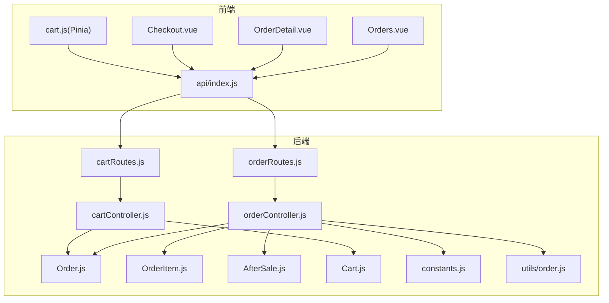
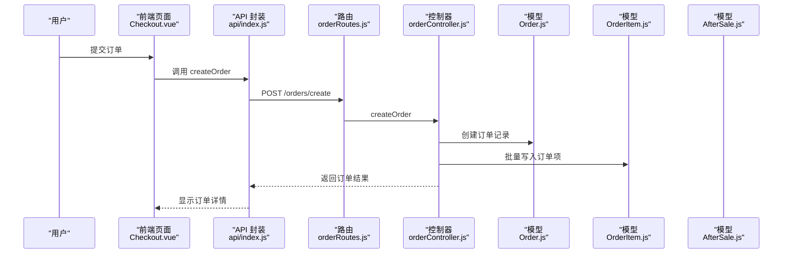
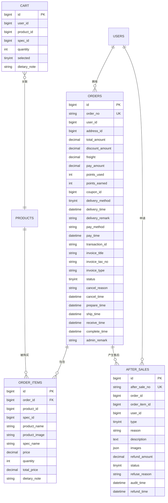
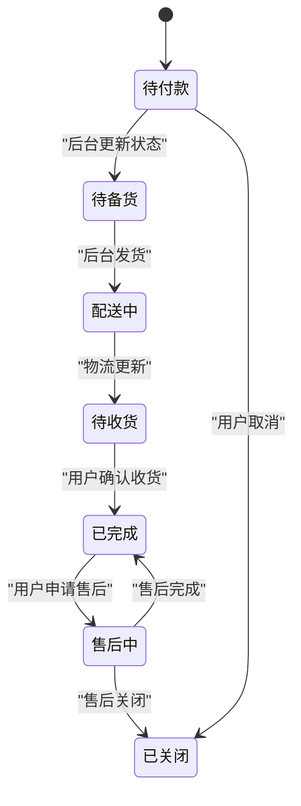
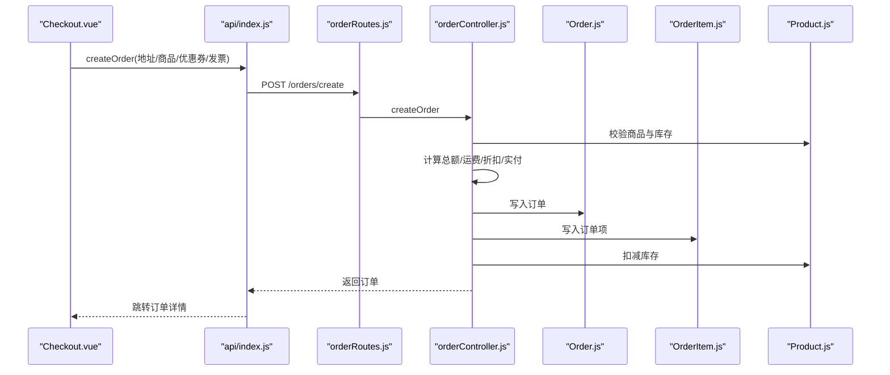
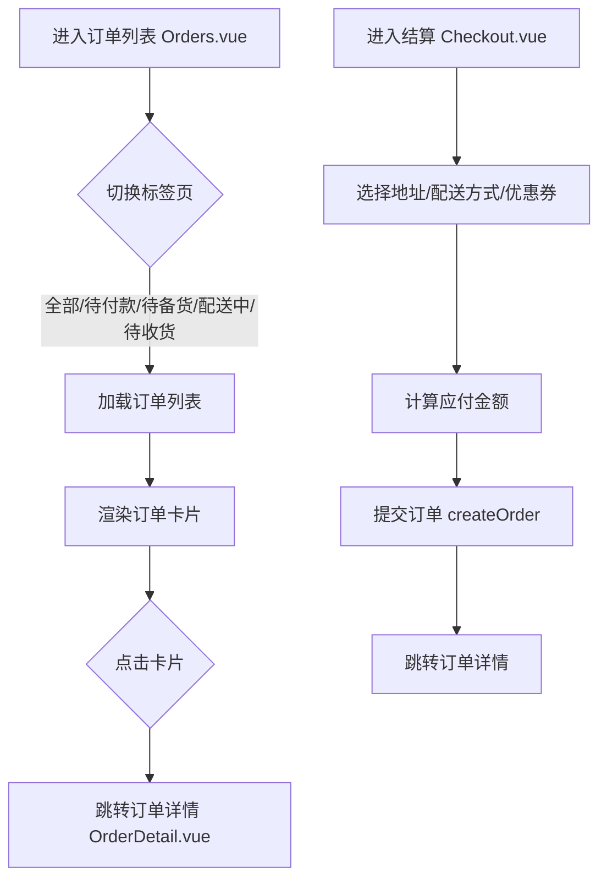
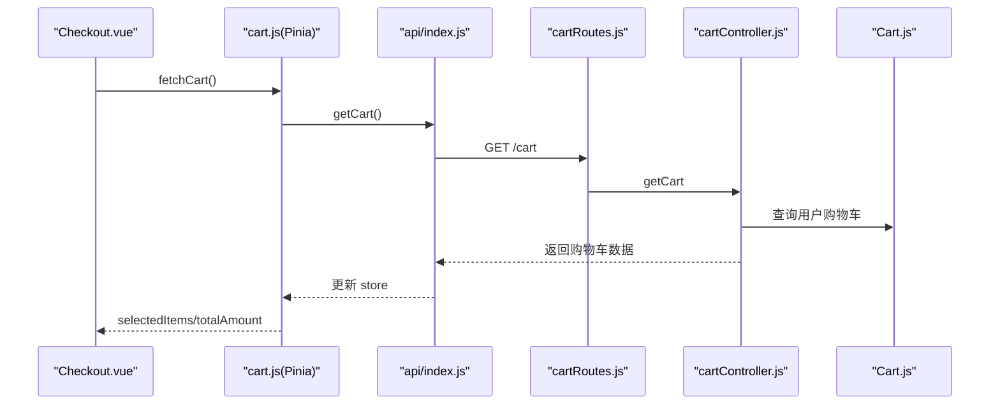
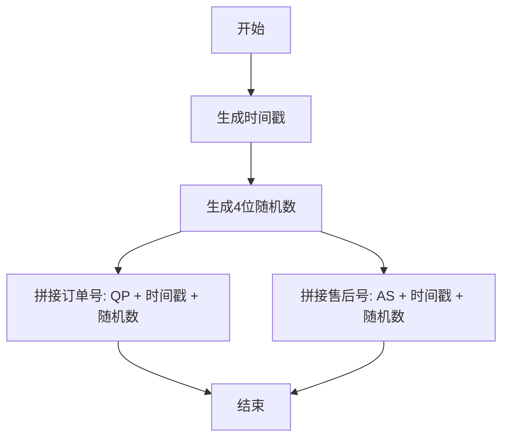
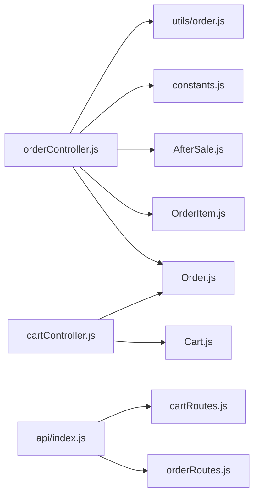

# 订单管理系统

<cite>
**本文引用的文件**
- [Order.js](file://backend/src/models/Order.js)
- [OrderItem.js](file://backend/src/models/OrderItem.js)
- [AfterSale.js](file://backend/src/models/AfterSale.js)
- [Cart.js](file://backend/src/models/Cart.js)
- [orderController.js](file://backend/src/controllers/orderController.js)
- [cartController.js](file://backend/src/controllers/cartController.js)
- [orderRoutes.js](file://backend/src/routes/orderRoutes.js)
- [cartRoutes.js](file://backend/src/routes/cartRoutes.js)
- [constants.js](file://backend/src/config/constants.js)
- [order.js](file://backend/src/utils/order.js)
- [Orders.vue](file://frontend/src/views/Orders.vue)
- [OrderDetail.vue](file://frontend/src/views/OrderDetail.vue)
- [Checkout.vue](file://frontend/src/views/Checkout.vue)
- [cart.js](file://frontend/src/store/cart.js)
- [index.js](file://frontend/src/api/index.js)
</cite>

## 目录
1. [简介](#简介)
2. [项目结构](#项目结构)
3. [核心组件](#核心组件)
4. [架构总览](#架构总览)
5. [详细组件分析](#详细组件分析)
6. [依赖关系分析](#依赖关系分析)
7. [性能考虑](#性能考虑)
8. [故障排查指南](#故障排查指南)
9. [结论](#结论)
10. [附录](#附录)

## 简介
本技术文档围绕订单管理系统展开，覆盖订单创建、支付处理、订单状态管理、售后服务、购物车系统与前端页面实现，并提供完整的订单管理API接口说明。文档同时阐述订单模型与订单项模型设计、订单状态枚举、支付方式、配送信息等字段定义，以及订单号生成规则、数据统计与退款处理等业务逻辑。

## 项目结构
后端采用 Node.js + Express + Sequelize 架构，前端基于 Vue 3 + Vant UI + Pinia 状态管理。订单相关模块分布如下：
- 后端
  - 模型层：Order、OrderItem、AfterSale、Cart
  - 控制器：orderController、cartController
  - 路由：orderRoutes、cartRoutes
  - 配置与工具：constants、order 工具函数
- 前端
  - 视图：Orders、OrderDetail、Checkout
  - 状态管理：cart store
  - API 封装：统一的 API 模块

**图表来源**
- [orderRoutes.js:1-18](file://backend/src/routes/orderRoutes.js#L1-L18)
- [cartRoutes.js:1-13](file://backend/src/routes/cartRoutes.js#L1-L13)
- [orderController.js:1-607](file://backend/src/controllers/orderController.js#L1-L607)
- [cartController.js:1-138](file://backend/src/controllers/cartController.js#L1-L138)
- [Order.js:1-160](file://backend/src/models/Order.js#L1-L160)
- [OrderItem.js:1-68](file://backend/src/models/OrderItem.js#L1-L68)
- [AfterSale.js:1-85](file://backend/src/models/AfterSale.js#L1-L85)
- [Cart.js:1-50](file://backend/src/models/Cart.js#L1-L50)
- [constants.js:1-132](file://backend/src/config/constants.js#L1-L132)
- [order.js:1-16](file://backend/src/utils/order.js#L1-L16)
- [Orders.vue:1-245](file://frontend/src/views/Orders.vue#L1-L245)
- [OrderDetail.vue:1-334](file://frontend/src/views/OrderDetail.vue#L1-L334)
- [Checkout.vue:1-565](file://frontend/src/views/Checkout.vue#L1-L565)
- [cart.js:1-68](file://frontend/src/store/cart.js#L1-L68)
- [index.js:1-136](file://frontend/src/api/index.js#L1-L136)

**章节来源**
- [orderRoutes.js:1-18](file://backend/src/routes/orderRoutes.js#L1-L18)
- [cartRoutes.js:1-13](file://backend/src/routes/cartRoutes.js#L1-L13)
- [orderController.js:1-607](file://backend/src/controllers/orderController.js#L1-L607)
- [cartController.js:1-138](file://backend/src/controllers/cartController.js#L1-L138)
- [Orders.vue:1-245](file://frontend/src/views/Orders.vue#L1-L245)
- [OrderDetail.vue:1-334](file://frontend/src/views/OrderDetail.vue#L1-L334)
- [Checkout.vue:1-565](file://frontend/src/views/Checkout.vue#L1-L565)
- [cart.js:1-68](file://frontend/src/store/cart.js#L1-L68)
- [index.js:1-136](file://frontend/src/api/index.js#L1-L136)

## 核心组件
- 订单模型 Order：定义订单主表字段，包含订单号、用户ID、地址ID、金额、优惠、运费、支付方式、支付时间、第三方交易号、发票信息、订单状态、取消原因与时间、备货/发货/收货/完成时间、管理员备注等。
- 订单项模型 OrderItem：定义订单明细字段，包含订单ID、商品ID、规格ID、商品快照名称与图片、规格快照、单价快照、数量、小计、忌口备注等。
- 售后模型 AfterSale：定义售后单字段，包含售后单号、订单ID、订单项ID、用户ID、售后类型、原因、描述、凭证图片、退款金额、状态、拒绝原因、审核时间、退款时间等。
- 购物车模型 Cart：定义购物车字段，包含用户ID、商品ID、规格ID、数量、是否选中、忌口备注等。
- 订单控制器 orderController：实现订单创建、查询、取消、确认收货、售后申请、评价、后台订单管理与导出等业务逻辑。
- 购物车控制器 cartController：实现购物车查询、添加、更新、删除、清空等操作。
- 前端视图与状态：Orders、OrderDetail、Checkout 页面，Pinia 购物车 store，统一 API 模块封装。

**章节来源**
- [Order.js:1-160](file://backend/src/models/Order.js#L1-L160)
- [OrderItem.js:1-68](file://backend/src/models/OrderItem.js#L1-L68)
- [AfterSale.js:1-85](file://backend/src/models/AfterSale.js#L1-L85)
- [Cart.js:1-50](file://backend/src/models/Cart.js#L1-L50)
- [orderController.js:1-607](file://backend/src/controllers/orderController.js#L1-L607)
- [cartController.js:1-138](file://backend/src/controllers/cartController.js#L1-L138)
- [Orders.vue:1-245](file://frontend/src/views/Orders.vue#L1-L245)
- [OrderDetail.vue:1-334](file://frontend/src/views/OrderDetail.vue#L1-L334)
- [Checkout.vue:1-565](file://frontend/src/views/Checkout.vue#L1-L565)
- [cart.js:1-68](file://frontend/src/store/cart.js#L1-L68)
- [index.js:1-136](file://frontend/src/api/index.js#L1-L136)

## 架构总览
系统采用前后端分离架构，前端通过 API 模块调用后端路由，后端控制器协调模型与数据库进行业务处理。订单状态与售后状态通过常量配置集中管理，订单号与售后号生成采用统一工具函数。

**图表来源**
- [Checkout.vue:240-282](file://frontend/src/views/Checkout.vue#L240-L282)
- [index.js:52-61](file://frontend/src/api/index.js#L52-L61)
- [orderRoutes.js](file://backend/src/routes/orderRoutes.js#L6)
- [orderController.js:6-122](file://backend/src/controllers/orderController.js#L6-L122)
- [Order.js:1-160](file://backend/src/models/Order.js#L1-L160)
- [OrderItem.js:1-68](file://backend/src/models/OrderItem.js#L1-L68)

**章节来源**
- [orderController.js:6-122](file://backend/src/controllers/orderController.js#L6-L122)
- [orderRoutes.js](file://backend/src/routes/orderRoutes.js#L6)
- [index.js:52-61](file://frontend/src/api/index.js#L52-L61)
- [Checkout.vue:240-282](file://frontend/src/views/Checkout.vue#L240-L282)

## 详细组件分析

### 订单模型与订单项模型
- 订单模型 Order 字段涵盖订单号唯一性、用户与地址关联、金额构成（总额、折扣、运费、实付）、积分使用与获取、优惠券关联、配送方式与时段备注、支付方式与第三方交易号、发票信息、订单状态与各节点时间戳、管理员备注等。
- 订单项模型 OrderItem 字段包含订单与商品快照信息（名称、图片、规格），单价与数量、小计与忌口备注，确保订单历史不可变性。
- 常量配置 constants.js 定义了订单状态、售后状态、售后类型、配送方式、优惠券类型、用户优惠券状态等枚举，便于前后端统一约定。

**图表来源**
- [Order.js:1-160](file://backend/src/models/Order.js#L1-L160)
- [OrderItem.js:1-68](file://backend/src/models/OrderItem.js#L1-L68)
- [Cart.js:1-50](file://backend/src/models/Cart.js#L1-L50)
- [AfterSale.js:1-85](file://backend/src/models/AfterSale.js#L1-L85)

**章节来源**
- [Order.js:1-160](file://backend/src/models/Order.js#L1-L160)
- [OrderItem.js:1-68](file://backend/src/models/OrderItem.js#L1-L68)
- [Cart.js:1-50](file://backend/src/models/Cart.js#L1-L50)
- [AfterSale.js:1-85](file://backend/src/models/AfterSale.js#L1-L85)
- [constants.js:2-28](file://backend/src/config/constants.js#L2-L28)

### 订单状态流转机制
- 订单状态枚举：待付款、待备货、配送中、待收货、已完成、售后中、已关闭。
- 状态转换逻辑：
  - 待付款 → 待备货：后台更新状态或支付完成后自动流转（当前控制器未显式实现支付回调，但字段支持支付时间与交易号）。
  - 待备货 → 配送中：后台发货更新状态。
  - 配送中/待收货 → 已完成：用户确认收货。
  - 已完成 → 售后中：用户申请售后。
  - 待付款 → 已关闭：用户取消订单。
- 售后状态：待审核、已审核、已拒绝、退货中、退款中、已完成、已关闭。

**图表来源**
- [constants.js:2-28](file://backend/src/config/constants.js#L2-L28)
- [orderController.js:187-241](file://backend/src/controllers/orderController.js#L187-L241)

**章节来源**
- [constants.js:2-28](file://backend/src/config/constants.js#L2-L28)
- [orderController.js:187-241](file://backend/src/controllers/orderController.js#L187-L241)

### 订单创建流程（含购物车集成）
- 前端 Checkout.vue 从购物车 store 获取选中商品，组装订单请求体（地址ID、商品项、备注、优惠券、配送方式、发票信息）。
- 后端 orderController.createOrder 校验地址、商品库存与状态、计算商品总额、运费（满99免邮）、校验优惠券、计算实付金额、生成订单号、写入订单与订单项、扣减商品库存、标记优惠券使用。
- 前端提交成功后跳转至订单详情页。

**图表来源**
- [Checkout.vue:240-282](file://frontend/src/views/Checkout.vue#L240-L282)
- [index.js:52-61](file://frontend/src/api/index.js#L52-L61)
- [orderRoutes.js](file://backend/src/routes/orderRoutes.js#L6)
- [orderController.js:6-122](file://backend/src/controllers/orderController.js#L6-L122)
- [Order.js:1-160](file://backend/src/models/Order.js#L1-L160)
- [OrderItem.js:1-68](file://backend/src/models/OrderItem.js#L1-L68)

**章节来源**
- [Checkout.vue:240-282](file://frontend/src/views/Checkout.vue#L240-L282)
- [orderController.js:6-122](file://backend/src/controllers/orderController.js#L6-L122)

### 前端订单页面实现
- 订单列表 Orders.vue：展示订单卡片、状态标签、商品缩略图与数量、合计金额，根据状态显示操作按钮（去支付、取消订单、确认收货、去评价、申请售后）。支持按状态筛选与分页加载。
- 订单详情 OrderDetail.vue：展示收货地址、商品清单、订单信息（配送方式/时段）、费用明细（商品金额、运费、优惠、实付），底部根据状态显示对应操作按钮。
- 结算页 Checkout.vue：选择地址、配送方式与时段、展示商品清单、选择优惠券、填写发票信息、计算应付金额、提交订单。

**图表来源**
- [Orders.vue:1-245](file://frontend/src/views/Orders.vue#L1-L245)
- [OrderDetail.vue:1-334](file://frontend/src/views/OrderDetail.vue#L1-L334)
- [Checkout.vue:1-565](file://frontend/src/views/Checkout.vue#L1-L565)

**章节来源**
- [Orders.vue:1-245](file://frontend/src/views/Orders.vue#L1-L245)
- [OrderDetail.vue:1-334](file://frontend/src/views/OrderDetail.vue#L1-L334)
- [Checkout.vue:1-565](file://frontend/src/views/Checkout.vue#L1-L565)

### 购物车系统实现
- 购物车模型 Cart：存储用户、商品、规格、数量、是否选中、忌口备注。
- 购物车控制器 cartController：提供获取、添加、更新、删除、清空接口；计算选中商品总价与选中数量。
- 前端购物车 store：封装获取、添加、更新、删除接口，计算选中项与总价；Checkout.vue 在提交前会拉取购物车数据以确保最新状态。

**图表来源**
- [Checkout.vue:284-290](file://frontend/src/views/Checkout.vue#L284-L290)
- [cart.js:17-25](file://frontend/src/store/cart.js#L17-L25)
- [index.js:44-50](file://frontend/src/api/index.js#L44-L50)
- [cartRoutes.js](file://backend/src/routes/cartRoutes.js#L6)
- [cartController.js:4-35](file://backend/src/controllers/cartController.js#L4-L35)
- [Cart.js:1-50](file://backend/src/models/Cart.js#L1-L50)

**章节来源**
- [cartController.js:1-138](file://backend/src/controllers/cartController.js#L1-L138)
- [cart.js:1-68](file://frontend/src/store/cart.js#L1-L68)
- [Checkout.vue:284-290](file://frontend/src/views/Checkout.vue#L284-L290)

### 订单号与售后号生成规则
- 订单号：采用“QP + 时间戳 + 4位随机数”格式，确保全局唯一性与可读性。
- 售后号：采用“AS + 时间戳 + 4位随机数”格式，便于区分与追踪。

**图表来源**
- [order.js:3-13](file://backend/src/utils/order.js#L3-L13)

**章节来源**
- [order.js:1-16](file://backend/src/utils/order.js#L1-L16)

### 售后与退款处理
- 用户在订单完成后可申请售后，提交售后类型、原因、图片等信息，状态初始为待审核。
- 后台可查看售后列表、查看详情、更新状态、导出售后数据。
- 退款金额与退款时间字段可用于财务对账与审计。

**章节来源**
- [orderController.js:243-294](file://backend/src/controllers/orderController.js#L243-L294)
- [AfterSale.js:1-85](file://backend/src/models/AfterSale.js#L1-L85)

## 依赖关系分析
- 订单控制器依赖模型 Order、OrderItem、Product、UserAddress、AfterSale、Review、UserCoupon、Coupon，用于订单创建、查询、状态更新与导出。
- 购物车控制器依赖模型 Cart、Product，用于购物车操作与库存扣减联动。
- 前端 API 模块统一封装请求方法，分别映射到后端路由。
- 常量配置集中定义状态与枚举，避免硬编码，提升一致性。

**图表来源**
- [orderController.js:1-6](file://backend/src/controllers/orderController.js#L1-L6)
- [cartController.js:1-2](file://backend/src/controllers/cartController.js#L1-L2)
- [Order.js:1-2](file://backend/src/models/Order.js#L1-L2)
- [OrderItem.js:1-2](file://backend/src/models/OrderItem.js#L1-L2)
- [AfterSale.js:1-2](file://backend/src/models/AfterSale.js#L1-L2)
- [Cart.js:1-2](file://backend/src/models/Cart.js#L1-L2)
- [constants.js:1-132](file://backend/src/config/constants.js#L1-L132)
- [order.js:1-16](file://backend/src/utils/order.js#L1-L16)
- [index.js:52-61](file://frontend/src/api/index.js#L52-L61)
- [orderRoutes.js:1-18](file://backend/src/routes/orderRoutes.js#L1-L18)
- [cartRoutes.js:1-13](file://backend/src/routes/cartRoutes.js#L1-L13)

**章节来源**
- [orderController.js:1-6](file://backend/src/controllers/orderController.js#L1-L6)
- [cartController.js:1-2](file://backend/src/controllers/cartController.js#L1-L2)
- [index.js:52-61](file://frontend/src/api/index.js#L52-L61)

## 性能考虑
- 数据库层面：订单号与售后号设置唯一索引，减少重复与冲突；订单与订单项采用分表设计，便于查询与统计。
- 接口层面：分页查询（page/pageSize）控制返回数据量；导出订单使用 Excel 流式输出，避免内存峰值过高。
- 前端层面：Pinia store 缓存购物车数据，减少重复请求；订单列表按状态筛选，降低渲染压力。
- 业务层面：库存扣减与恢复在事务内执行，防止超卖；运费策略简单明确，便于前端实时计算。

## 故障排查指南
- 订单创建失败
  - 检查地址是否存在且归属当前用户。
  - 校验商品是否存在、状态正常且库存充足。
  - 优惠券是否有效、未过期、满足最低消费。
  - 订单号生成是否冲突（唯一索引约束）。
- 取消订单失败
  - 确认订单状态为待付款，否则不允许取消。
  - 检查库存回退是否成功。
- 确认收货失败
  - 确认订单状态为待收货或配送中。
- 售后申请失败
  - 订单状态需为已完成。
  - 图片上传与 JSON 存储格式正确。
- 导出订单异常
  - 捕获导出异常并回退输出提示表格，避免前端空白。

**章节来源**
- [orderController.js:187-294](file://backend/src/controllers/orderController.js#L187-L294)

## 结论
本订单管理系统通过清晰的模型设计、完善的业务流程与前后端协同，实现了从购物车到订单创建、状态流转、售后处理的全链路闭环。常量与工具函数提升了代码一致性与可维护性，前端页面提供了良好的用户体验。后续可在支付回调、库存并发控制、订单统计报表等方面进一步优化。

## 附录

### 订单管理 API 接口文档
- 订单创建
  - 方法：POST
  - 路径：/orders/create
  - 请求体字段：address_id、items（数组，包含 product_id、quantity、spec_name）、remark、user_coupon_id、delivery_method、invoice_type、invoice_title、invoice_tax_no
  - 响应：订单对象
- 获取订单列表
  - 方法：GET
  - 路径：/orders
  - 查询参数：page、pageSize、status
  - 响应：分页数据（data、total、page、pageSize）
- 获取订单详情
  - 方法：GET
  - 路径：/orders/:id
  - 响应：订单详情（包含 items 与 address）
- 取消订单
  - 方法：PUT
  - 路径：/orders/:id/cancel
  - 请求体：reason
  - 响应：取消结果
- 确认收货
  - 方法：PUT
  - 路径：/orders/:id/confirm
  - 响应：确认结果
- 售后申请
  - 方法：POST
  - 路径：/orders/after-sales
  - 请求体：order_id、order_item_id、type、reason、images
  - 响应：售后单对象
- 售后列表
  - 方法：GET
  - 路径：/orders/after-sales/list
  - 查询参数：page、pageSize
  - 响应：分页数据
- 评价创建
  - 方法：POST
  - 路径：/orders/reviews
  - 请求体：order_item_id、rating、content、images
  - 响应：评价对象

**章节来源**
- [orderRoutes.js:6-15](file://backend/src/routes/orderRoutes.js#L6-L15)
- [index.js:52-61](file://frontend/src/api/index.js#L52-L61)
- [orderController.js:6-333](file://backend/src/controllers/orderController.js#L6-L333)