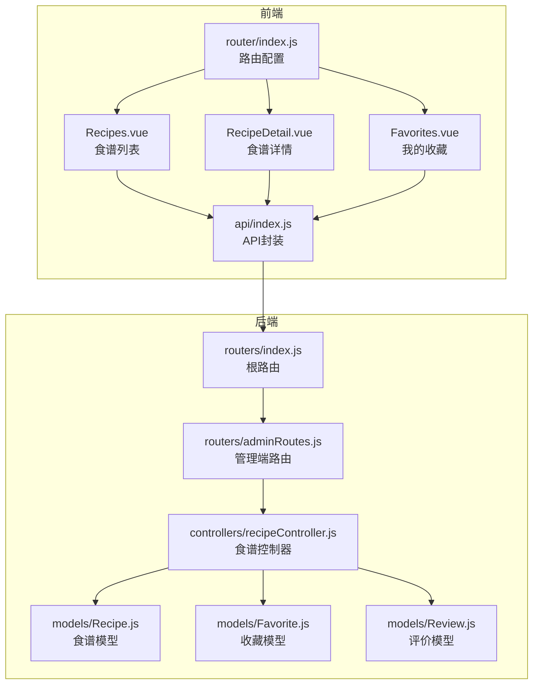
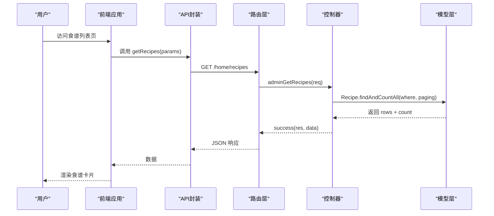
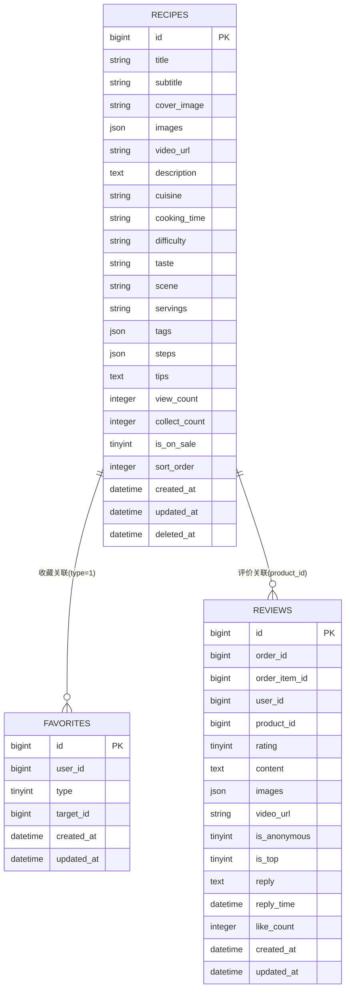
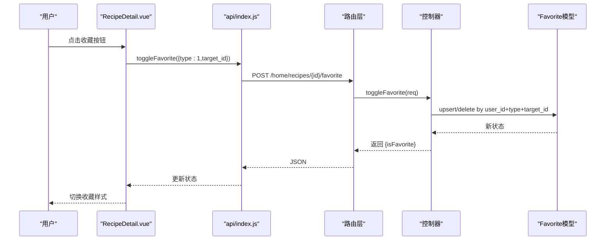
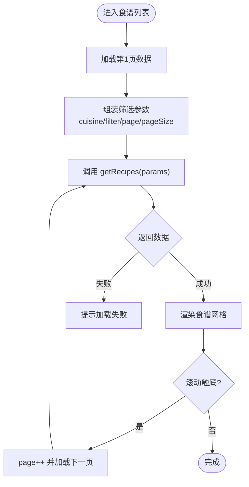
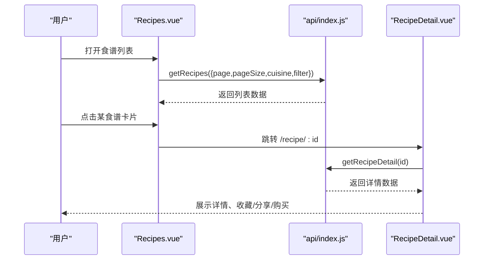
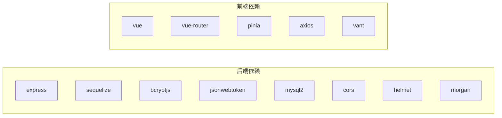

# 食谱管理系统

<cite>
**本文档引用的文件**
- [backend/src/models/Recipe.js](file://backend/src/models/Recipe.js)
- [backend/src/models/Favorite.js](file://backend/src/models/Favorite.js)
- [backend/src/models/Review.js](file://backend/src/models/Review.js)
- [backend/src/controllers/recipeController.js](file://backend/src/controllers/recipeController.js)
- [backend/src/routers/index.js](file://backend/src/routers/index.js)
- [backend/src/routers/adminRoutes.js](file://backend/src/routers/adminRoutes.js)
- [frontend/src/views/Recipes.vue](file://frontend/src/views/Recipes.vue)
- [frontend/src/views/RecipeDetail.vue](file://frontend/src/views/RecipeDetail.vue)
- [frontend/src/views/Favorites.vue](file://frontend/src/views/Favorites.vue)
- [frontend/src/api/index.js](file://frontend/src/api/index.js)
- [frontend/src/router/index.js](file://frontend/src/router/index.js)
- [backend/package.json](file://backend/package.json)
- [frontend/package.json](file://frontend/package.json)
</cite>

## 目录
1. [简介](#简介)
2. [项目结构](#项目结构)
3. [核心组件](#核心组件)
4. [架构总览](#架构总览)
5. [详细组件分析](#详细组件分析)
6. [依赖分析](#依赖分析)
7. [性能考虑](#性能考虑)
8. [故障排查指南](#故障排查指南)
9. [结论](#结论)
10. [附录](#附录)

## 简介
本项目是一个基于 Node.js + Express + Vue 3 的食谱管理系统，涵盖食谱展示、详情查看、收藏管理、评论互动等核心功能。后端使用 Sequelize 进行数据库建模与 ORM 操作，前端采用 Vant 移动端 UI 组件库构建移动端页面。系统支持管理员后台对食谱进行增删改查，并提供用户侧的食谱浏览、收藏、购买食材等体验。

## 项目结构
后端采用分层架构：路由层（routers）、控制器层（controllers）、模型层（models）、工具与中间件层（utils/middlewares）。前端采用 Vue 3 单页应用结构，通过路由组织页面，使用 Pinia 管理状态，Vant 提供 UI 组件。

**图表来源**
- [frontend/src/views/Recipes.vue:1-228](file://frontend/src/views/Recipes.vue#L1-L228)
- [frontend/src/views/RecipeDetail.vue:1-328](file://frontend/src/views/RecipeDetail.vue#L1-L328)
- [frontend/src/views/Favorites.vue:1-144](file://frontend/src/views/Favorites.vue#L1-L144)
- [frontend/src/router/index.js:1-192](file://frontend/src/router/index.js#L1-L192)
- [frontend/src/api/index.js:1-136](file://frontend/src/api/index.js#L1-L136)
- [backend/src/routers/index.js:1-27](file://backend/src/routers/index.js#L1-L27)
- [backend/src/routers/adminRoutes.js:1-80](file://backend/src/routers/adminRoutes.js#L1-L80)
- [backend/src/controllers/recipeController.js:1-126](file://backend/src/controllers/recipeController.js#L1-L126)
- [backend/src/models/Recipe.js:1-124](file://backend/src/models/Recipe.js#L1-L124)
- [backend/src/models/Favorite.js:1-33](file://backend/src/models/Favorite.js#L1-L33)
- [backend/src/models/Review.js:1-86](file://backend/src/models/Review.js#L1-L86)

**章节来源**
- [backend/src/routers/index.js:1-27](file://backend/src/routers/index.js#L1-L27)
- [backend/src/routers/adminRoutes.js:1-80](file://backend/src/routers/adminRoutes.js#L1-L80)
- [frontend/src/router/index.js:1-192](file://frontend/src/router/index.js#L1-L192)
- [frontend/src/api/index.js:1-136](file://frontend/src/api/index.js#L1-L136)

## 核心组件
- 食谱模型（Recipe）：定义食谱标题、描述、步骤、图片、食材清单、烹饪时长、难度、口味、适用人数、标签、浏览量、收藏量、上下架状态、排序等字段。
- 收藏模型（Favorite）：统一收藏机制，支持多种类型（如商品、食谱），通过 type 和 target_id 关联不同实体。
- 评价模型（Review）：用于商品评价，包含评分、内容、图片、视频、匿名、置顶、回复等字段。
- 食谱控制器（recipeController）：提供管理员端的食谱增删改查接口；前端通过 home/recipes 接口获取食谱列表与详情。
- 前端视图：Recipes.vue（食谱列表）、RecipeDetail.vue（食谱详情与收藏/分享/购买）、Favorites.vue（收藏列表）。
- 前端路由与 API 封装：router/index.js 定义页面路由；api/index.js 封装请求方法，统一调用后端接口。

**章节来源**
- [backend/src/models/Recipe.js:1-124](file://backend/src/models/Recipe.js#L1-L124)
- [backend/src/models/Favorite.js:1-33](file://backend/src/models/Favorite.js#L1-L33)
- [backend/src/models/Review.js:1-86](file://backend/src/models/Review.js#L1-L86)
- [backend/src/controllers/recipeController.js:1-126](file://backend/src/controllers/recipeController.js#L1-L126)
- [frontend/src/views/Recipes.vue:1-228](file://frontend/src/views/Recipes.vue#L1-L228)
- [frontend/src/views/RecipeDetail.vue:1-328](file://frontend/src/views/RecipeDetail.vue#L1-L328)
- [frontend/src/views/Favorites.vue:1-144](file://frontend/src/views/Favorites.vue#L1-L144)
- [frontend/src/router/index.js:1-192](file://frontend/src/router/index.js#L1-L192)
- [frontend/src/api/index.js:1-136](file://frontend/src/api/index.js#L1-L136)

## 架构总览
系统采用前后端分离架构，前端通过 axios 发起 HTTP 请求，后端使用 Express 提供 RESTful 接口。路由层负责将请求分发到对应控制器，控制器调用模型层进行数据库操作，最终返回统一格式的响应。

**图表来源**
- [frontend/src/api/index.js:14-17](file://frontend/src/api/index.js#L14-L17)
- [backend/src/routers/adminRoutes.js:60-64](file://backend/src/routers/adminRoutes.js#L60-L64)
- [backend/src/controllers/recipeController.js:5-31](file://backend/src/controllers/recipeController.js#L5-L31)
- [backend/src/models/Recipe.js:1-124](file://backend/src/models/Recipe.js#L1-L124)

**章节来源**
- [backend/src/routers/adminRoutes.js:1-80](file://backend/src/routers/adminRoutes.js#L1-L80)
- [backend/src/controllers/recipeController.js:1-126](file://backend/src/controllers/recipeController.js#L1-L126)
- [frontend/src/api/index.js:1-136](file://frontend/src/api/index.js#L1-L136)

## 详细组件分析

### 食谱模型设计与关系映射
- 字段定义：标题、副标题、封面图、多图、视频链接、描述、菜系、烹饪时长、难度、口味、场景、适用人数、标签（JSON）、步骤（JSON）、小贴士、浏览量、收藏量、上下架状态、排序、软删除时间戳。
- 关系映射：食谱与收藏之间通过 Favorite 表的 type=1、target_id 关联；食谱与评价之间通过 Review 表的 product_id 关联（注意：当前 Review 模型字段为 product_id，若用于食谱评价需调整）。
- 设计要点：使用 JSON 字段存储步骤与食材清单，便于灵活展示；使用软删除（paranoid）支持逻辑删除；使用排序字段控制展示顺序。

**图表来源**
- [backend/src/models/Recipe.js:1-124](file://backend/src/models/Recipe.js#L1-L124)
- [backend/src/models/Favorite.js:1-33](file://backend/src/models/Favorite.js#L1-L33)
- [backend/src/models/Review.js:1-86](file://backend/src/models/Review.js#L1-L86)

**章节来源**
- [backend/src/models/Recipe.js:1-124](file://backend/src/models/Recipe.js#L1-L124)
- [backend/src/models/Favorite.js:1-33](file://backend/src/models/Favorite.js#L1-L33)
- [backend/src/models/Review.js:1-86](file://backend/src/models/Review.js#L1-L86)

### 收藏功能实现机制
- 收藏表设计：统一的收藏表，通过 type 区分收藏对象类型（如 0 商品、1 食谱），target_id 指向具体实体 ID。
- 状态管理：前端在详情页根据接口返回的 isFavorite 控制收藏按钮状态；收藏/取消收藏通过 toggleFavorite 接口切换。
- 列表展示：收藏页按 type 分类展示商品与食谱两类收藏，支持删除单项收藏。

**图表来源**
- [frontend/src/views/RecipeDetail.vue:112-123](file://frontend/src/views/RecipeDetail.vue#L112-L123)
- [frontend/src/api/index.js:14-17](file://frontend/src/api/index.js#L14-L17)
- [backend/src/routers/adminRoutes.js:60-64](file://backend/src/routers/adminRoutes.js#L60-L64)
- [backend/src/models/Favorite.js:1-33](file://backend/src/models/Favorite.js#L1-L33)

**章节来源**
- [frontend/src/views/RecipeDetail.vue:1-328](file://frontend/src/views/RecipeDetail.vue#L1-L328)
- [frontend/src/views/Favorites.vue:1-144](file://frontend/src/views/Favorites.vue#L1-L144)
- [frontend/src/api/index.js:1-136](file://frontend/src/api/index.js#L1-L136)
- [backend/src/models/Favorite.js:1-33](file://backend/src/models/Favorite.js#L1-L33)

### 食谱搜索与筛选
- 前端筛选：Recipes.vue 提供菜系标签与自定义标签（如“快速”、“低卡”、“儿童”、“新手”）筛选，通过 params.cuisine 与 params.filter 传递给后端。
- 后端查询：recipeController.adminGetRecipes 支持 keyword 搜索标题，分页查询（page、pageSize），按创建时间倒序。
- 扩展建议：可在后端增加按难度、烹饪时长、标签等条件过滤，前端配合多维度筛选器。

**图表来源**
- [frontend/src/views/Recipes.vue:85-117](file://frontend/src/views/Recipes.vue#L85-L117)
- [frontend/src/api/index.js:14-17](file://frontend/src/api/index.js#L14-L17)
- [backend/src/controllers/recipeController.js:7-26](file://backend/src/controllers/recipeController.js#L7-L26)

**章节来源**
- [frontend/src/views/Recipes.vue:1-228](file://frontend/src/views/Recipes.vue#L1-L228)
- [backend/src/controllers/recipeController.js:1-126](file://backend/src/controllers/recipeController.js#L1-L126)

### 前端食谱页面实现
- 食谱列表页（Recipes.vue）
  - 使用 Vant Tabs 实现菜系筛选，使用 Tag 实现标签筛选。
  - 支持分页加载与触底加载更多。
  - 点击卡片跳转至食谱详情页，支持一键购买食材（需登录态）。
- 食谱详情页（RecipeDetail.vue）
  - 展示封面图、标题、烹饪时长、难度、适用人数。
  - 渲染食材清单与烹饪步骤（含步骤图）。
  - 收藏按钮与分享按钮（提示开发中），支持一键购买食材。
- 我的收藏页（Favorites.vue）
  - 分类展示商品与食谱两类收藏，支持删除单项收藏。

**图表来源**
- [frontend/src/views/Recipes.vue:28-46](file://frontend/src/views/Recipes.vue#L28-L46)
- [frontend/src/views/RecipeDetail.vue:101-110](file://frontend/src/views/RecipeDetail.vue#L101-L110)
- [frontend/src/api/index.js:14-17](file://frontend/src/api/index.js#L14-L17)
- [frontend/src/router/index.js:46-49](file://frontend/src/router/index.js#L46-L49)

**章节来源**
- [frontend/src/views/Recipes.vue:1-228](file://frontend/src/views/Recipes.vue#L1-L228)
- [frontend/src/views/RecipeDetail.vue:1-328](file://frontend/src/views/RecipeDetail.vue#L1-L328)
- [frontend/src/views/Favorites.vue:1-144](file://frontend/src/views/Favorites.vue#L1-L144)
- [frontend/src/router/index.js:1-192](file://frontend/src/router/index.js#L1-L192)

### 食谱管理 API 接口文档
以下为与食谱相关的接口定义（以实际代码为准）：

- 获取食谱列表
  - 方法：GET
  - 路径：/admin/recipes
  - 查询参数：page、pageSize、keyword
  - 返回：分页数据（rows + count）
- 获取食谱详情
  - 方法：GET
  - 路径：/admin/recipes/:id
  - 返回：单个食谱对象
- 创建食谱
  - 方法：POST
  - 路径：/admin/recipes
  - 请求体：title、description、cover_image、cooking_time、difficulty、ingredients、steps、tips、status
  - 返回：创建后的食谱对象
- 更新食谱
  - 方法：PUT
  - 路径：/admin/recipes/:id
  - 请求体：同创建，支持部分字段更新
  - 返回：更新后的食谱对象
- 删除食谱
  - 方法：DELETE
  - 路径：/admin/recipes/:id
  - 返回：删除成功消息

- 前端调用（home/recipes）
  - 获取列表：GET /home/recipes
  - 获取详情：GET /home/recipes/:id

**章节来源**
- [backend/src/routers/adminRoutes.js:60-64](file://backend/src/routers/adminRoutes.js#L60-L64)
- [backend/src/controllers/recipeController.js:5-117](file://backend/src/controllers/recipeController.js#L5-L117)
- [frontend/src/api/index.js:14-17](file://frontend/src/api/index.js#L14-L17)

### 评分系统与评论功能（实现思路）
- 当前 Review 模型字段为 product_id，若用于食谱评价，需扩展字段（如 recipe_id）或引入新的实体关联。
- 评分字段 rating（tinyint）与内容 content（text）可直接复用；支持匿名、置顶、回复、点赞等能力。
- 建议在食谱详情页增加“评价”入口，展示评价列表与评分统计。

**章节来源**
- [backend/src/models/Review.js:1-86](file://backend/src/models/Review.js#L1-L86)

### 食谱分享机制（实现思路）
- 前端 RecipeDetail.vue 中分享按钮目前提示“开发中”，可集成浏览器原生分享 API 或第三方分享组件。
- 可在后端增加分享次数统计字段，便于运营分析。

**章节来源**
- [frontend/src/views/RecipeDetail.vue:125-127](file://frontend/src/views/RecipeDetail.vue#L125-L127)

## 依赖分析
- 后端依赖：Express、Sequelize、bcryptjs、jsonwebtoken、mysql2、cors、helmet、morgan 等，提供 Web 服务、ORM、鉴权、日志与安全能力。
- 前端依赖：Vue 3、Vue Router、Pinia、Axios、Vant，提供响应式 UI、路由导航、状态管理与网络请求。

**图表来源**
- [backend/package.json:18-40](file://backend/package.json#L18-L40)
- [frontend/package.json:10-24](file://frontend/package.json#L10-L24)

**章节来源**
- [backend/package.json:1-50](file://backend/package.json#L1-L50)
- [frontend/package.json:1-26](file://frontend/package.json#L1-L26)

## 性能考虑
- 分页查询：后端已实现分页（offset/limit），前端应避免一次性加载过多数据，结合“触底加载”策略。
- 图片优化：封面图与步骤图建议使用 CDN 与懒加载，减少首屏压力。
- 缓存策略：可引入 Redis 缓存热门食谱列表与详情，降低数据库压力。
- 数据库索引：对常用查询字段（如 title、cuisine、created_at）建立索引，提升检索效率。
- 前端渲染：列表卡片与详情页尽量使用虚拟滚动与图片压缩，提升交互流畅度。

## 故障排查指南
- 登录态校验失败
  - 现象：访问需要登录的页面被重定向至登录页。
  - 排查：检查本地存储 app_token 与 app_user 是否存在且有效；路由守卫会校验 token 与用户信息。
- 收藏状态异常
  - 现象：收藏/取消收藏后按钮状态不变化。
  - 排查：确认 toggleFavorite 接口返回的 isFavorite 字段是否正确；检查收藏表是否按 user_id+type+target_id 唯一约束。
- 食谱列表为空
  - 现象：筛选后无数据。
  - 排查：确认 params.cuisine 与 params.filter 参数是否正确传入；后端 keyword 搜索仅匹配标题。
- 详情页加载失败
  - 现象：点击食谱卡片无法进入详情。
  - 排查：确认路由配置 /recipe/:id 是否正确；检查 getRecipeDetail 接口是否可用。

**章节来源**
- [frontend/src/router/index.js:155-189](file://frontend/src/router/index.js#L155-L189)
- [frontend/src/views/RecipeDetail.vue:101-110](file://frontend/src/views/RecipeDetail.vue#L101-L110)
- [frontend/src/views/Recipes.vue:85-117](file://frontend/src/views/Recipes.vue#L85-L117)

## 结论
本系统通过清晰的前后端分层与统一的 API 设计，实现了食谱的展示、详情、收藏与购买等核心功能。模型层以 JSON 字段灵活承载步骤与食材清单，路由与控制器职责明确，前端页面交互友好。后续可在评价体系、分享机制、搜索与筛选能力等方面进一步完善，以提升用户体验与运营效率。

## 附录
- 开发环境启动
  - 后端：npm run dev
  - 前端：npm run dev
- 数据库初始化
  - 使用数据库脚本初始化表结构，确保 recipes、favorites、reviews 等表存在
- 管理后台
  - 管理员登录路径：/admin/login；管理端路由位于 /admin 下