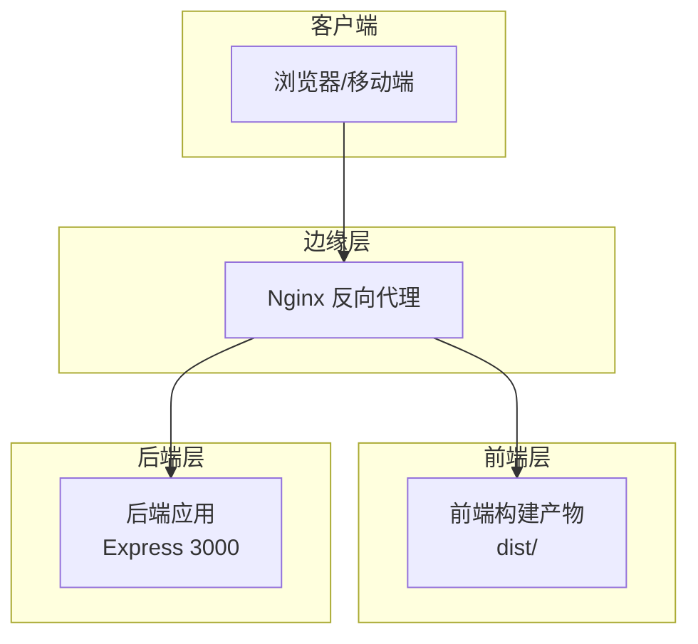
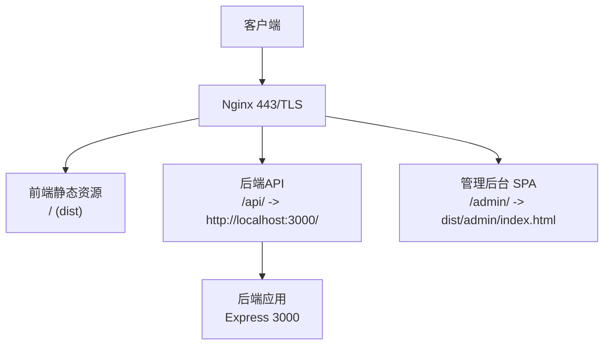
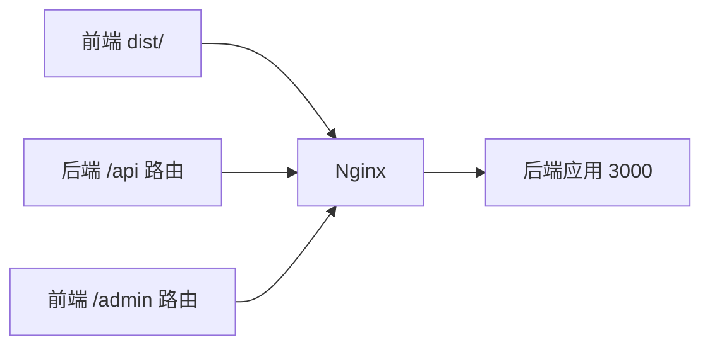

# Nginx配置

<cite>
**本文引用的文件**
- [docs/deploy.md](file://docs/deploy.md)
- [frontend/vite.config.js](file://frontend/vite.config.js)
- [backend/src/app.js](file://backend/src/app.js)
- [backend/src/routes/index.js](file://backend/src/routes/index.js)
- [frontend/src/router/index.js](file://frontend/src/router/index.js)
- [frontend/src/admin/views/Home.vue](file://frontend/src/admin/views/Home.vue)
- [backend/src/models/Config.js](file://backend/src/models/Config.js)
- [backend/src/controllers/settingsController.js](file://backend/src/controllers/settingsController.js)
</cite>

## 目录
1. [简介](#简介)
2. [项目结构](#项目结构)
3. [核心组件](#核心组件)
4. [架构总览](#架构总览)
5. [详细组件分析](#详细组件分析)
6. [依赖关系分析](#依赖关系分析)
7. [性能考虑](#性能考虑)
8. [故障排查指南](#故障排查指南)
9. [结论](#结论)
10. [附录](#附录)

## 简介
本指南面向趣配鲜项目的运维与开发人员，提供基于仓库现有部署文档的Nginx反向代理配置方案。内容涵盖：
- 虚拟主机与HTTP到HTTPS重定向
- 前端静态资源服务、后端API代理转发、管理后台路由
- location块配置要点（缓存、超时、SPA路由回退）
- SSL证书配置与加密协议
- 配置验证与重启命令
- 性能优化建议（Gzip、缓存策略）
- 常见问题排查思路

## 项目结构
从仓库中可见，前端通过Vite构建产物输出至dist目录；后端Express应用监听本地端口并通过统一前缀对外提供API；部署文档中给出了完整的Nginx虚拟主机示例，覆盖静态资源、API代理、管理后台路由、SSL与日志等。

**章节来源**
- [docs/deploy.md:205-263](file://docs/deploy.md#L205-L263)
- [frontend/vite.config.js:21-25](file://frontend/vite.config.js#L21-L25)
- [backend/src/app.js:49-50](file://backend/src/app.js#L49-L50)

## 核心组件
- 虚拟主机与重定向：一个监听80端口的server负责将所有请求重定向至HTTPS。
- HTTPS站点：监听443端口，启用SSL，配置证书路径与加密套件。
- 前端静态资源：根路径返回dist中的HTML，并使用try_files实现SPA回退；对静态资源设置长期缓存头。
- API代理：/api前缀代理至后端3000端口，传递真实客户端IP与协议头，设置超时。
- 管理后台：/admin前缀指向dist中的管理后台入口，同样使用SPA回退。
- 日志：分别记录访问与错误日志。

**章节来源**
- [docs/deploy.md:205-263](file://docs/deploy.md#L205-L263)

## 架构总览
下图展示了Nginx作为统一入口，将不同路径的流量分发到前端静态资源、后端API或管理后台的典型拓扑。

**图表来源**
- [docs/deploy.md:205-263](file://docs/deploy.md#L205-L263)
- [backend/src/app.js:49-50](file://backend/src/app.js#L49-L50)

## 详细组件分析

### 虚拟主机与HTTP到HTTPS重定向
- 80端口server仅做重定向，避免明文传输。
- 443端口server启用SSL，配置证书与加密协议版本。

**章节来源**
- [docs/deploy.md:205-214](file://docs/deploy.md#L205-L214)
- [docs/deploy.md:216-225](file://docs/deploy.md#L216-L225)

### 前端静态资源与SPA回退
- 根路径location返回dist目录，index为index.html。
- try_files优先命中实际文件，否则回退到index.html，支持Vue Router的history模式。
- 对JS/CSS/PNG/JPG/GIF/ICO/SVG等静态资源设置一年缓存与immutable标志。

**章节来源**
- [docs/deploy.md:226-237](file://docs/deploy.md#L226-L237)

### 后端API代理
- /api前缀代理到后端3000端口。
- 传递Host、X-Real-IP、X-Forwarded-For、X-Forwarded-Proto，便于后端记录真实来源与协议。
- 设置连接、发送与读取超时均为60秒。

**章节来源**
- [docs/deploy.md:239-251](file://docs/deploy.md#L239-L251)
- [backend/src/app.js:49-50](file://backend/src/app.js#L49-L50)

### 管理后台路由
- /admin前缀指向dist目录，index为index.html。
- try_files实现SPA回退，确保管理后台子路由可直接访问。

**章节来源**
- [docs/deploy.md:253-258](file://docs/deploy.md#L253-L258)
- [frontend/src/router/index.js:131-147](file://frontend/src/router/index.js#L131-L147)

### SSL证书与加密协议
- 证书与私钥路径按部署文档配置。
- 支持TLSv1.2与TLSv1.3，使用高强度密码套件。

**章节来源**
- [docs/deploy.md:221-224](file://docs/deploy.md#L221-L224)

### 日志与健康检查
- 访问日志与错误日志分别落盘。
- 后端提供/health接口用于健康检查（可由Nginx探活使用）。

**章节来源**
- [docs/deploy.md:260-262](file://docs/deploy.md#L260-L262)
- [backend/src/routes/index.js:18-24](file://backend/src/routes/index.js#L18-L24)

### 前端开发代理与生产差异
- Vite开发服务器通过代理将/api前缀转发至后端3000端口，便于本地联调。
- 生产环境由Nginx统一代理，无需Vite代理参与。

**章节来源**
- [frontend/vite.config.js:12-20](file://frontend/vite.config.js#L12-L20)
- [docs/deploy.md:239-251](file://docs/deploy.md#L239-L251)

### 管理后台前端路由与菜单
- 管理后台路由以/admin开头，包含多级子路由。
- 前端Home组件定义了主要菜单项，对应/admin下的各功能页。

**章节来源**
- [frontend/src/router/index.js:131-147](file://frontend/src/router/index.js#L131-L147)
- [frontend/src/admin/views/Home.vue:55-65](file://frontend/src/admin/views/Home.vue#L55-L65)

## 依赖关系分析
- Nginx依赖后端API前缀与Express路由前缀保持一致，当前为/api。
- 前端构建产物位于dist目录，Nginx需指向该目录提供静态资源。
- 管理后台路由与前端路由约定一致，均以/admin开头。

**图表来源**
- [docs/deploy.md:226-258](file://docs/deploy.md#L226-L258)
- [backend/src/app.js:49-50](file://backend/src/app.js#L49-L50)
- [frontend/src/router/index.js:131-147](file://frontend/src/router/index.js#L131-L147)

**章节来源**
- [backend/src/routes/index.js:11-16](file://backend/src/routes/index.js#L11-L16)
- [frontend/vite.config.js:21-25](file://frontend/vite.config.js#L21-L25)

## 性能考虑
- Gzip压缩：建议开启gzip以压缩文本类响应，降低带宽占用。
- 静态资源缓存：已对前端静态资源设置一年缓存与immutable标志，有利于提升二次访问速度。
- 超时与缓冲：代理超时已设置为60秒，可根据业务复杂度适当调整。
- SSL性能：使用现代TLS版本与高效密码套件，在保证安全的前提下尽量减少握手开销。
- 日志轮转：建议配合logrotate进行日志轮转，避免磁盘占用过大。

[本节为通用性能建议，不直接分析具体文件]

## 故障排查指南
- 配置语法检查：使用配置检查命令验证语法无误后再重启服务。
- 重启与启用开机自启：重启服务并设置开机自启。
- 访问与错误日志：通过tail实时查看访问与错误日志，定位问题。
- 健康检查：后端提供/health接口，可在Nginx中配置探活。
- 证书问题：确认证书与私钥路径正确，权限合理，且域名匹配。
- 代理不通：检查/api前缀是否与后端路由前缀一致，代理目标地址与端口是否可达。
- SPA路由：若管理后台或前端路由出现404，检查try_files是否正确回退到index.html。
- 缓存问题：若更新静态资源未生效，检查浏览器缓存与Nginx缓存头设置。

**章节来源**
- [docs/deploy.md:268-275](file://docs/deploy.md#L268-L275)
- [docs/deploy.md:344-349](file://docs/deploy.md#L344-L349)
- [backend/src/routes/index.js:18-24](file://backend/src/routes/index.js#L18-L24)
- [docs/deploy.md:221-224](file://docs/deploy.md#L221-L224)
- [docs/deploy.md:239-251](file://docs/deploy.md#L239-L251)
- [docs/deploy.md:253-258](file://docs/deploy.md#L253-L258)

## 结论
本指南基于仓库现有部署文档，提供了完整的Nginx反向代理配置思路与实践要点。通过统一的虚拟主机、明确的location分发、合理的缓存与超时设置以及完善的SSL与日志策略，可以稳定支撑趣配鲜的前端、后端与管理后台业务。建议在生产环境中结合监控与日志轮转机制，持续优化性能与可用性。

[本节为总结性内容，不直接分析具体文件]

## 附录

### 关键配置要点速查
- 80端口重定向至443
- 443端口启用SSL，配置证书与加密协议
- 根路径location指向dist，SPA回退至index.html
- /api前缀代理至后端3000，传递真实来源与协议头，设置超时
- /admin前缀指向管理后台入口，SPA回退
- 静态资源设置一年缓存与immutable
- 访问与错误日志落盘

**章节来源**
- [docs/deploy.md:205-263](file://docs/deploy.md#L205-L263)

### 与后端路由前缀的一致性
- 后端通过统一前缀挂载路由，确保与Nginx代理前缀一致，避免路径错配。

**章节来源**
- [backend/src/app.js:49-50](file://backend/src/app.js#L49-L50)
- [backend/src/routes/index.js:11-16](file://backend/src/routes/index.js#L11-L16)

### 系统设置模型与控制器
- 后端提供系统设置的增删改查能力，可通过管理后台进行配置维护。

**章节来源**
- [backend/src/models/Config.js:1-44](file://backend/src/models/Config.js#L1-L44)
- [backend/src/controllers/settingsController.js:1-49](file://backend/src/controllers/settingsController.js#L1-L49)