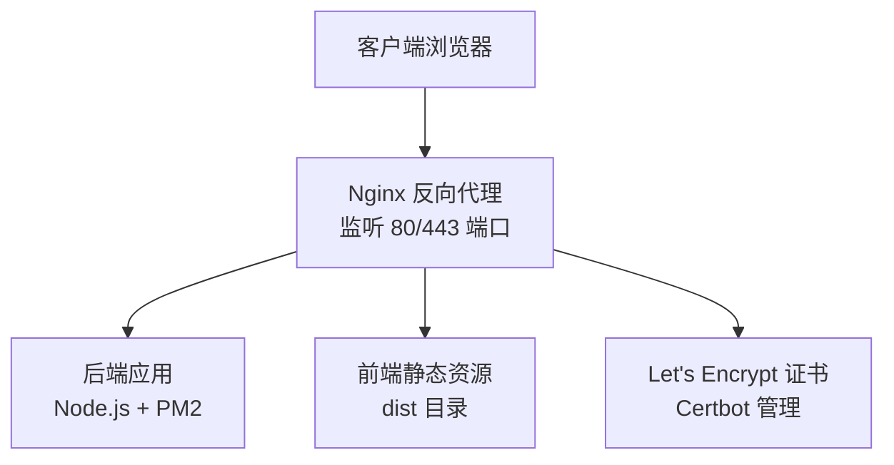
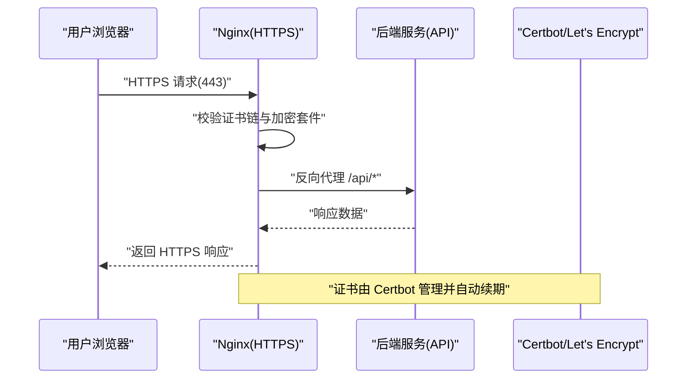
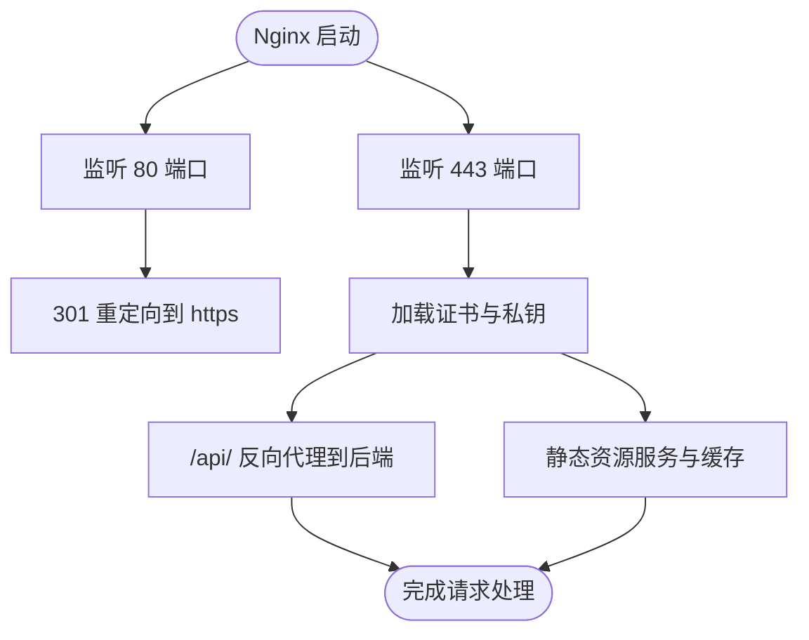
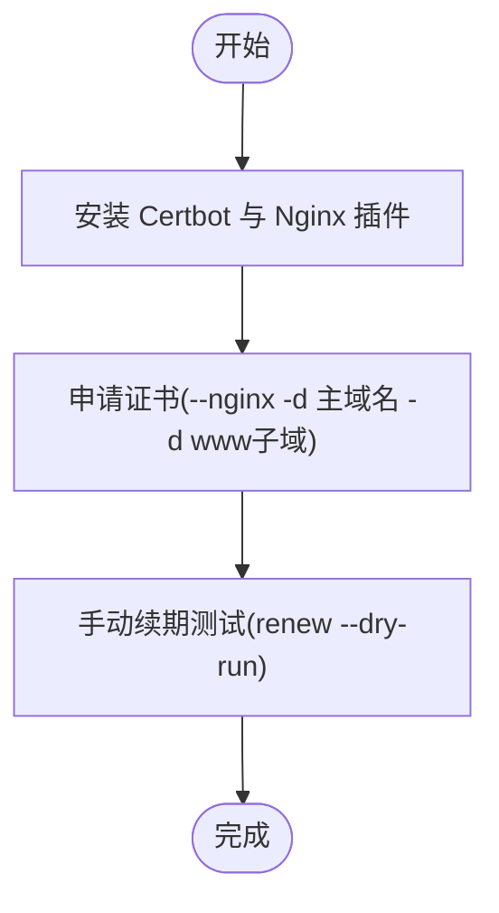
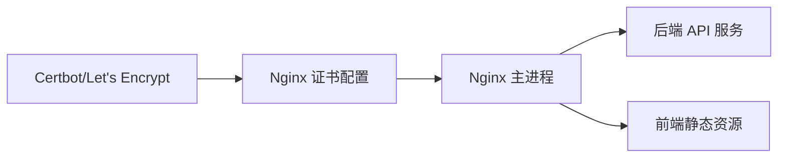

# SSL证书配置

<cite>
**本文引用的文件**
- [docs/deploy.md](file://docs/deploy.md)
- [README.md](file://README.md)
</cite>

## 目录
1. [简介](#简介)
2. [项目结构](#项目结构)
3. [核心组件](#核心组件)
4. [架构总览](#架构总览)
5. [详细组件分析](#详细组件分析)
6. [依赖关系分析](#依赖关系分析)
7. [性能与安全考量](#性能与安全考量)
8. [故障排查指南](#故障排查指南)
9. [结论](#结论)
10. [附录](#附录)

## 简介
本指南面向“趣配鲜”项目的运维与开发人员，提供基于 Let's Encrypt 的免费 SSL 证书获取、安装与自动续期的完整流程，覆盖多域名证书（含主域名与 www 子域名）配置、Nginx 证书路径与加密参数配置、以及证书有效性验证与常见问题排查。文档中的操作步骤与示例均来源于项目现有部署文档与说明。

## 项目结构
- 本项目包含后端、前端、数据库与部署文档等模块。SSL 证书配置主要涉及 Nginx 反向代理层的 HTTPS 终止与证书挂载，部署文档中已给出 Nginx 的 SSL 配置片段与 Certbot 的安装与申请命令。
- 关键参考位置：
  - 部署与 SSL 配置：[docs/deploy.md](file://docs/deploy.md)
  - 项目说明（含 SSL 推荐）：[README.md](file://README.md)

**章节来源**
- [docs/deploy.md:205-293](file://docs/deploy.md#L205-L293)
- [README.md:148](file://README.md#L148)

## 核心组件
- Nginx：负责 HTTP 到 HTTPS 的重定向、HTTPS 终止、证书挂载、静态资源缓存与反向代理到后端服务。
- Certbot：自动化获取与续签 Let's Encrypt 证书，并与 Nginx 集成。
- 后端服务：通过 Nginx 暴露的 HTTPS 接口对外提供 API 服务。
- 前端静态资源：由 Nginx 提供，支持缓存优化与 HTTPS 访问。

**章节来源**
- [docs/deploy.md:205-293](file://docs/deploy.md#L205-L293)

## 架构总览
下图展示了从浏览器到后端服务的 HTTPS 请求链路，以及证书在 Nginx 层面的处理方式：

**图表来源**
- [docs/deploy.md:205-293](file://docs/deploy.md#L205-L293)

## 详细组件分析

### Nginx SSL 配置要点
- 监听 80/443 端口，80 端口用于强制跳转至 HTTPS。
- 证书文件路径：
  - 证书链：/etc/nginx/ssl/fullchain.pem
  - 私钥：/etc/nginx/ssl/privkey.pem
- 加密协议与套件：
  - 协议：TLSv1.2、TLSv1.3
  - 套件：示例采用 HIGH:!aNULL:!MD5（建议结合当前最佳实践进行评估与调整）
- 反向代理：
  - 将 /api/ 路径代理至本地后端服务（如 localhost:3000），并传递必要的头部（X-Forwarded-Proto 等）。
- 静态资源：
  - 对前端静态资源启用长期缓存与 immutable 标记，提升性能与安全性。

**图表来源**
- [docs/deploy.md:205-263](file://docs/deploy.md#L205-L263)

**章节来源**
- [docs/deploy.md:205-263](file://docs/deploy.md#L205-L263)

### Certbot 安装与证书申请
- 安装 Certbot 与 Nginx 集成插件（CentOS 与 Ubuntu 分别使用 yum/apt）。
- 申请多域名证书（主域名与 www 子域名），并自动更新 Nginx 配置。
- 手动验证续期（dry-run），确保自动续期脚本可用。

**图表来源**
- [docs/deploy.md:281-293](file://docs/deploy.md#L281-L293)

**章节来源**
- [docs/deploy.md:281-293](file://docs/deploy.md#L281-L293)

### 多域名证书配置（主域名与 www）
- 在申请时同时指定主域名与 www 子域名，确保两者均可通过 HTTPS 正常访问。
- Nginx server_name 需要同时包含主域名与 www 子域名，以匹配证书 SAN。

**章节来源**
- [docs/deploy.md:205-293](file://docs/deploy.md#L205-L293)

### 自动续期配置
- 建议使用系统计划任务（如 cron）定期执行续期测试或自动续期，确保证书在到期前被更新。
- 可结合系统日志与监控，观察续期结果与异常。

**章节来源**
- [docs/deploy.md:281-293](file://docs/deploy.md#L281-L293)

### 证书验证方法
- 浏览器侧验证：访问站点，确认地址栏显示安全锁；点击可查看证书颁发者、有效期与 SAN。
- 在线 SSL 测试工具：使用第三方 SSL 检测服务，验证证书链完整性、协议与套件支持情况。
- Nginx 日志：通过访问与错误日志定位证书加载与握手失败等问题。

**章节来源**
- [docs/deploy.md:205-293](file://docs/deploy.md#L205-L293)

### 加密协议与套件优化建议
- 协议：优先启用 TLSv1.2 与 TLSv1.3，禁用过时协议。
- 套件：遵循最小化原则，仅允许现代、高性能且安全的套件；避免弱加密与已弃用套件。
- 建议结合当前行业最佳实践与合规要求进行评估与调整。

**章节来源**
- [docs/deploy.md:205-293](file://docs/deploy.md#L205-L293)

## 依赖关系分析
- Nginx 依赖 Certbot 提供的证书文件（fullchain.pem 与 privkey.pem）。
- 后端服务通过 Nginx 的 HTTPS 反向代理暴露 API，需确保 X-Forwarded-Proto 等头部正确传递。
- 前端静态资源由 Nginx 提供，建议开启长期缓存与安全头。

**图表来源**
- [docs/deploy.md:205-293](file://docs/deploy.md#L205-L293)

**章节来源**
- [docs/deploy.md:205-293](file://docs/deploy.md#L205-L293)

## 性能与安全考量
- 性能：对静态资源启用长期缓存与 immutable 标记，减少重复下载；合理设置代理超时。
- 安全：仅启用现代 TLS 协议与安全套件；定期检查证书链完整性与到期时间；限制可访问端口，仅开放 80/443。

**章节来源**
- [docs/deploy.md:205-293](file://docs/deploy.md#L205-L293)

## 故障排查指南
- 证书未生效或握手失败：
  - 检查证书与私钥路径是否正确、权限是否正确。
  - 使用 Nginx 配置测试命令验证语法。
- 重定向循环或 301 循环：
  - 检查 80 端口重定向规则与 server_name 是否一致。
- 代理到后端失败：
  - 检查后端服务是否运行、端口是否可达、X-Forwarded-Proto 是否正确传递。
- 续期失败：
  - 执行 dry-run 进行自检；查看系统计划任务与日志输出；确认域名解析与端口开放。

**章节来源**
- [docs/deploy.md:205-293](file://docs/deploy.md#L205-L293)

## 结论
通过在 Nginx 层面集成 Let's Encrypt 证书并使用 Certbot 自动化管理，可以高效地为“趣配鲜”项目提供安全可靠的 HTTPS 服务。配合多域名证书、合理的加密参数与自动续期机制，可在保证安全的同时降低维护成本。建议持续关注证书到期与日志告警，确保线上环境稳定运行。

## 附录
- 快速参考（来自部署文档）：
  - 安装 Certbot 与 Nginx 插件（CentOS/Ubuntu）
  - 申请多域名证书（主域名与 www 子域名）
  - 手动续期测试
  - Nginx SSL 配置要点（证书路径、协议与套件）

**章节来源**
- [docs/deploy.md:281-293](file://docs/deploy.md#L281-L293)
- [README.md:148](file://README.md#L148)