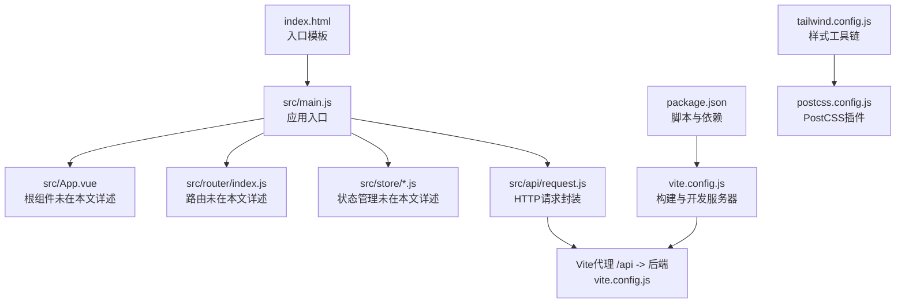
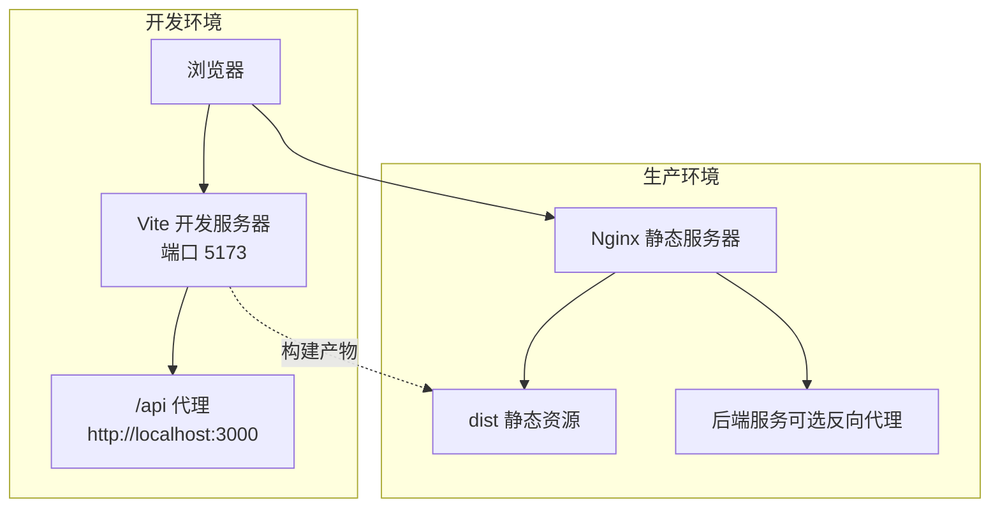
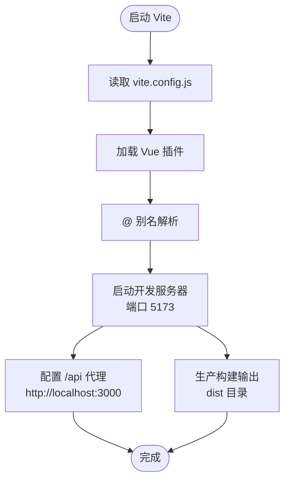
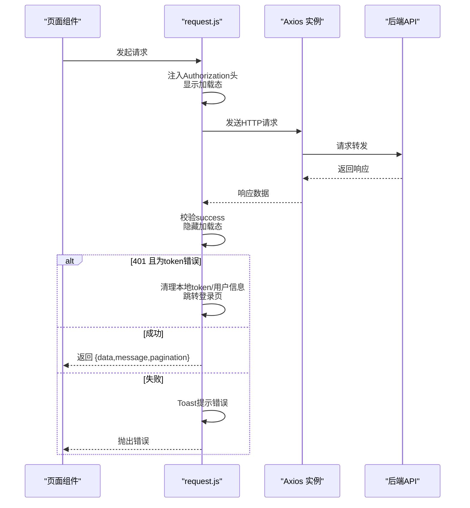
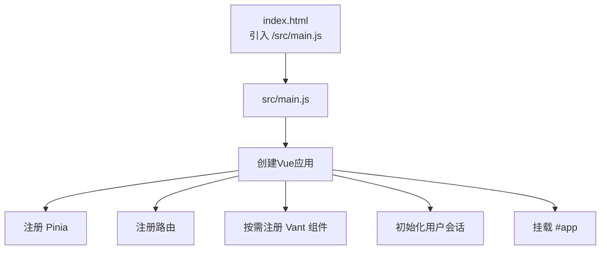
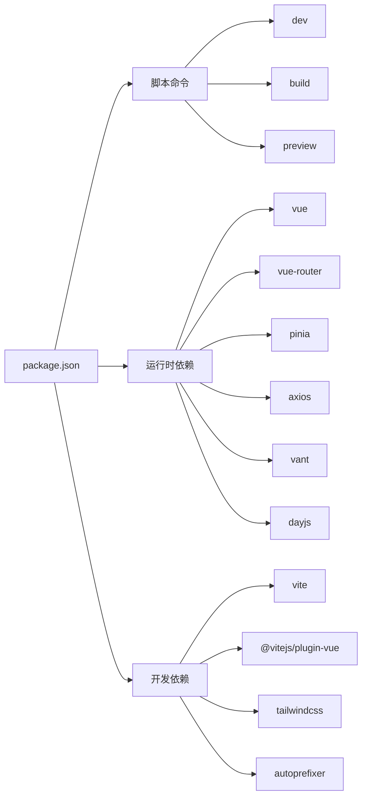
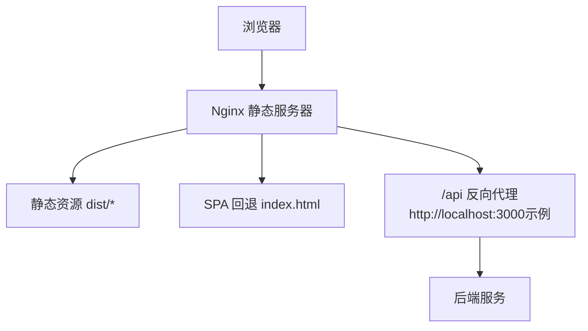

# 前端部署

<cite>
**本文引用的文件**
- [frontend/vite.config.js](file://frontend/vite.config.js)
- [frontend/package.json](file://frontend/package.json)
- [frontend/src/api/request.js](file://frontend/src/api/request.js)
- [frontend/src/main.js](file://frontend/src/main.js)
- [frontend/index.html](file://frontend/index.html)
- [frontend/tailwind.config.js](file://frontend/tailwind.config.js)
- [frontend/postcss.config.js](file://frontend/postcss.config.js)
- [README.md](file://README.md)
</cite>

## 目录
1. [简介](#简介)
2. [项目结构](#项目结构)
3. [核心组件](#核心组件)
4. [架构总览](#架构总览)
5. [详细组件分析](#详细组件分析)
6. [依赖关系分析](#依赖关系分析)
7. [性能与缓存策略](#性能与缓存策略)
8. [部署与Nginx配置](#部署与nginx配置)
9. [调试与问题排查](#调试与问题排查)
10. [结论](#结论)

## 简介
本指南面向“趣配鲜”项目的前端应用部署，围绕Vite构建工具展开，覆盖开发与生产环境的构建配置、依赖安装与构建命令、构建产物与静态资源处理、API地址配置、部署位置与Nginx静态文件配置、缓存策略与性能优化建议，以及前端调试与问题排查方法。目标是帮助运维与开发者快速、稳定地完成前端部署。

## 项目结构
前端工程位于仓库根目录下的 frontend 子目录，采用Vite作为构建工具，Vue 3 + Pinia + Vant UI为主要技术栈。关键文件包括：
- 构建与开发服务器：vite.config.js
- 依赖与脚本：package.json
- API封装与拦截器：src/api/request.js
- 应用入口：src/main.js
- 入口HTML模板：index.html
- 样式与工具链：tailwind.config.js、postcss.config.js

图表来源
- [frontend/index.html:1-14](file://frontend/index.html#L1-L14)
- [frontend/src/main.js:1-56](file://frontend/src/main.js#L1-L56)
- [frontend/src/api/request.js:1-111](file://frontend/src/api/request.js#L1-L111)
- [frontend/vite.config.js:1-26](file://frontend/vite.config.js#L1-L26)
- [frontend/package.json:1-26](file://frontend/package.json#L1-L26)
- [frontend/tailwind.config.js:1-24](file://frontend/tailwind.config.js#L1-L24)
- [frontend/postcss.config.js:1-7](file://frontend/postcss.config.js#L1-L7)

章节来源
- [frontend/vite.config.js:1-26](file://frontend/vite.config.js#L1-L26)
- [frontend/package.json:1-26](file://frontend/package.json#L1-L26)
- [frontend/src/api/request.js:1-111](file://frontend/src/api/request.js#L1-L111)
- [frontend/src/main.js:1-56](file://frontend/src/main.js#L1-L56)
- [frontend/index.html:1-14](file://frontend/index.html#L1-L14)
- [frontend/tailwind.config.js:1-24](file://frontend/tailwind.config.js#L1-L24)
- [frontend/postcss.config.js:1-7](file://frontend/postcss.config.js#L1-L7)

## 核心组件
- Vite构建与开发服务器
  - 插件：@vitejs/plugin-vue
  - 别名：@ 指向 src
  - 开发服务器端口：5173
  - 本地代理：/api 代理到 http://localhost:3000
  - 生产构建输出目录：dist
  - 源码映射：关闭
- 依赖与脚本
  - 依赖：vue、vue-router、pinia、axios、vant、dayjs
  - 脚本：dev、build、preview
- API请求封装
  - 基础URL优先取 import.meta.env.VITE_API_BASE_URL，否则默认 “/api”
  - 统一请求拦截与响应拦截，统一处理加载态、鉴权失效跳转、错误提示等
- 应用入口
  - 创建Vue应用、注册Pinia、注册路由、按需引入Vant组件、初始化用户会话
- 样式工具链
  - Tailwind内容扫描范围、主题颜色与字体
  - PostCSS启用tailwindcss与autoprefixer

章节来源
- [frontend/vite.config.js:1-26](file://frontend/vite.config.js#L1-L26)
- [frontend/package.json:1-26](file://frontend/package.json#L1-L26)
- [frontend/src/api/request.js:1-111](file://frontend/src/api/request.js#L1-L111)
- [frontend/src/main.js:1-56](file://frontend/src/main.js#L1-L56)
- [frontend/tailwind.config.js:1-24](file://frontend/tailwind.config.js#L1-L24)
- [frontend/postcss.config.js:1-7](file://frontend/postcss.config.js#L1-L7)

## 架构总览
前端通过Vite进行开发与构建，开发时由Vite本地服务器提供服务；生产时生成静态资源至 dist 目录。浏览器请求API时，若使用相对路径 “/api”，则经由Vite代理转发至后端服务（默认 http://localhost:3000）。生产环境部署时，应将 dist 目录中的静态资源交由Web服务器（如Nginx）托管。

图表来源
- [frontend/vite.config.js:12-24](file://frontend/vite.config.js#L12-L24)
- [frontend/index.html:1-14](file://frontend/index.html#L1-L14)

## 详细组件分析

### Vite构建与开发服务器
- 功能要点
  - 使用 @vitejs/plugin-vue 提供Vue单文件组件支持
  - 路径别名 @ 指向 src，便于导入
  - 开发服务器端口 5173，默认开启热更新
  - 本地代理 /api -> http://localhost:3000，便于前后端联调
  - 生产构建输出目录 dist，关闭源码映射
- 关键配置项
  - plugins: [vue()]
  - resolve.alias: { '@': path.resolve(__dirname, 'src') }
  - server.port: 5173
  - server.proxy: { '/api': { target: 'http://localhost:3000', changeOrigin: true } }
  - build.outDir: 'dist'
  - build.sourcemap: false

图表来源
- [frontend/vite.config.js:5-24](file://frontend/vite.config.js#L5-L24)

章节来源
- [frontend/vite.config.js:1-26](file://frontend/vite.config.js#L1-L26)

### API请求封装与环境变量
- 功能要点
  - 基础URL优先从 import.meta.env.VITE_API_BASE_URL 获取，否则回退为 “/api”
  - 请求拦截：自动注入Authorization头（Bearer token），统一显示加载态
  - 响应拦截：根据success字段决定返回数据或抛错；对401错误进行登录态校验与跳转
  - 错误提示：基于 Vant Toast统一提示
- 环境变量
  - 在生产环境中，可通过设置 VITE_API_BASE_URL 指定后端API域名
  - 示例路径：frontend/src/api/request.js 第4行

图表来源
- [frontend/src/api/request.js:29-109](file://frontend/src/api/request.js#L29-L109)

章节来源
- [frontend/src/api/request.js:1-111](file://frontend/src/api/request.js#L1-L111)

### 应用入口与组件注册
- 功能要点
  - 创建Vue应用、挂载Pinia、注册路由
  - 初始化用户会话（useUserStore().initUserSession）
  - 按需引入Vant组件，减少打包体积
- 入口模板
  - index.html 中通过模块脚本引入 /src/main.js

图表来源
- [frontend/index.html:1-14](file://frontend/index.html#L1-L14)
- [frontend/src/main.js:1-56](file://frontend/src/main.js#L1-L56)

章节来源
- [frontend/index.html:1-14](file://frontend/index.html#L1-L14)
- [frontend/src/main.js:1-56](file://frontend/src/main.js#L1-L56)

### 样式工具链（Tailwind + PostCSS）
- Tailwind配置
  - content 扫描范围包含 index.html 与 src/**/*.{vue,js,ts,jsx,tsx}
  - 主题颜色与字体自定义
- PostCSS配置
  - 启用 tailwindcss 与 autoprefixer 插件

章节来源
- [frontend/tailwind.config.js:1-24](file://frontend/tailwind.config.js#L1-L24)
- [frontend/postcss.config.js:1-7](file://frontend/postcss.config.js#L1-L7)

## 依赖关系分析
- 构建与运行时依赖
  - 构建：vite、@vitejs/plugin-vue、tailwindcss、autoprefixer
  - 运行时：vue、vue-router、pinia、axios、vant、dayjs
- 脚本命令
  - dev：启动Vite开发服务器
  - build：执行Vite生产构建，输出至 dist
  - preview：预览生产构建结果

图表来源
- [frontend/package.json:1-26](file://frontend/package.json#L1-L26)

章节来源
- [frontend/package.json:1-26](file://frontend/package.json#L1-L26)

## 性能与缓存策略
- 构建优化
  - 生产构建关闭源码映射，减小包体与提升构建速度
  - 使用按需引入Vant组件，避免全量引入导致的体积膨胀
- 缓存策略建议
  - 静态资源：dist 目录中的文件名包含哈希，浏览器可长期缓存；建议在Nginx中为静态资源设置较长的Cache-Control
  - HTML：不缓存或短缓存，确保能及时获取最新构建
  - API：由后端控制缓存策略，前端避免对API请求做无意义的客户端缓存
- 其他优化建议
  - 合理拆分路由组件与异步加载
  - 图片与媒体资源使用现代格式（如WebP）并压缩
  - 启用Gzip/Br压缩（在Nginx层）

章节来源
- [frontend/vite.config.js:21-24](file://frontend/vite.config.js#L21-L24)
- [frontend/src/main.js:8-54](file://frontend/src/main.js#L8-L54)

## 部署与Nginx配置
- 构建产物
  - 生产构建输出目录：dist
  - 产物包含HTML、JS、CSS、图片等静态资源
- 部署位置
  - 将 dist 目录中的所有文件部署到Web服务器的静态站点根目录
- Nginx静态文件配置要点
  - 静态资源根目录指向 dist
  - 对HTML请求回退到 index.html（用于SPA路由）
  - 设置合理的缓存头（静态资源长缓存，HTML短缓存）
  - 可选：将 /api 前缀的请求反向代理到后端服务（例如 http://localhost:3000 或实际后端域名）
- API地址配置
  - 在生产环境中，通过设置 VITE_API_BASE_URL 指定后端API域名
  - 若使用Nginx反向代理 /api，则可保持前端代码中的 “/api” 不变

图表来源
- [frontend/vite.config.js:14-19](file://frontend/vite.config.js#L14-L19)
- [frontend/src/api/request.js:4-7](file://frontend/src/api/request.js#L4-L7)

章节来源
- [frontend/vite.config.js:21-24](file://frontend/vite.config.js#L21-L24)
- [frontend/src/api/request.js:4-7](file://frontend/src/api/request.js#L4-L7)

## 调试与问题排查
- 开发环境调试
  - 使用 npm run dev 启动Vite开发服务器（端口 5173）
  - 通过浏览器开发者工具查看网络请求，确认 /api 是否被正确代理
- 生产构建验证
  - 使用 npm run build 生成 dist
  - 使用 npm run preview 预览生产构建效果
- 常见问题与定位
  - API 401/403：检查前端是否正确携带Authorization头；确认后端接口权限与登录态
  - 接口跨域：确认Vite代理或Nginx反向代理配置是否正确
  - 静态资源404：确认Nginx根目录指向正确，且HTML回退规则生效
  - 缓存问题：清理浏览器缓存或临时禁用缓存，确认更新已生效
- 日志与提示
  - 前端请求日志：可在请求拦截器中查看请求URL与参数
  - 错误提示：统一通过 Vant Toast 展示，便于快速定位

章节来源
- [frontend/package.json:5-8](file://frontend/package.json#L5-L8)
- [frontend/src/api/request.js:36-47](file://frontend/src/api/request.js#L36-L47)
- [frontend/vite.config.js:12-20](file://frontend/vite.config.js#L12-L20)

## 结论
通过以上配置与流程，前端应用可稳定地在开发与生产环境运行。开发阶段借助Vite的热更新与代理能力提升效率；生产阶段通过合理的Nginx静态托管与缓存策略保障性能与用户体验。API地址配置灵活，既支持直接使用相对路径，也支持通过环境变量指定后端域名，满足不同部署场景需求。