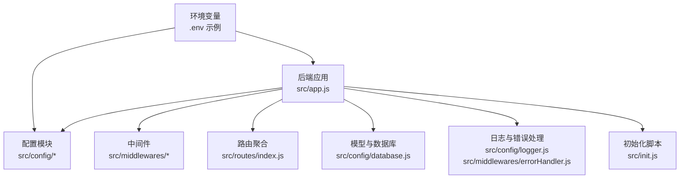
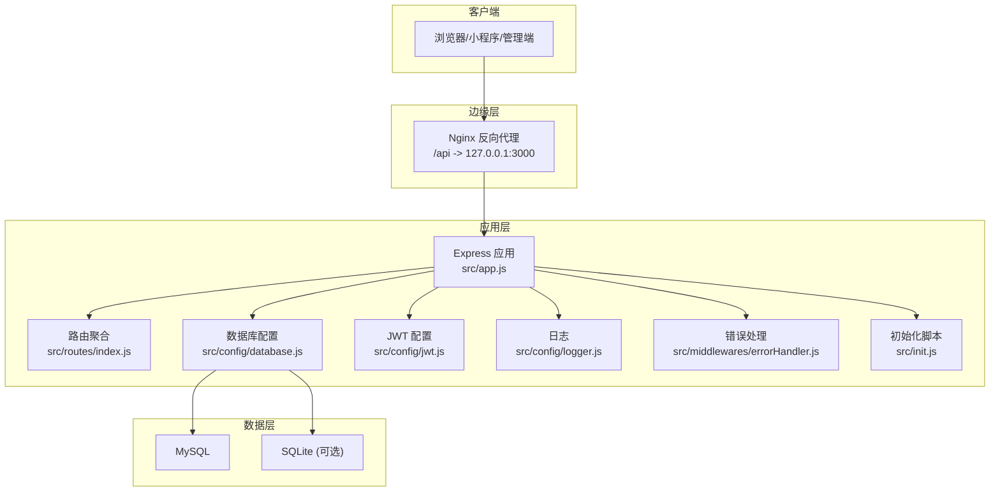
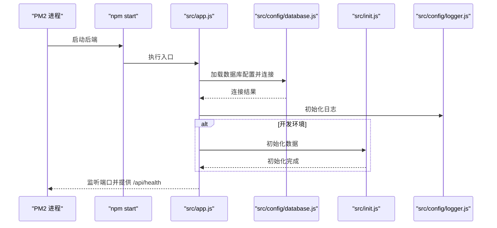

# 后端部署

<cite>
**本文引用的文件**
- [backend/package.json](file://backend/package.json)
- [backend/.env.example](file://backend/.env.example)
- [backend/src/app.js](file://backend/src/app.js)
- [backend/src/config/database.js](file://backend/src/config/database.js)
- [backend/src/config/jwt.js](file://backend/src/config/jwt.js)
- [backend/src/config/logger.js](file://backend/src/config/logger.js)
- [backend/src/middlewares/errorHandler.js](file://backend/src/middlewares/errorHandler.js)
- [backend/src/routes/index.js](file://backend/src/routes/index.js)
- [backend/src/init.js](file://backend/src/init.js)
- [docs/deploy.md](file://docs/deploy.md)
</cite>

## 目录
1. [简介](#简介)
2. [项目结构](#项目结构)
3. [核心组件](#核心组件)
4. [架构总览](#架构总览)
5. [详细组件分析](#详细组件分析)
6. [依赖关系分析](#依赖关系分析)
7. [性能考虑](#性能考虑)
8. [故障排查指南](#故障排查指南)
9. [结论](#结论)
10. [附录](#附录)

## 简介
本指南面向趣配鲜项目的后端服务部署，覆盖从代码上传、目录结构与权限、依赖安装、环境变量配置，到 PM2 进程管理、健康检查与状态监控，以及常见问题排查。目标是帮助运维人员以最小成本完成稳定可靠的生产部署。

## 项目结构
后端位于 backend 目录，核心由以下部分组成：
- 配置层：数据库、JWT、日志、常量等
- 应用入口：Express 应用、中间件、路由聚合
- 初始化：数据库连接、开发环境数据初始化
- 部署与运维：PM2 启动、Nginx 反代、SSL、日志与备份

图表来源
- [backend/src/app.js:1-84](file://backend/src/app.js#L1-L84)
- [backend/src/config/database.js:1-56](file://backend/src/config/database.js#L1-L56)
- [backend/src/config/jwt.js:1-41](file://backend/src/config/jwt.js#L1-L41)
- [backend/src/config/logger.js:1-52](file://backend/src/config/logger.js#L1-L52)
- [backend/src/middlewares/errorHandler.js:1-47](file://backend/src/middlewares/errorHandler.js#L1-L47)
- [backend/src/routes/index.js:1-27](file://backend/src/routes/index.js#L1-L27)
- [backend/src/init.js:1-502](file://backend/src/init.js#L1-L502)
- [backend/.env.example:1-63](file://backend/.env.example#L1-L63)

章节来源
- [backend/src/app.js:1-84](file://backend/src/app.js#L1-L84)
- [docs/deploy.md:110-170](file://docs/deploy.md#L110-L170)

## 核心组件
- 应用入口与启动：负责加载环境变量、初始化安全中间件、速率限制、日志、静态资源、路由挂载、数据库连接与启动监听。
- 数据库配置：支持 MySQL 与 SQLite 两种模式，通过环境变量切换；生产环境默认 MySQL。
- JWT 配置：提供生成与校验访问令牌与刷新令牌的能力。
- 日志与错误处理：统一输出 JSON 格式日志，区分错误级别，并在开发环境输出控制台彩色日志。
- 健康检查：提供 /health 接口，便于 PM2/Nginx/云监控探测。
- 初始化脚本：开发环境首次启动时创建管理员、用户、分类、商品、食谱、Banner、公告、资质与协议等基础数据。

章节来源
- [backend/src/app.js:1-84](file://backend/src/app.js#L1-L84)
- [backend/src/config/database.js:1-56](file://backend/src/config/database.js#L1-L56)
- [backend/src/config/jwt.js:1-41](file://backend/src/config/jwt.js#L1-L41)
- [backend/src/config/logger.js:1-52](file://backend/src/config/logger.js#L1-L52)
- [backend/src/middlewares/errorHandler.js:1-47](file://backend/src/middlewares/errorHandler.js#L1-L47)
- [backend/src/routes/index.js:18-24](file://backend/src/routes/index.js#L18-L24)
- [backend/src/init.js:1-502](file://backend/src/init.js#L1-L502)

## 架构总览
后端采用 Express + Sequelize 的典型 Node.js 架构，结合 Nginx 反向代理对外提供 API 与静态资源服务。PM2 负责进程守护、自动重启与开机自启。

图表来源
- [backend/src/app.js:1-84](file://backend/src/app.js#L1-L84)
- [backend/src/config/database.js:1-56](file://backend/src/config/database.js#L1-L56)
- [backend/src/config/jwt.js:1-41](file://backend/src/config/jwt.js#L1-L41)
- [backend/src/config/logger.js:1-52](file://backend/src/config/logger.js#L1-L52)
- [backend/src/middlewares/errorHandler.js:1-47](file://backend/src/middlewares/errorHandler.js#L1-L47)
- [backend/src/routes/index.js:1-27](file://backend/src/routes/index.js#L1-L27)
- [backend/src/init.js:1-502](file://backend/src/init.js#L1-L502)

## 详细组件分析

### 代码上传与目录结构
- 在服务器上创建项目目录并上传代码：
  - 目录：/var/www/qupeixian
  - 权限：确保部署用户对 /var/www/qupeixian 及子目录具有读写权限（用于上传目录与日志）
- 建议的目录布局（与仓库一致）：
  - backend：后端源码与配置
  - frontend：前端构建产物（dist）
  - database：数据库脚本
  - logs：应用日志目录（由后端日志模块自动创建）

章节来源
- [docs/deploy.md:112-122](file://docs/deploy.md#L112-L122)

### npm 依赖安装（生产环境）
- 切换到 backend 目录，使用生产模式安装依赖，避免安装开发依赖：
  - 命令：npm install --production
- 依赖清单（节选）：Express、Sequelize、MySQL2、Redis、Winston、Helmet、Rate Limit、JWT、Multer、XSS 清理等
- Node 版本要求：>= 16.0.0（工程 engines 字段）

章节来源
- [backend/package.json:18-48](file://backend/package.json#L18-L48)
- [docs/deploy.md:123-128](file://docs/deploy.md#L123-L128)

### .env 环境变量配置
- 关键配置项（摘录）：
  - 应用与端口：NODE_ENV、PORT、API_PREFIX
  - JWT：JWT_SECRET、JWT_EXPIRE、JWT_REFRESH_SECRET、JWT_REFRESH_EXPIRE
  - 数据库：DB_HOST、DB_PORT、DB_NAME、DB_USER、DB_PASSWORD、DB_CONNECTION（sqlite/mysql）、DB_FILENAME（sqlite）
  - Redis：REDIS_HOST、REDIS_PORT、REDIS_PASSWORD、REDIS_DB
  - 安全与限流：CORS_ORIGIN、RATE_LIMIT_WINDOW_MS、RATE_LIMIT_MAX_REQUESTS
  - 日志：LOG_LEVEL、LOG_DIR
  - 文件上传：UPLOAD_DIR、MAX_FILE_SIZE、ALLOWED_FILE_TYPES
  - 微信支付与小程序：WECHAT_*、WECHAT_MINI_*
- 配置示例参考：backend/.env.example

章节来源
- [backend/.env.example:1-63](file://backend/.env.example#L1-L63)
- [backend/src/config/database.js:10-53](file://backend/src/config/database.js#L10-L53)
- [backend/src/config/jwt.js:3-8](file://backend/src/config/jwt.js#L3-L8)
- [backend/src/app.js:21-38](file://backend/src/app.js#L21-L38)
- [backend/src/config/logger.js:5-8](file://backend/src/config/logger.js#L5-L8)

### PM2 进程管理
- 启动应用：
  - pm2 start npm --name "qupeixian-api" -- run start
- 开机自启：
  - pm2 startup
  - pm2 save
- 常用命令：
  - pm2 status
  - pm2 logs qupeixian-api
  - pm2 restart qupeixian-api

章节来源
- [docs/deploy.md:160-169](file://docs/deploy.md#L160-L169)

### 健康检查与状态监控
- 健康检查接口：GET /api/health
  - 返回 success、message、timestamp
- PM2 监控：
  - pm2 status 查看进程状态
  - pm2 logs qupeixian-api 查看实时日志
- Nginx 日志：
  - 访问日志与错误日志位于 /var/log/nginx/
- 应用日志：
  - Winston 输出到 LOG_DIR（默认 ./logs），包含 error、combined、access 三个文件

章节来源
- [backend/src/routes/index.js:18-24](file://backend/src/routes/index.js#L18-L24)
- [docs/deploy.md:328-349](file://docs/deploy.md#L328-L349)
- [backend/src/config/logger.js:22-38](file://backend/src/config/logger.js#L22-L38)

### 数据库初始化与开发环境数据
- 应用启动时根据 NODE_ENV 决定是否同步数据库并初始化数据：
  - development：同步表结构、初始化管理员、用户、分类、商品、食谱、Banner、公告、资质、协议等
  - production：仅同步表结构
- 初始化脚本会检测各表是否存在数据，避免重复初始化

章节来源
- [backend/src/app.js:57-79](file://backend/src/app.js#L57-L79)
- [backend/src/init.js:5-492](file://backend/src/init.js#L5-L492)

## 依赖关系分析
后端启动的关键调用链如下：

图表来源
- [backend/src/app.js:57-79](file://backend/src/app.js#L57-L79)
- [backend/src/config/database.js:1-56](file://backend/src/config/database.js#L1-L56)
- [backend/src/init.js:1-502](file://backend/src/init.js#L1-L502)
- [backend/src/config/logger.js:1-52](file://backend/src/config/logger.js#L1-L52)

章节来源
- [backend/src/app.js:1-84](file://backend/src/app.js#L1-L84)
- [backend/src/config/database.js:1-56](file://backend/src/config/database.js#L1-L56)
- [backend/src/init.js:1-502](file://backend/src/init.js#L1-L502)

## 性能考虑
- 启用 Redis 缓存（可选）：在配置中启用 Redis，减少数据库压力
- 数据库连接池：Sequelize 默认池参数适合中小规模，可根据并发调整
- Gzip 压缩：可在 Nginx 层开启压缩，降低带宽占用
- 日志轮转：Winston 已内置文件大小与数量限制，建议配合系统日志轮转策略

章节来源
- [docs/deploy.md:413-441](file://docs/deploy.md#L413-L441)
- [backend/src/config/database.js:38-43](file://backend/src/config/database.js#L38-L43)
- [backend/src/config/logger.js:22-38](file://backend/src/config/logger.js#L22-L38)

## 故障排查指南
- 无法连接数据库
  - 检查 MySQL 服务状态与配置
  - 核对 .env 中 DB_HOST、DB_PORT、DB_NAME、DB_USER、DB_PASSWORD
  - 若使用 SQLite，确认 DB_FILENAME 与权限
- 前端页面空白
  - 检查前端构建是否成功
  - 检查 Nginx 静态文件根目录与 try_files 配置
- API 请求失败
  - 检查 PM2 状态与端口占用
  - 查看 pm2 日志与后端日志
- SSL 证书过期
  - 手动执行证书续期命令
- 健康检查失败
  - 访问 /api/health 确认服务可用
  - 检查防火墙与 Nginx 反代

章节来源
- [docs/deploy.md:392-409](file://docs/deploy.md#L392-L409)
- [backend/src/routes/index.js:18-24](file://backend/src/routes/index.js#L18-L24)

## 结论
通过以上步骤，可以在 Linux 服务器上完成趣配鲜后端服务的稳定部署。关键在于：
- 正确的目录与权限设置
- 生产环境依赖安装与 .env 配置
- PM2 的进程守护与自启
- 健康检查与日志监控
- 常见问题的快速定位与修复

## 附录

### 环境变量清单（摘要）
- 应用与端口：NODE_ENV、PORT、API_PREFIX
- JWT：JWT_SECRET、JWT_EXPIRE、JWT_REFRESH_SECRET、JWT_REFRESH_EXPIRE
- 数据库：DB_HOST、DB_PORT、DB_NAME、DB_USER、DB_PASSWORD、DB_CONNECTION、DB_FILENAME
- Redis：REDIS_HOST、REDIS_PORT、REDIS_PASSWORD、REDIS_DB
- 安全与限流：CORS_ORIGIN、RATE_LIMIT_WINDOW_MS、RATE_LIMIT_MAX_REQUESTS
- 日志：LOG_LEVEL、LOG_DIR
- 文件上传：UPLOAD_DIR、MAX_FILE_SIZE、ALLOWED_FILE_TYPES
- 微信支付与小程序：WECHAT_*、WECHAT_MINI_*

章节来源
- [backend/.env.example:1-63](file://backend/.env.example#L1-L63)