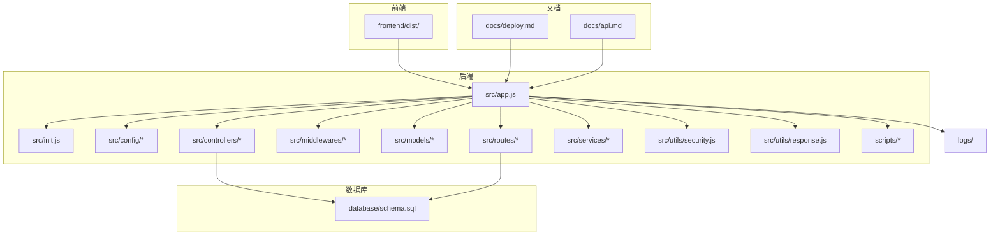
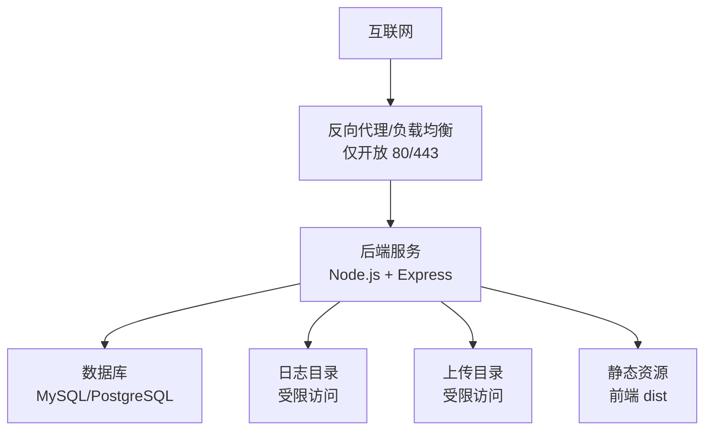
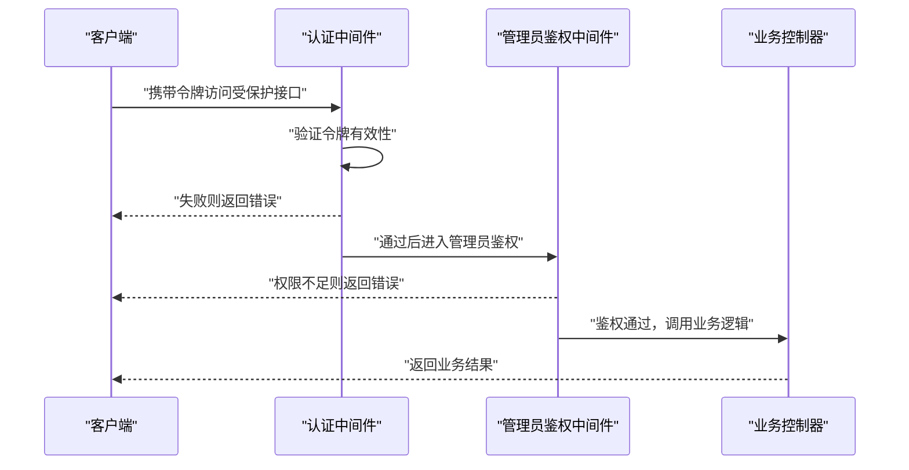
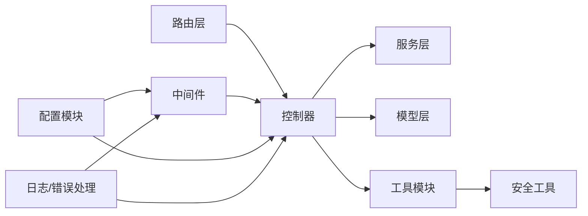

# 安全配置

<cite>
**本文引用的文件**
- [README.md](file://README.md)
- [deploy.md](file://docs/deploy.md)
- [security.js](file://backend/src/utils/security.js)
- [adminAuth.js](file://backend/src/middlewares/adminAuth.js)
- [auth.js](file://backend/src/middlewares/auth.js)
- [errorHandler.js](file://backend/src/middlewares/errorHandler.js)
- [jwt.js](file://backend/src/config/jwt.js)
- [logger.js](file://backend/src/config/logger.js)
- [constants.js](file://backend/src/config/constants.js)
- [database.js](file://backend/src/config/database.js)
- [check_users.js](file://backend/scripts/check_users.js)
- [reset-admin-password.js](file://backend/scripts/reset-admin-password.js)
- [schema.sql](file://database/schema.sql)
</cite>

## 目录
1. [简介](#简介)
2. [项目结构](#项目结构)
3. [核心组件](#核心组件)
4. [架构总览](#架构总览)
5. [详细组件分析](#详细组件分析)
6. [依赖关系分析](#依赖关系分析)
7. [性能考虑](#性能考虑)
8. [故障排查指南](#故障排查指南)
9. [结论](#结论)
10. [附录](#附录)

## 简介
本指南面向趣配鲜项目的生产环境，聚焦于系统与应用层面的安全配置与运维实践。内容涵盖：
- 防火墙策略：仅开放必要端口（80/443），并给出 firewalld 与 iptables 的配置要点
- SSH 安全加固：禁用 root 远程登录、修改默认端口、强制强密码等
- 系统用户管理：创建普通部署用户、合理分配 sudo 权限
- 文件权限与敏感文件保护：项目目录权限、日志与上传目录隔离
- Web 应用防火墙（WAF）与 DDoS 防护建议
- 定期安全检查与漏洞扫描方法
- 常见威胁防护与应急响应流程

## 项目结构
后端采用 Node.js + Express 架构，前端为 Vue 单页应用，数据库脚本位于 database 目录。部署文档与 API 文档分别在 docs 目录中。

图表来源
- [deploy.md](file://docs/deploy.md)
- [README.md](file://README.md)

章节来源
- [README.md](file://README.md)
- [deploy.md](file://docs/deploy.md)

## 核心组件
- 认证与授权中间件：提供用户认证与管理员鉴权能力，保障接口访问安全
- JWT 配置：定义令牌签发与校验策略
- 日志与错误处理：统一记录异常与安全事件
- 安全工具模块：集中存放安全相关工具函数
- 数据库配置：连接参数与连接池配置
- 常量与环境常量：统一管理安全相关的常量值
- 脚本工具：用户检查与重置管理员密码脚本

章节来源
- [auth.js](file://backend/src/middlewares/auth.js)
- [adminAuth.js](file://backend/src/middlewares/adminAuth.js)
- [jwt.js](file://backend/src/config/jwt.js)
- [logger.js](file://backend/src/config/logger.js)
- [errorHandler.js](file://backend/src/middlewares/errorHandler.js)
- [security.js](file://backend/src/utils/security.js)
- [database.js](file://backend/src/config/database.js)
- [constants.js](file://backend/src/config/constants.js)
- [check_users.js](file://backend/scripts/check_users.js)
- [reset-admin-password.js](file://backend/scripts/reset-admin-password.js)

## 架构总览
下图展示生产环境中的网络边界、服务暴露面与内部组件交互关系。生产服务器仅对外暴露 80/443，内部通过反向代理或负载均衡器分发请求至后端服务；数据库与日志目录严格限制访问。

图表来源
- [deploy.md](file://docs/deploy.md)
- [schema.sql](file://database/schema.sql)

## 详细组件分析

### 认证与授权中间件
- 用户认证中间件负责校验访问令牌，拒绝未授权请求
- 管理员鉴权中间件对后台管理接口进行额外权限控制
- 错误处理中间件统一捕获异常并记录日志，避免敏感信息泄露

图表来源
- [auth.js](file://backend/src/middlewares/auth.js)
- [adminAuth.js](file://backend/src/middlewares/adminAuth.js)

章节来源
- [auth.js](file://backend/src/middlewares/auth.js)
- [adminAuth.js](file://backend/src/middlewares/adminAuth.js)
- [errorHandler.js](file://backend/src/middlewares/errorHandler.js)

### JWT 安全配置
- 令牌签名算法与密钥管理
- 令牌有效期与刷新策略
- 令牌撤销与黑名单机制（如需）

章节来源
- [jwt.js](file://backend/src/config/jwt.js)

### 安全工具模块
- 密码哈希与校验
- 请求参数过滤与输入校验
- 敏感操作审计日志

章节来源
- [security.js](file://backend/src/utils/security.js)

### 日志与错误处理
- 统一日志格式与级别
- 错误响应不泄露内部细节
- 安全事件记录与告警

章节来源
- [logger.js](file://backend/src/config/logger.js)
- [errorHandler.js](file://backend/src/middlewares/errorHandler.js)

### 数据库与脚本工具
- 数据库连接配置与连接池参数
- 用户检查脚本用于发现弱口令与异常账户
- 管理员密码重置脚本用于紧急恢复

章节来源
- [database.js](file://backend/src/config/database.js)
- [check_users.js](file://backend/scripts/check_users.js)
- [reset-admin-password.js](file://backend/scripts/reset-admin-password.js)
- [schema.sql](file://database/schema.sql)

## 依赖关系分析
后端服务依赖配置模块、中间件、模型与工具模块；路由层将请求分发到控制器；控制器调用服务与模型完成业务处理；日志与错误处理贯穿整个请求链路。

图表来源
- [deploy.md](file://docs/deploy.md)
- [security.js](file://backend/src/utils/security.js)
- [auth.js](file://backend/src/middlewares/auth.js)
- [adminAuth.js](file://backend/src/middlewares/adminAuth.js)
- [errorHandler.js](file://backend/src/middlewares/errorHandler.js)

章节来源
- [deploy.md](file://docs/deploy.md)

## 性能考虑
- 反向代理缓存静态资源，降低后端压力
- 合理设置连接池大小与超时时间
- 对高频接口启用速率限制与熔断
- 使用压缩与持久连接优化传输效率

## 故障排查指南
- 检查日志目录权限与磁盘空间
- 排查数据库连接参数与网络连通性
- 核对认证中间件是否正确加载与执行
- 使用用户检查脚本定位弱口令与异常账户
- 必要时通过密码重置脚本恢复管理员访问

章节来源
- [logger.js](file://backend/src/config/logger.js)
- [errorHandler.js](file://backend/src/middlewares/errorHandler.js)
- [check_users.js](file://backend/scripts/check_users.js)
- [reset-admin-password.js](file://backend/scripts/reset-admin-password.js)

## 结论
通过最小化暴露面、强化身份认证与授权、完善日志与监控、规范用户与文件权限，以及建立定期安全检查与应急响应机制，可显著提升趣配鲜项目的生产环境安全性与稳定性。

## 附录

### 生产环境安全配置清单
- 防火墙仅开放 80/443
  - firewalld：添加 http/https 服务或放行 80/443 端口，拒绝其他入站流量
  - iptables：允许 80/443 入站，丢弃其他入站包，保留出站与回环
- SSH 安全加固
  - 禁用 root 远程登录
  - 修改默认端口（如 3022）
  - 强制使用公钥认证与强密码
  - 限制可登录用户组
- 系统用户管理
  - 创建普通部署用户，授予最小必要权限
  - 通过 sudoers 文件精确授权命令执行
- 文件权限与敏感文件保护
  - 项目目录属主为部署用户，禁止组写与世界写
  - 日志与上传目录独立且权限收紧
  - 敏感配置文件（如数据库凭据）仅部署用户可读
- WAF 与 DDoS 防护
  - 反向代理层启用 WAF 规则集
  - 配置速率限制与 IP 黑名单
  - 使用 CDN/云防护服务抵御 DDoS
- 定期安全检查与漏洞扫描
  - 每月扫描系统与依赖漏洞
  - 季度渗透测试与基线核查
  - 年度安全审计与合规评估
- 常见威胁防护与应急响应
  - 异常登录检测与自动封禁
  - 令牌过期与撤销策略
  - 数据备份与快速恢复流程
  - 安全事件分级与上报机制