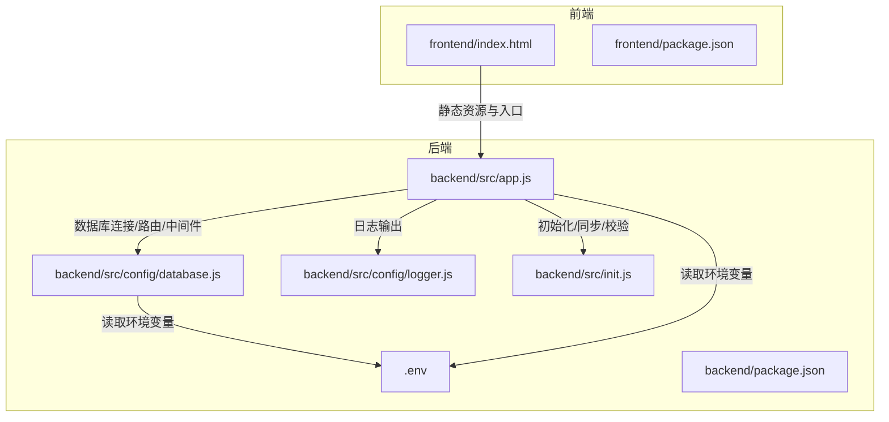
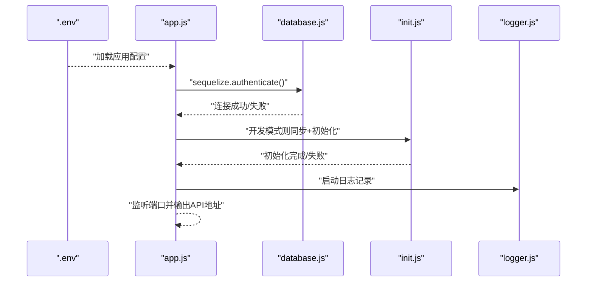
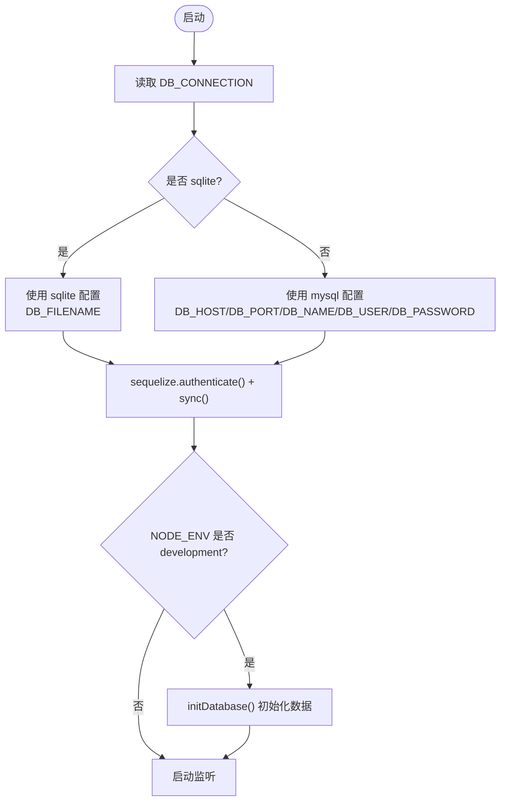
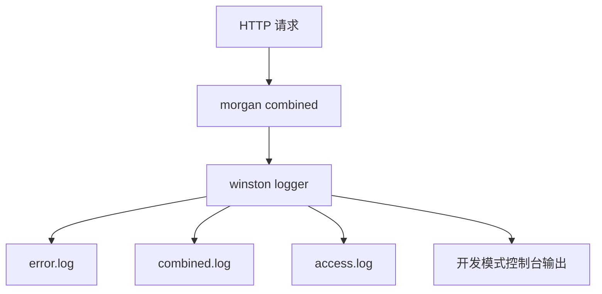
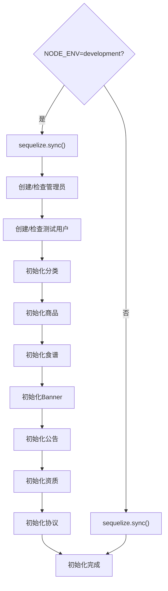
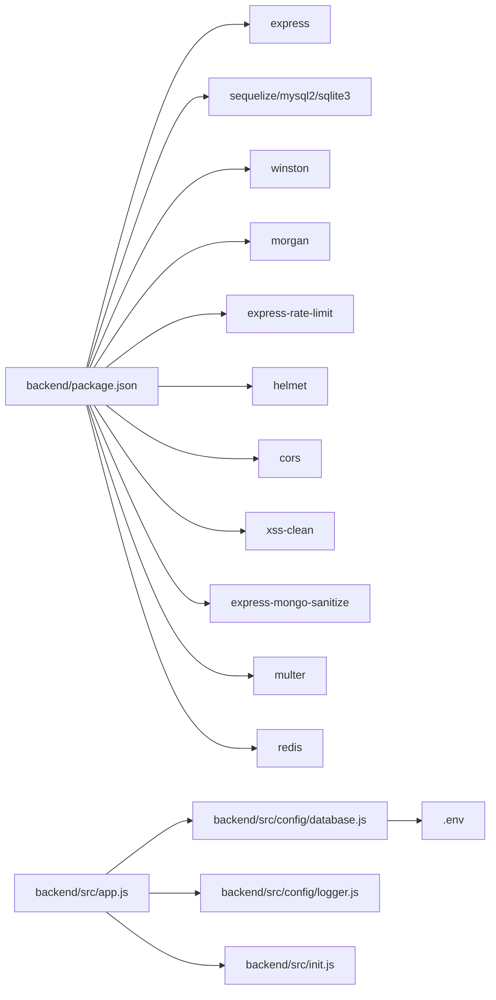
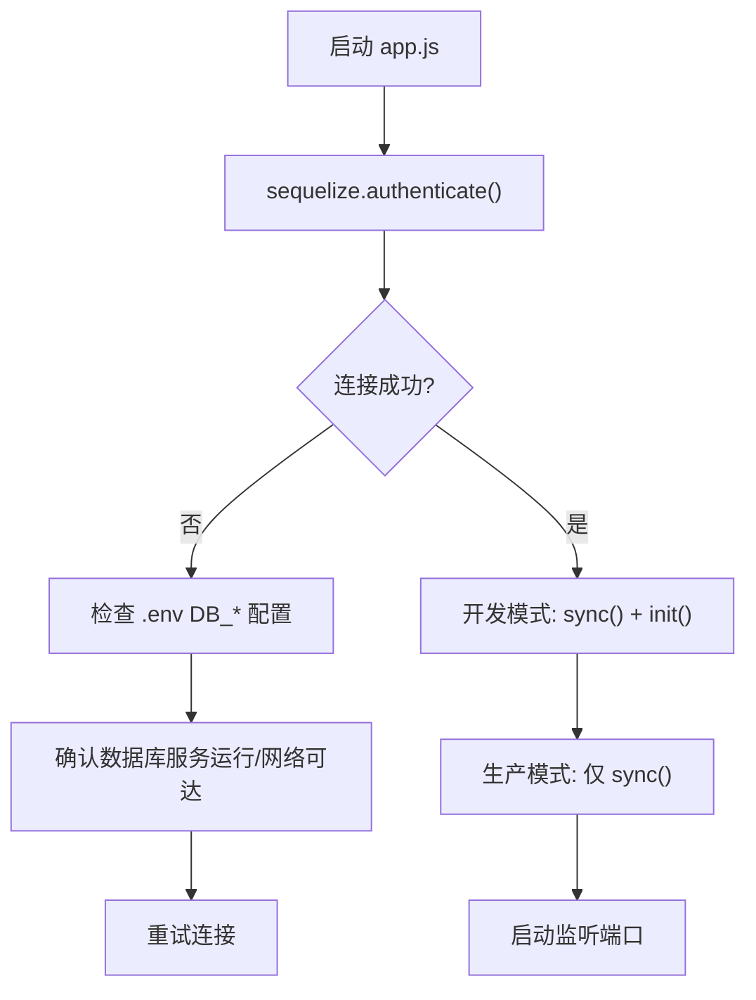
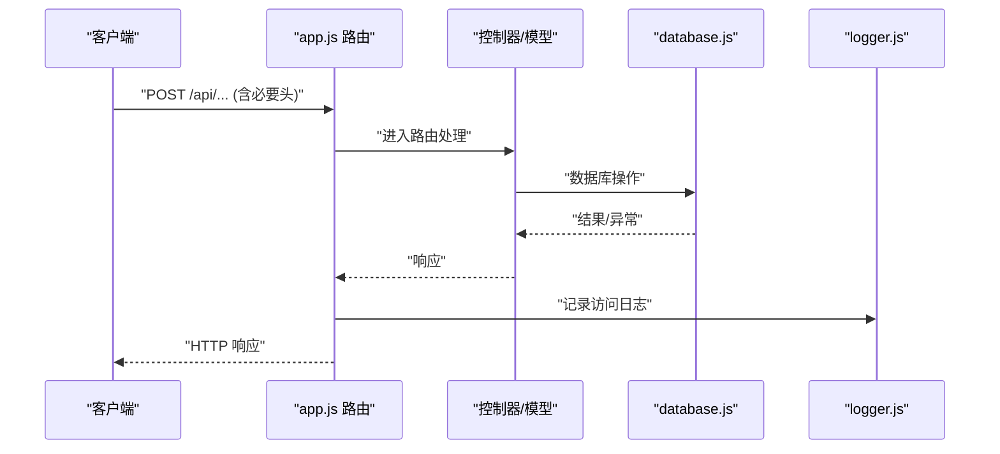

# 故障排查

<cite>
**本文引用的文件**
- [backend/src/config/database.js](file://backend/src/config/database.js)
- [backend/src/config/logger.js](file://backend/src/config/logger.js)
- [backend/src/app.js](file://backend/src/app.js)
- [backend/src/init.js](file://backend/src/init.js)
- [backend/.env](file://backend/.env)
- [backend/package.json](file://backend/package.json)
- [backend/test-env.js](file://backend/test-env.js)
- [backend/diagnose.js](file://backend/diagnose.js)
- [backend/test-endpoint.js](file://backend/test-endpoint.js)
- [backend/test-full.js](file://backend/test-full.js)
- [backend/scripts/check_users.js](file://backend/scripts/check_users.js)
- [frontend/index.html](file://frontend/index.html)
- [frontend/package.json](file://frontend/package.json)
- [README.md](file://README.md)
</cite>

## 目录
1. [简介](#简介)
2. [项目结构](#项目结构)
3. [核心组件](#核心组件)
4. [架构总览](#架构总览)
5. [详细组件分析](#详细组件分析)
6. [依赖关系分析](#依赖关系分析)
7. [性能考虑](#性能考虑)
8. [故障排查指南](#故障排查指南)
9. [结论](#结论)
10. [附录](#附录)

## 简介
本指南面向“趣配鲜”项目的运维与开发人员，提供系统化的故障排查流程与操作步骤，覆盖数据库连接失败、前端页面空白、API 请求错误、SSL 证书问题、日志定位、网络连通性与端口监听检查、数据库与 API 测试工具使用、性能诊断以及紧急恢复与回滚建议。文档基于仓库中的实际代码与配置文件进行分析，确保每一步都可落地执行。

## 项目结构
- 后端采用 Node.js + Express + Sequelize，支持 SQLite 与 MySQL 两种数据库模式，日志由 winston 输出到文件与控制台。
- 前端为 Vue 3 应用，使用 Vite 构建，入口为 index.html。
- 提供多类诊断与测试脚本，便于快速定位问题。

图表来源
- [backend/src/app.js:1-84](file://backend/src/app.js#L1-L84)
- [backend/src/config/database.js:1-56](file://backend/src/config/database.js#L1-L56)
- [backend/src/config/logger.js:1-52](file://backend/src/config/logger.js#L1-L52)
- [backend/src/init.js:1-502](file://backend/src/init.js#L1-L502)
- [backend/.env:1-55](file://backend/.env#L1-L55)
- [frontend/index.html:1-14](file://frontend/index.html#L1-L14)
- [frontend/package.json:1-26](file://frontend/package.json#L1-L26)
- [backend/package.json:1-50](file://backend/package.json#L1-L50)

章节来源
- [backend/src/app.js:1-84](file://backend/src/app.js#L1-L84)
- [backend/src/config/database.js:1-56](file://backend/src/config/database.js#L1-L56)
- [backend/src/config/logger.js:1-52](file://backend/src/config/logger.js#L1-L52)
- [backend/src/init.js:1-502](file://backend/src/init.js#L1-L502)
- [backend/.env:1-55](file://backend/.env#L1-L55)
- [frontend/index.html:1-14](file://frontend/index.html#L1-L14)
- [frontend/package.json:1-26](file://frontend/package.json#L1-L26)
- [backend/package.json:1-50](file://backend/package.json#L1-L50)

## 核心组件
- 应用入口与启动：负责加载环境变量、启用安全中间件、速率限制、日志记录、静态资源、路由挂载与数据库连接校验。
- 数据库配置：支持 SQLite 与 MySQL，读取 .env 中的连接参数；开发模式下自动同步模型并初始化基础数据。
- 日志系统：winston 输出 error/combined/access 三类日志文件，默认写入 ./logs，支持控制台输出。
- 初始化脚本：在生产模式下同步表结构，在开发模式下创建管理员、测试用户、分类、商品、食谱、Banner、公告、资质、协议等初始数据。
- 诊断与测试脚本：用于环境变量检查、数据库连接与表结构验证、商品创建端到端测试、模拟前端请求等。

章节来源
- [backend/src/app.js:1-84](file://backend/src/app.js#L1-L84)
- [backend/src/config/database.js:1-56](file://backend/src/config/database.js#L1-L56)
- [backend/src/config/logger.js:1-52](file://backend/src/config/logger.js#L1-L52)
- [backend/src/init.js:1-502](file://backend/src/init.js#L1-L502)
- [backend/.env:1-55](file://backend/.env#L1-L55)

## 架构总览
后端启动流程概览如下：

图表来源
- [backend/src/app.js:55-79](file://backend/src/app.js#L55-L79)
- [backend/src/config/database.js:59-69](file://backend/src/app.js#L59-L69)
- [backend/src/init.js:5-15](file://backend/src/init.js#L5-L15)
- [backend/src/config/logger.js:10-49](file://backend/src/config/logger.js#L10-L49)

## 详细组件分析

### 数据库连接与切换
- 支持 SQLite 与 MySQL 两种模式，通过 DB_CONNECTION 判断；SQLite 默认文件路径来自 DB_FILENAME。
- 开发模式下自动执行数据库同步与初始化；生产模式仅同步。
- 若切换数据库类型或参数，需确保 .env 中对应键值正确。

图表来源
- [backend/src/config/database.js:10-53](file://backend/src/config/database.js#L10-L53)
- [backend/src/app.js:57-74](file://backend/src/app.js#L57-L74)
- [backend/src/init.js:5-15](file://backend/src/init.js#L5-L15)
- [backend/.env:18-20](file://backend/.env#L18-L20)

章节来源
- [backend/src/config/database.js:1-56](file://backend/src/config/database.js#L1-L56)
- [backend/src/app.js:57-79](file://backend/src/app.js#L57-L79)
- [backend/src/init.js:1-502](file://backend/src/init.js#L1-L502)
- [backend/.env:18-20](file://backend/.env#L18-L20)

### 日志系统与位置
- 日志目录默认 ./logs，可通过 LOG_DIR 覆盖；日志级别由 LOG_LEVEL 控制。
- 输出文件：error.log、combined.log、access.log；开发模式同时输出到控制台。
- 访问日志由 morgan 写入 logger，统一格式化与时间戳。

图表来源
- [backend/src/app.js:41-49](file://backend/src/app.js#L41-L49)
- [backend/src/config/logger.js:10-49](file://backend/src/config/logger.js#L10-L49)
- [backend/.env:43-45](file://backend/.env#L43-L45)

章节来源
- [backend/src/config/logger.js:1-52](file://backend/src/config/logger.js#L1-L52)
- [backend/src/app.js:41-49](file://backend/src/app.js#L41-L49)
- [backend/.env:43-45](file://backend/.env#L43-L45)

### 初始化与开发模式数据
- 开发模式下自动同步表并初始化管理员、测试用户、分类、商品、食谱、Banner、公告、资质、协议等。
- 生产模式仅同步，不注入演示数据。

图表来源
- [backend/src/app.js:62-69](file://backend/src/app.js#L62-L69)
- [backend/src/init.js:5-486](file://backend/src/init.js#L5-L486)

章节来源
- [backend/src/app.js:62-69](file://backend/src/app.js#L62-L69)
- [backend/src/init.js:1-502](file://backend/src/init.js#L1-L502)

### 前端入口与构建
- 前端入口 index.html 引入模块入口；构建产物位于 frontend/dist（仓库中已存在）。
- 开发与构建脚本由 frontend/package.json 提供。

章节来源
- [frontend/index.html:1-14](file://frontend/index.html#L1-L14)
- [frontend/package.json:1-26](file://frontend/package.json#L1-L26)

## 依赖关系分析
- 后端依赖：Express、Sequelize、Winston、Morgan、Rate Limit、Helmet、CORS、XSS 清理、Mongo Sanitize、Multer、Redis、MySQL2/SQLite3 等。
- 前端依赖：Vue 3、Vue Router、Pinia、Axios、Vant、TailwindCSS、Vite 等。
- 关键耦合点：app.js 依赖 database.js、logger.js、init.js；database.js 依赖 .env；日志由 morgan 统一接入 logger。

图表来源
- [backend/package.json:18-39](file://backend/package.json#L18-L39)
- [backend/src/app.js:1-16](file://backend/src/app.js#L1-L16)
- [backend/src/config/database.js:1-56](file://backend/src/config/database.js#L1-L56)
- [backend/src/config/logger.js:1-52](file://backend/src/config/logger.js#L1-L52)
- [backend/src/init.js:1-502](file://backend/src/init.js#L1-L502)
- [backend/.env:1-55](file://backend/.env#L1-L55)

章节来源
- [backend/package.json:1-50](file://backend/package.json#L1-L50)
- [frontend/package.json:1-26](file://frontend/package.json#L1-L26)

## 性能考虑
- 数据库连接池：MySQL 池大小、空闲与获取超时可调；SQLite 无连接池概念。
- 日志级别与文件轮转：生产环境建议提升日志级别并合理配置文件大小与保留份数。
- 速率限制：窗口与最大请求数可按业务调整，避免误伤正常流量。
- 静态资源：上传文件目录通过 /uploads 暴露，注意访问控制与存储空间监控。

章节来源
- [backend/src/config/database.js:38-43](file://backend/src/config/database.js#L38-L43)
- [backend/src/config/logger.js:22-38](file://backend/src/config/logger.js#L22-L38)
- [backend/src/app.js:32-39](file://backend/src/app.js#L32-L39)
- [backend/src/app.js:47](file://backend/src/app.js#L47)

## 故障排查指南

### 一、环境检查与通用流程
- 步骤 1：确认 Node 版本满足要求（backend/package.json 中 engines 指定）。
- 步骤 2：安装依赖
  - 后端：在 backend 目录执行安装命令。
  - 前端：在 frontend 目录执行安装命令。
- 步骤 3：检查 .env 配置项（数据库类型、主机、端口、用户名、密码、日志目录、API 前缀、CORS、限流等）。
- 步骤 4：确认端口占用与防火墙策略（默认端口 3000）。

章节来源
- [backend/package.json:46-48](file://backend/package.json#L46-L48)
- [backend/.env:1-55](file://backend/.env#L1-L55)
- [backend/src/app.js:55](file://backend/src/app.js#L55)

### 二、数据库连接失败
- 症状：启动时报数据库连接失败或无法同步。
- 排查要点：
  - 确认 DB_CONNECTION 类型（sqlite 或 mysql）与 .env 对应键值一致。
  - 若为 MySQL，核对 DB_HOST、DB_PORT、DB_NAME、DB_USER、DB_PASSWORD。
  - 若为 SQLite，确认 DB_FILENAME 路径存在且可写。
  - 在开发模式下，确认已执行数据库同步与初始化。
- 快速验证：
  - 使用环境变量检查脚本：[backend/test-env.js:1-16](file://backend/test-env.js#L1-L16)
  - 使用诊断脚本：[backend/diagnose.js:1-107](file://backend/diagnose.js#L1-L107)
  - 使用用户查询脚本：[backend/scripts/check_users.js:1-47](file://backend/scripts/check_users.js#L1-L47)

图表来源
- [backend/src/app.js:59-69](file://backend/src/app.js#L59-L69)
- [backend/src/config/database.js:10-53](file://backend/src/config/database.js#L10-L53)
- [backend/.env:18-20](file://backend/.env#L18-L20)

章节来源
- [backend/test-env.js:1-16](file://backend/test-env.js#L1-L16)
- [backend/diagnose.js:1-107](file://backend/diagnose.js#L1-L107)
- [backend/scripts/check_users.js:1-47](file://backend/scripts/check_users.js#L1-L47)
- [backend/src/app.js:59-69](file://backend/src/app.js#L59-L69)
- [backend/src/config/database.js:10-53](file://backend/src/config/database.js#L10-L53)

### 三、前端页面空白
- 症状：浏览器打开首页白屏或 404。
- 排查要点：
  - 确认前端已构建（dist 存在），或使用开发服务器。
  - 检查 index.html 的模块入口路径是否正确。
  - 确认后端已启动并监听端口，前端代理或跨域配置是否正确。
- 快速验证：
  - 查看前端 package.json 的 dev/build 脚本。
  - 在浏览器开发者工具 Network 面板观察静态资源与 API 请求。

章节来源
- [frontend/index.html:1-14](file://frontend/index.html#L1-14)
- [frontend/package.json:1-26](file://frontend/package.json#L1-L26)
- [backend/src/app.js:47](file://backend/src/app.js#L47)

### 四、API 请求错误
- 症状：返回 4xx/5xx 错误，或响应异常。
- 排查要点：
  - 检查 API 前缀（API_PREFIX）与请求路径是否匹配。
  - 核对 CORS 配置（CORS_ORIGIN）。
  - 查看后端日志（access.log、error.log、combined.log）。
  - 使用内置测试脚本模拟请求，定位问题环节。
- 快速验证：
  - 端点测试脚本：[backend/test-endpoint.js:1-183](file://backend/test-endpoint.js#L1-L183)
  - 端到端测试脚本：[backend/test-full.js:1-181](file://backend/test-full.js#L1-L181)

图表来源
- [backend/src/app.js:49-53](file://backend/src/app.js#L49-L53)
- [backend/src/config/database.js:1-56](file://backend/src/config/database.js#L1-L56)
- [backend/src/config/logger.js:10-49](file://backend/src/config/logger.js#L10-L49)

章节来源
- [backend/test-endpoint.js:1-183](file://backend/test-endpoint.js#L1-L183)
- [backend/test-full.js:1-181](file://backend/test-full.js#L1-L181)
- [backend/src/app.js:49-53](file://backend/src/app.js#L49-L53)

### 五、SSL 证书问题
- 说明：当前仓库未提供 SSL 相关配置与证书文件；如需 HTTPS，请在反向代理层（如 Nginx/Traefik）配置证书与重定向。
- 建议：
  - 在反向代理处启用 TLS 并指向后端 3000 端口。
  - 如需本地自签证书，使用标准工具生成并在代理层加载。
  - 避免在 Node 层直接处理证书，保持后端专注业务逻辑。

[本节为通用指导，不直接分析具体文件]

### 六、日志文件位置与查看方法
- 后端日志目录：./logs（可通过 LOG_DIR 覆盖）
  - error.log：错误级别日志
  - combined.log：综合日志
  - access.log：访问日志
- 查看方法：
  - 开发模式：日志同时输出到控制台
  - 生产模式：查看 logs 目录下的对应文件
- 关键日志来源：
  - morgan combined 写入 logger
  - winston File transports 输出到各日志文件

章节来源
- [backend/src/config/logger.js:22-38](file://backend/src/config/logger.js#L22-L38)
- [backend/src/app.js:41-49](file://backend/src/app.js#L41-L49)
- [backend/.env:43-45](file://backend/.env#L43-L45)

### 七、网络连通性与端口监听检查
- 检查端口占用与监听
  - Windows：netstat -ano | findstr :3000
  - Linux/macOS：lsof -i :3000 或 ss -tuln | grep :3000
- 端口开放性
  - 本机访问：curl http://localhost:3000/api
  - 外网访问：确认防火墙与安全组放行 3000 端口
- CORS 与代理
  - 前端开发时注意跨域，生产环境通过反向代理统一处理

章节来源
- [backend/src/app.js:55](file://backend/src/app.js#L55)
- [backend/.env:48](file://backend/.env#L48)

### 八、数据库连接测试与 API 接口测试
- 数据库连接测试
  - 使用环境变量检查脚本：[backend/test-env.js:1-16](file://backend/test-env.js#L1-L16)
  - 使用诊断脚本：[backend/diagnose.js:1-107](file://backend/diagnose.js#L1-L107)
- API 接口测试
  - 端点测试脚本：[backend/test-endpoint.js:1-183](file://backend/test-endpoint.js#L1-L183)
  - 端到端测试脚本：[backend/test-full.js:1-181](file://backend/test-full.js#L1-L181)
- 建议
  - 先用 test-endpoint.js 启动临时服务，模拟前端请求，快速定位参数与权限问题
  - 再用 test-full.js 模拟完整流程（含 token 生成）

章节来源
- [backend/test-env.js:1-16](file://backend/test-env.js#L1-L16)
- [backend/diagnose.js:1-107](file://backend/diagnose.js#L1-L107)
- [backend/test-endpoint.js:1-183](file://backend/test-endpoint.js#L1-L183)
- [backend/test-full.js:1-181](file://backend/test-full.js#L1-L181)

### 九、性能问题诊断
- 慢查询分析
  - 开启数据库日志（MySQL：general_log 或慢查询日志），定位耗时 SQL
  - 结合后端日志时间戳，复现高峰期请求
- 资源使用监控
  - 使用系统工具监控 CPU、内存、磁盘 IO
  - 观察日志文件大小与轮转策略，避免磁盘占满
- 优化建议
  - 合理设置数据库连接池参数
  - 降低日志级别或增加轮转保留天数
  - 速率限制与缓存策略配合使用

章节来源
- [backend/src/config/database.js:38-43](file://backend/src/config/database.js#L38-L43)
- [backend/src/config/logger.js:22-38](file://backend/src/config/logger.js#L22-L38)

### 十、紧急恢复与回滚
- 数据备份与恢复
  - SQLite：备份 DB_FILENAME 文件
  - MySQL：使用 mysqldump 或物理备份策略
- 回滚策略
  - 回退到上一个稳定版本的 Docker 镜像或 Git commit
  - 更换回旧的 .env 配置文件
- 初始化与修复
  - 开发模式下可重新执行初始化脚本（谨慎用于生产）
  - 使用诊断脚本快速验证核心功能（商品创建、分类存在性等）

章节来源
- [backend/src/init.js:1-502](file://backend/src/init.js#L1-L502)
- [backend/.env:52-55](file://backend/.env#L52-L55)

## 结论
本指南提供了从环境检查、数据库与 API 诊断、日志定位、网络与性能到紧急恢复的全流程排障方法。建议在日常运维中结合内置脚本与日志系统，建立标准化的巡检与应急响应机制，确保系统稳定运行。

## 附录
- 常用命令参考
  - 后端启动：在 backend 目录执行安装与启动命令
  - 前端启动：在 frontend 目录执行安装与启动命令
  - 环境变量检查：node backend/test-env.js
  - 数据库诊断：node backend/diagnose.js
  - 端点测试：node backend/test-endpoint.js
  - 端到端测试：node backend/test-full.js
  - 用户查询：node backend/scripts/check_users.js

章节来源
- [backend/package.json:6-9](file://backend/package.json#L6-L9)
- [frontend/package.json:5-8](file://frontend/package.json#L5-L8)
- [backend/test-env.js:1-16](file://backend/test-env.js#L1-L16)
- [backend/diagnose.js:1-107](file://backend/diagnose.js#L1-L107)
- [backend/test-endpoint.js:1-183](file://backend/test-endpoint.js#L1-L183)
- [backend/test-full.js:1-181](file://backend/test-full.js#L1-L181)
- [backend/scripts/check_users.js:1-47](file://backend/scripts/check_users.js#L1-L47)