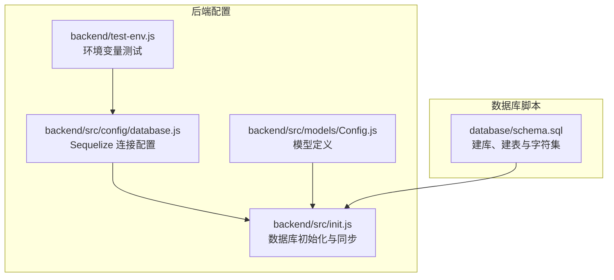
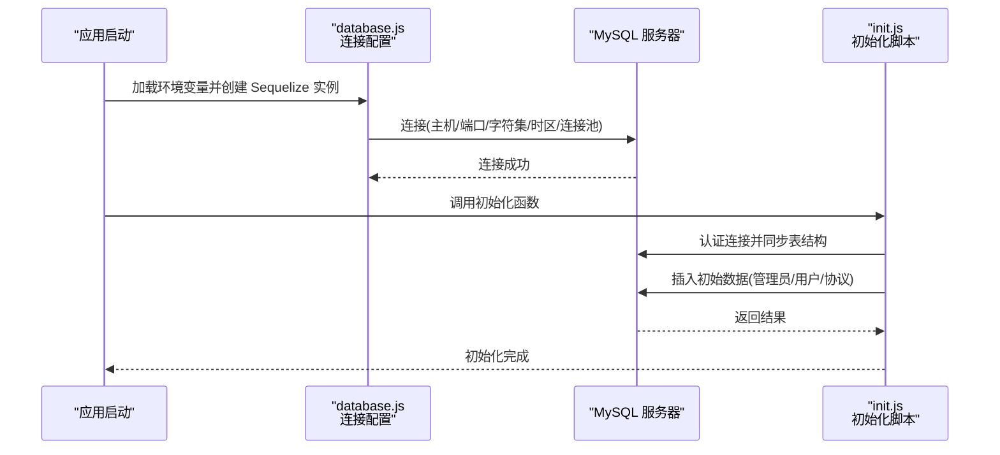
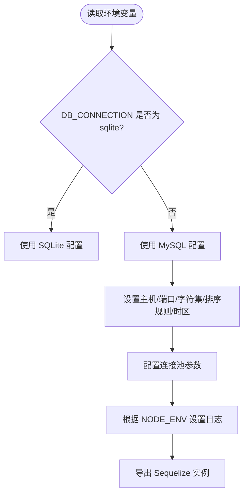
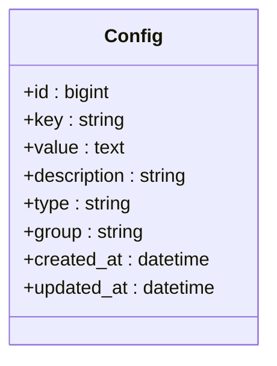
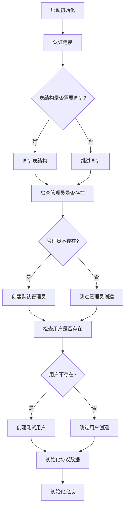
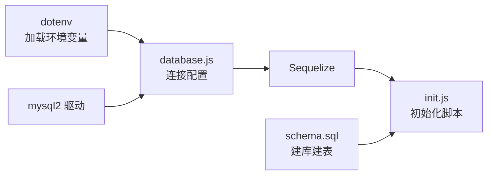

# 数据库配置

<cite>
**本文引用的文件**
- [backend/src/config/database.js](file://backend/src/config/database.js)
- [backend/src/models/Config.js](file://backend/src/models/Config.js)
- [backend/src/init.js](file://backend/src/init.js)
- [backend/test-env.js](file://backend/test-env.js)
- [database/schema.sql](file://database/schema.sql)
- [backend/package-lock.json](file://backend/package-lock.json)
</cite>

## 目录
1. [简介](#简介)
2. [项目结构](#项目结构)
3. [核心组件](#核心组件)
4. [架构总览](#架构总览)
5. [详细组件分析](#详细组件分析)
6. [依赖关系分析](#依赖关系分析)
7. [性能考虑](#性能考虑)
8. [故障排查指南](#故障排查指南)
9. [结论](#结论)
10. [附录](#附录)

## 简介
本指南面向趣配鲜项目的数据库配置与运维，聚焦于 MySQL 的安装、启动、安全加固、字符集与排序规则、连接参数、初始化脚本导入、以及基于项目现有实现的连接池与字符集配置要点。文档严格依据仓库中的配置与脚本文件进行说明，并提供可操作步骤与排障建议。

## 项目结构
与数据库配置直接相关的文件主要分布在后端配置目录与数据库脚本目录中：
- 后端数据库配置：Sequelize 连接配置、模型定义、初始化脚本
- 数据库脚本：SQL 架构与默认字符集设置
- 环境变量与测试：用于验证数据库类型与连接参数

图表来源
- [backend/src/config/database.js:1-55](file://backend/src/config/database.js#L1-L55)
- [backend/src/init.js:1-501](file://backend/src/init.js#L1-L501)
- [backend/src/models/Config.js:1-44](file://backend/src/models/Config.js#L1-L44)
- [backend/test-env.js:1-16](file://backend/test-env.js#L1-L16)
- [database/schema.sql:1-805](file://database/schema.sql#L1-L805)

章节来源
- [backend/src/config/database.js:1-55](file://backend/src/config/database.js#L1-L55)
- [backend/src/init.js:1-501](file://backend/src/init.js#L1-L501)
- [backend/src/models/Config.js:1-44](file://backend/src/models/Config.js#L1-L44)
- [backend/test-env.js:1-16](file://backend/test-env.js#L1-L16)
- [database/schema.sql:1-805](file://database/schema.sql#L1-L805)

## 核心组件
- 数据库连接配置（MySQL）
  - 默认主机与端口、字符集与排序规则、时区、连接池参数、日志开关
  - 支持通过环境变量覆盖默认值
- 模型定义
  - 使用 Sequelize 定义模型，统一时间字段命名与表名冻结策略
- 初始化脚本
  - 自动连接数据库、同步表结构、创建初始管理员与测试用户、写入协议数据
- SQL 架构脚本
  - 建库语句指定字符集与排序规则；各表默认使用相同字符集与排序规则
- 环境变量测试
  - 验证数据库类型选择逻辑与关键连接参数

章节来源
- [backend/src/config/database.js:1-55](file://backend/src/config/database.js#L1-L55)
- [backend/src/models/Config.js:1-44](file://backend/src/models/Config.js#L1-L44)
- [backend/src/init.js:1-501](file://backend/src/init.js#L1-L501)
- [backend/test-env.js:1-16](file://backend/test-env.js#L1-L16)
- [database/schema.sql:1-805](file://database/schema.sql#L1-L805)

## 架构总览
下图展示应用如何通过配置模块建立数据库连接，并在启动时执行初始化流程。

图表来源
- [backend/src/config/database.js:1-55](file://backend/src/config/database.js#L1-L55)
- [backend/src/init.js:1-501](file://backend/src/init.js#L1-L501)

## 详细组件分析

### 组件一：数据库连接配置（MySQL）
- 关键点
  - 默认主机与端口、字符集与排序规则、时区、连接池参数、日志开关
  - 通过环境变量覆盖默认值，支持切换 SQLite 模式
- 参数说明
  - 主机与端口：默认本地 3306
  - 字符集与排序规则：utf8mb4 与 utf8mb4_unicode_ci
  - 时区：+08:00
  - 连接池：最大 20，最小 5，获取超时 60000ms，空闲回收 10000ms
  - 日志：开发模式输出 SQL 日志
- 环境变量
  - DB_CONNECTION：选择 sqlite 或 mysql
  - DB_NAME、DB_USER、DB_PASSWORD、DB_HOST、DB_PORT：MySQL 连接参数
  - NODE_ENV：控制日志输出

图表来源
- [backend/src/config/database.js:1-55](file://backend/src/config/database.js#L1-L55)

章节来源
- [backend/src/config/database.js:1-55](file://backend/src/config/database.js#L1-L55)
- [backend/test-env.js:1-16](file://backend/test-env.js#L1-L16)

### 组件二：模型定义（以 Config 为例）
- 关键点
  - 使用 Sequelize 定义模型，统一时间字段命名与表名冻结策略
  - 字段类型与约束满足业务需求
- 影响
  - 与初始化脚本配合，确保表结构一致
  - 与连接配置的字符集保持一致，避免乱码

图表来源
- [backend/src/models/Config.js:1-44](file://backend/src/models/Config.js#L1-L44)

章节来源
- [backend/src/models/Config.js:1-44](file://backend/src/models/Config.js#L1-L44)

### 组件三：数据库初始化与同步
- 关键点
  - 认证连接、同步表结构（不强制覆盖）
  - 初始化管理员账号、测试用户、协议数据
- 影响
  - 确保首次运行时具备基础数据
  - 与模型定义保持一致，避免迁移冲突

图表来源
- [backend/src/init.js:1-501](file://backend/src/init.js#L1-L501)

章节来源
- [backend/src/init.js:1-501](file://backend/src/init.js#L1-L501)

### 组件四：SQL 架构脚本（字符集与排序规则）
- 关键点
  - 建库语句指定字符集与排序规则
  - 多数表默认使用 utf8mb4 与 utf8mb4_unicode_ci
- 影响
  - 保证数据库与表层面的字符集一致性，避免存储与显示异常

章节来源
- [database/schema.sql:1-805](file://database/schema.sql#L1-L805)

### 组件五：环境变量测试
- 关键点
  - 验证 DB_CONNECTION 切换逻辑与关键连接参数
- 影响
  - 确保在不同部署环境下正确选择数据库类型

章节来源
- [backend/test-env.js:1-16](file://backend/test-env.js#L1-L16)

## 依赖关系分析
- 运行时依赖
  - 项目使用 mysql2 作为驱动，Sequelize 作为 ORM
- 配置依赖
  - database.js 依赖 dotenv 加载环境变量
  - init.js 依赖 database.js 建立连接并同步模型
  - schema.sql 与 init.js 共同决定数据库初始化行为

图表来源
- [backend/src/config/database.js:1-55](file://backend/src/config/database.js#L1-L55)
- [backend/src/init.js:1-501](file://backend/src/init.js#L1-L501)
- [database/schema.sql:1-805](file://database/schema.sql#L1-L805)
- [backend/package-lock.json:4848-4879](file://backend/package-lock.json#L4848-L4879)

章节来源
- [backend/src/config/database.js:1-55](file://backend/src/config/database.js#L1-L55)
- [backend/src/init.js:1-501](file://backend/src/init.js#L1-L501)
- [database/schema.sql:1-805](file://database/schema.sql#L1-L805)
- [backend/package-lock.json:4848-4879](file://backend/package-lock.json#L4848-L4879)

## 性能考虑
- 连接池参数
  - 最大连接数、最小连接数、获取超时与空闲回收时间已在配置中设定，可根据并发与资源情况调整
- 日志级别
  - 开发环境开启 SQL 日志便于调试，生产环境建议关闭以降低开销
- 字符集与排序规则
  - 使用 utf8mb4 与 utf8mb4_unicode_ci 可提升多语言兼容性，注意索引长度限制与排序成本
- 初始化策略
  - 使用非强制同步策略，避免误删数据；如需重置，请谨慎处理

章节来源
- [backend/src/config/database.js:1-55](file://backend/src/config/database.js#L1-L55)

## 故障排查指南
- 连接失败
  - 检查主机、端口、用户名、密码是否正确
  - 确认 MySQL 服务已启动且允许远程访问（如需）
  - 查看连接池参数与日志输出定位问题
- 字符集乱码
  - 确认数据库、表与连接字符集一致
  - 检查建库与建表脚本中的字符集设置
- 初始化异常
  - 查看初始化脚本输出，确认管理员、用户与协议数据是否成功写入
  - 如需重置，请先清理相关数据或调整初始化逻辑

章节来源
- [backend/src/config/database.js:1-55](file://backend/src/config/database.js#L1-L55)
- [backend/src/init.js:1-501](file://backend/src/init.js#L1-L501)
- [database/schema.sql:1-805](file://database/schema.sql#L1-L805)

## 结论
本指南基于项目现有配置与脚本，明确了 MySQL 的连接参数、字符集与排序规则、初始化流程与依赖关系。建议在生产环境中结合实际负载调优连接池参数，并完善安全加固与监控策略。

## 附录
- 环境变量参考
  - DB_CONNECTION：选择 sqlite 或 mysql
  - DB_NAME、DB_USER、DB_PASSWORD、DB_HOST、DB_PORT：MySQL 连接参数
  - NODE_ENV：控制日志输出
- 初始化脚本位置
  - backend/src/init.js
- 架构脚本位置
  - database/schema.sql

章节来源
- [backend/test-env.js:1-16](file://backend/test-env.js#L1-L16)
- [backend/src/init.js:1-501](file://backend/src/init.js#L1-L501)
- [database/schema.sql:1-805](file://database/schema.sql#L1-L805)