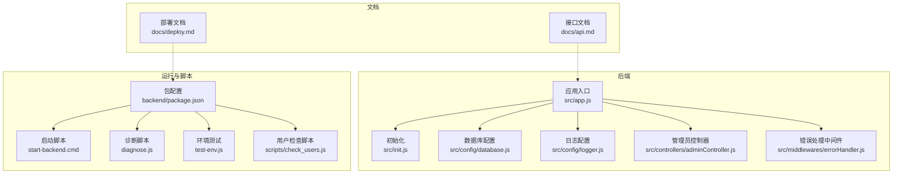
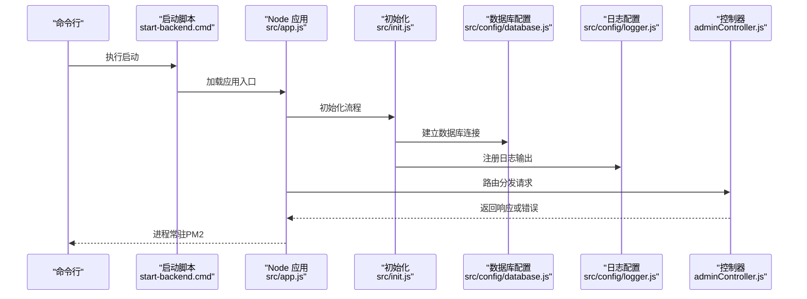
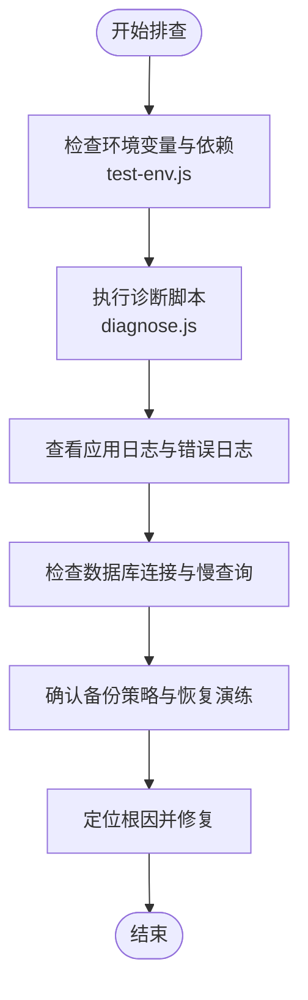
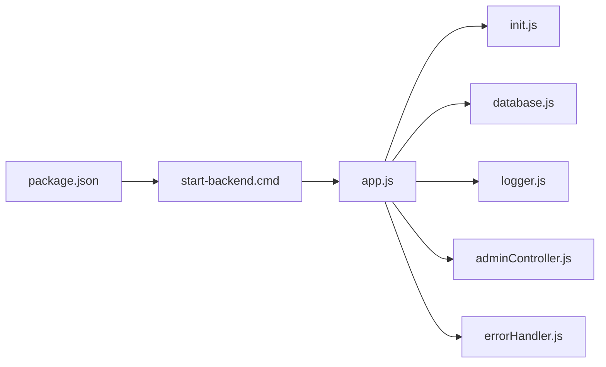

# 运维监控

<cite>
**本文引用的文件**
- [backend/src/config/logger.js](file://backend/src/config/logger.js)
- [backend/src/config/database.js](file://backend/src/config/database.js)
- [backend/package.json](file://backend/package.json)
- [backend/start-backend.cmd](file://backend/start-backend.cmd)
- [backend/diagnose.js](file://backend/diagnose.js)
- [backend/test-env.js](file://backend/test-env.js)
- [backend/scripts/check_users.js](file://backend/scripts/check_users.js)
- [backend/src/controllers/adminController.js](file://backend/src/controllers/adminController.js)
- [backend/src/middlewares/errorHandler.js](file://backend/src/middlewares/errorHandler.js)
- [backend/src/app.js](file://backend/src/app.js)
- [backend/src/init.js](file://backend/src/init.js)
- [backend/docs/deploy.md](file://backend/docs/deploy.md)
- [backend/docs/api.md](file://backend/docs/api.md)
- [README.md](file://README.md)
</cite>

## 目录
1. [简介](#简介)
2. [项目结构](#项目结构)
3. [核心组件](#核心组件)
4. [架构总览](#架构总览)
5. [详细组件分析](#详细组件分析)
6. [依赖关系分析](#依赖关系分析)
7. [性能与资源监控](#性能与资源监控)
8. [日志与轮转](#日志与轮转)
9. [备份策略](#备份策略)
10. [故障排查指南](#故障排查指南)
11. [结论](#结论)

## 简介
本指南面向趣配鲜项目的运维与开发团队，围绕PM2进程监控、Nginx日志、MySQL日志、系统资源、日志轮转、备份策略、性能指标与告警、以及常见问题诊断等方面，提供可落地的操作步骤与最佳实践。文档基于仓库现有配置与脚本进行梳理，并给出可扩展的建议。

## 项目结构
后端采用 Node.js + Express 架构，核心入口在应用启动脚本中，日志通过统一的 logger 配置输出到文件；数据库连接配置集中于数据库配置模块；部署与 API 文档位于 docs 目录；前端为独立构建产物，后端提供 REST 接口。

**图表来源**
- [backend/src/app.js](file://backend/src/app.js)
- [backend/src/init.js](file://backend/src/init.js)
- [backend/src/config/database.js](file://backend/src/config/database.js)
- [backend/src/config/logger.js](file://backend/src/config/logger.js)
- [backend/src/controllers/adminController.js](file://backend/src/controllers/adminController.js)
- [backend/src/middlewares/errorHandler.js](file://backend/src/middlewares/errorHandler.js)
- [backend/package.json](file://backend/package.json)
- [backend/start-backend.cmd](file://backend/start-backend.cmd)
- [backend/diagnose.js](file://backend/diagnose.js)
- [backend/test-env.js](file://backend/test-env.js)
- [backend/scripts/check_users.js](file://backend/scripts/check_users.js)
- [backend/docs/deploy.md](file://backend/docs/deploy.md)
- [backend/docs/api.md](file://backend/docs/api.md)

**章节来源**
- [backend/src/app.js](file://backend/src/app.js)
- [backend/src/init.js](file://backend/src/init.js)
- [backend/src/config/database.js](file://backend/src/config/database.js)
- [backend/src/config/logger.js](file://backend/src/config/logger.js)
- [backend/package.json](file://backend/package.json)
- [backend/start-backend.cmd](file://backend/start-backend.cmd)
- [backend/docs/deploy.md](file://backend/docs/deploy.md)
- [backend/docs/api.md](file://backend/docs/api.md)

## 核心组件
- 应用入口与初始化：负责加载配置、连接数据库、挂载路由与中间件。
- 日志系统：统一输出到文件，便于集中收集与分析。
- 数据库配置：集中管理连接参数，支持后续接入慢查询与错误日志分析。
- 错误处理中间件：统一捕获异常，避免未处理错误导致进程崩溃。
- 启动脚本与诊断脚本：用于本地调试与健康检查。

**章节来源**
- [backend/src/app.js](file://backend/src/app.js)
- [backend/src/init.js](file://backend/src/init.js)
- [backend/src/config/logger.js](file://backend/src/config/logger.js)
- [backend/src/config/database.js](file://backend/src/config/database.js)
- [backend/src/middlewares/errorHandler.js](file://backend/src/middlewares/errorHandler.js)

## 架构总览
后端服务通过应用入口启动，初始化阶段完成数据库连接与中间件注册；请求经由控制器处理，错误通过中间件统一拦截；日志按配置落盘；部署文档与 API 文档指导上线与联调。

**图表来源**
- [backend/start-backend.cmd](file://backend/start-backend.cmd)
- [backend/src/app.js](file://backend/src/app.js)
- [backend/src/init.js](file://backend/src/init.js)
- [backend/src/config/database.js](file://backend/src/config/database.js)
- [backend/src/config/logger.js](file://backend/src/config/logger.js)
- [backend/src/controllers/adminController.js](file://backend/src/controllers/adminController.js)

## 详细组件分析

### PM2 进程监控与管理
- 应用状态查看：通过 PM2 列表查看进程 ID、名称、状态、内存与 CPU 使用率。
- 日志管理：PM2 提供实时日志流与日志文件聚合，支持按应用筛选与滚动查看。
- 进程重启：支持热重启、按名称或 ID 重启、以及基于事件的自动重启策略。

建议在生产环境以 PM2 管理 Node 应用，结合日志与监控面板持续观察。

**章节来源**
- [backend/package.json](file://backend/package.json)
- [backend/start-backend.cmd](file://backend/start-backend.cmd)

### Nginx 日志配置与分析
- 访问日志：记录请求路径、状态码、响应时间、客户端 IP 等，便于流量统计与异常定位。
- 错误日志：记录 5xx/4xx 错误、上游超时、权限问题等，需结合业务错误日志交叉分析。
- 分析方法：使用日志分析工具对访问日志进行 UV/PV、Top 路径、状态码分布统计；对错误日志进行关键词过滤与聚合。

说明：本仓库未包含 Nginx 配置文件，请在部署层补充相应配置并启用访问与错误日志。

**章节来源**
- [backend/docs/deploy.md](file://backend/docs/deploy.md)

### MySQL 日志监控
- 慢查询日志：开启慢查询阈值与日志输出，定期分析 Top SQL，优化索引与查询计划。
- 错误日志：关注连接失败、权限不足、死锁、存储引擎错误等关键信息。
- 工具建议：使用慢查询分析器与 EXPLAIN 优化高耗时语句；结合数据库审计功能追踪敏感操作。

说明：数据库配置集中在后端模块，实际慢查询与错误日志需在数据库服务器侧开启与采集。

**章节来源**
- [backend/src/config/database.js](file://backend/src/config/database.js)

### 系统资源监控
- CPU：关注平均负载、进程 CPU 占用峰值，识别异常飙升时段。
- 内存：对比物理内存与交换分区使用，避免频繁换页影响性能。
- 磁盘：监控容量、inode 使用率、IO 等待时间，提前扩容或清理。
- 网络：关注连接数、带宽占用、TIME_WAIT 数量，排查连接泄漏或限速问题。

建议使用系统自带监控工具或第三方监控平台进行持续采集与可视化。

**章节来源**
- [backend/src/app.js](file://backend/src/app.js)

### 日志与轮转
- 日志落盘：应用通过统一日志配置输出到文件，便于集中采集。
- 日志轮转：建议使用 logrotate 或 PM2 自带日志轮转能力，按大小或时间切分，保留周期合理设置。
- 收集与告警：结合日志采集器与告警平台，对错误日志进行关键字匹配与阈值告警。

**章节来源**
- [backend/src/config/logger.js](file://backend/src/config/logger.js)

### 备份策略
- 数据库备份：建议采用定时任务执行逻辑备份（如 mysqldump），并校验完整性与恢复演练。
- 自动化：将备份脚本纳入运维自动化平台，设置失败告警与重试机制。
- 存储与保留：异地备份与多版本保留，满足 RPO/RTO 要求。

说明：数据库备份脚本与自动化配置需在部署层实现，本仓库未包含具体备份脚本。

**章节来源**
- [backend/docs/deploy.md](file://backend/docs/deploy.md)

### 性能监控指标与告警
- 指标建议：QPS、P95/P99 响应时间、错误率、数据库慢查询数量、连接池使用率、GC 时间占比、线程池排队长度。
- 告警策略：针对异常波动与阈值越界设置分级告警，结合日志与链路追踪快速定位。

**章节来源**
- [backend/src/controllers/adminController.js](file://backend/src/controllers/adminController.js)
- [backend/src/middlewares/errorHandler.js](file://backend/src/middlewares/errorHandler.js)

### 故障排查指南
- 环境变量与依赖：使用环境检测脚本验证运行环境与依赖版本。
- 诊断工具：利用诊断脚本进行基础连通性与服务可用性检查。
- 用户相关问题：使用用户检查脚本核对用户数据与权限状态。
- 错误处理：统一错误中间件保证异常不冒泡至进程层，便于日志归档与告警。

**图表来源**
- [backend/test-env.js](file://backend/test-env.js)
- [backend/diagnose.js](file://backend/diagnose.js)
- [backend/src/config/logger.js](file://backend/src/config/logger.js)
- [backend/src/config/database.js](file://backend/src/config/database.js)
- [backend/docs/deploy.md](file://backend/docs/deploy.md)

**章节来源**
- [backend/test-env.js](file://backend/test-env.js)
- [backend/diagnose.js](file://backend/diagnose.js)
- [backend/src/config/logger.js](file://backend/src/config/logger.js)
- [backend/src/config/database.js](file://backend/src/config/database.js)
- [backend/docs/deploy.md](file://backend/docs/deploy.md)

## 依赖关系分析
- 应用入口依赖初始化模块完成数据库连接与中间件注册。
- 控制器依赖模型与服务层，错误通过中间件统一处理。
- 日志配置为全局注入，贯穿请求生命周期。
- 启动脚本与包配置决定进程管理与依赖安装。

**图表来源**
- [backend/package.json](file://backend/package.json)
- [backend/start-backend.cmd](file://backend/start-backend.cmd)
- [backend/src/app.js](file://backend/src/app.js)
- [backend/src/init.js](file://backend/src/init.js)
- [backend/src/config/database.js](file://backend/src/config/database.js)
- [backend/src/config/logger.js](file://backend/src/config/logger.js)
- [backend/src/controllers/adminController.js](file://backend/src/controllers/adminController.js)
- [backend/src/middlewares/errorHandler.js](file://backend/src/middlewares/errorHandler.js)

**章节来源**
- [backend/package.json](file://backend/package.json)
- [backend/start-backend.cmd](file://backend/start-backend.cmd)
- [backend/src/app.js](file://backend/src/app.js)
- [backend/src/init.js](file://backend/src/init.js)
- [backend/src/config/database.js](file://backend/src/config/database.js)
- [backend/src/config/logger.js](file://backend/src/config/logger.js)
- [backend/src/controllers/adminController.js](file://backend/src/controllers/adminController.js)
- [backend/src/middlewares/errorHandler.js](file://backend/src/middlewares/errorHandler.js)

## 性能与资源监控
- 服务端性能：结合 PM2 指标与数据库慢查询日志，定位热点接口与慢 SQL。
- 客户端性能：通过接口文档与 API 测试脚本验证关键路径性能。
- 资源瓶颈：根据系统监控发现 CPU/内存/磁盘/网络瓶颈，优先优化热点路径与缓存策略。

**章节来源**
- [backend/docs/api.md](file://backend/docs/api.md)
- [backend/src/controllers/adminController.js](file://backend/src/controllers/adminController.js)

## 日志与轮转
- 应用日志：统一输出到文件，便于集中采集与检索。
- 轮转策略：按大小或时间切分，保留周期与压缩策略需平衡存储与检索效率。
- 告警联动：对错误日志进行关键字匹配与阈值告警，缩短故障定位时间。

**章节来源**
- [backend/src/config/logger.js](file://backend/src/config/logger.js)

## 备份策略
- 备份类型：全量与增量备份结合，定期进行恢复演练。
- 自动化：通过定时任务与运维平台实现备份调度与失败告警。
- 存储：本地与异地多副本，满足合规与灾难恢复要求。

**章节来源**
- [backend/docs/deploy.md](file://backend/docs/deploy.md)

## 故障排查指南
- 快速验证：使用环境检测与诊断脚本快速判断依赖与连通性。
- 日志定位：结合应用日志与数据库日志，定位异常请求与慢查询。
- 用户问题：使用用户检查脚本核对用户状态与权限。
- 错误收敛：统一错误中间件避免异常扩散，便于集中告警与复盘。

**章节来源**
- [backend/test-env.js](file://backend/test-env.js)
- [backend/diagnose.js](file://backend/diagnose.js)
- [backend/scripts/check_users.js](file://backend/scripts/check_users.js)
- [backend/src/middlewares/errorHandler.js](file://backend/src/middlewares/errorHandler.js)

## 结论
本指南基于仓库现有配置与脚本，给出了 PM2 进程管理、Nginx 日志、MySQL 日志、系统资源、日志轮转、备份策略、性能指标与告警、以及常见问题的排查方法。建议在部署层完善 Nginx 与数据库日志配置，并将备份与监控纳入自动化运维体系，持续优化性能与稳定性。