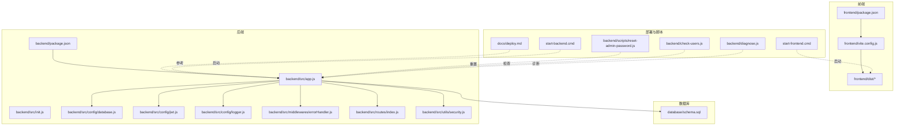
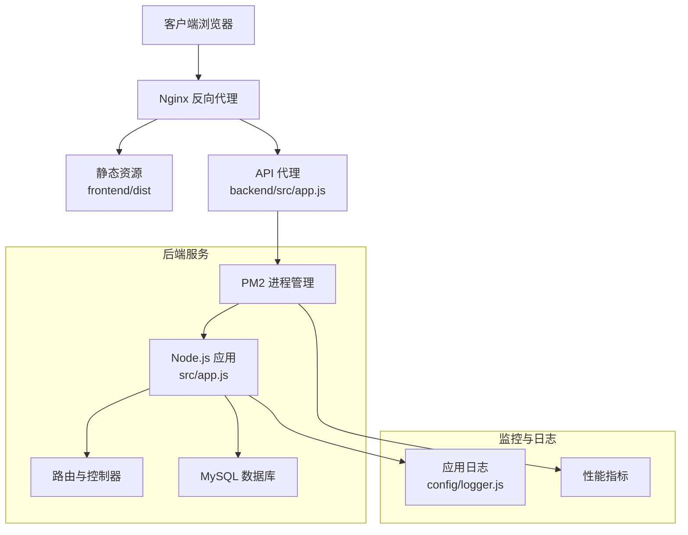
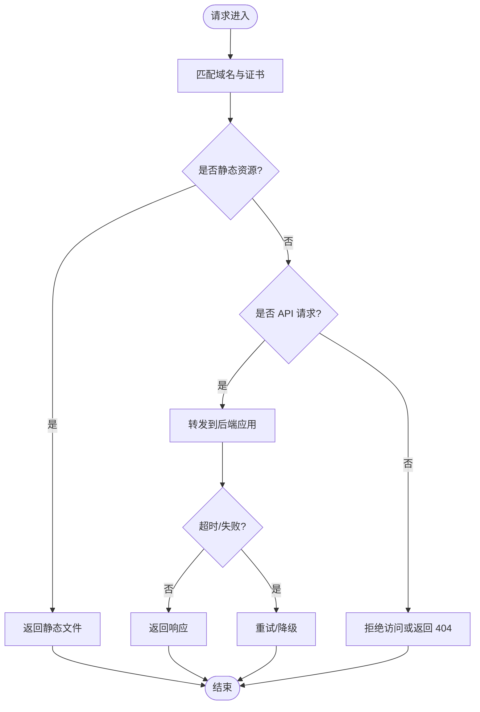
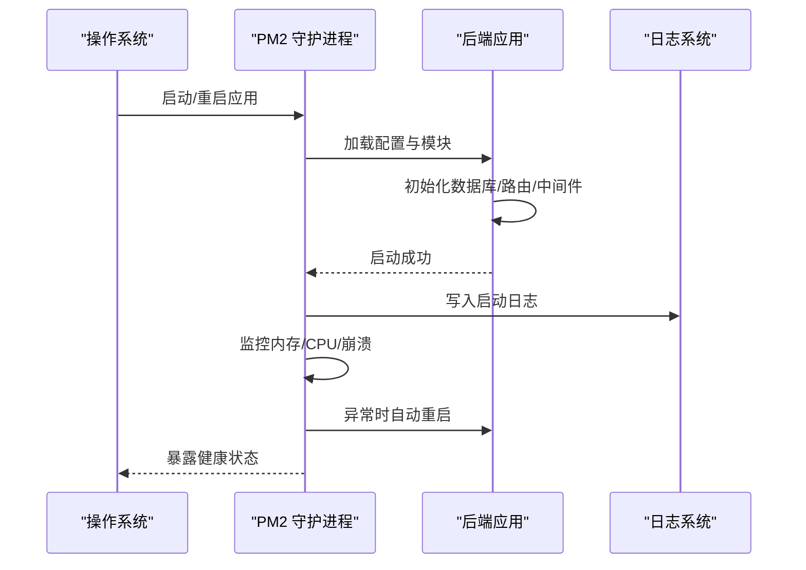
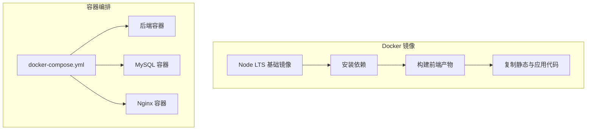
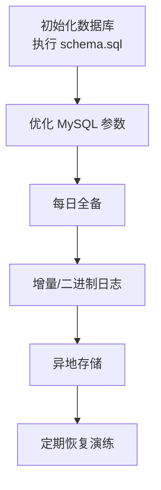
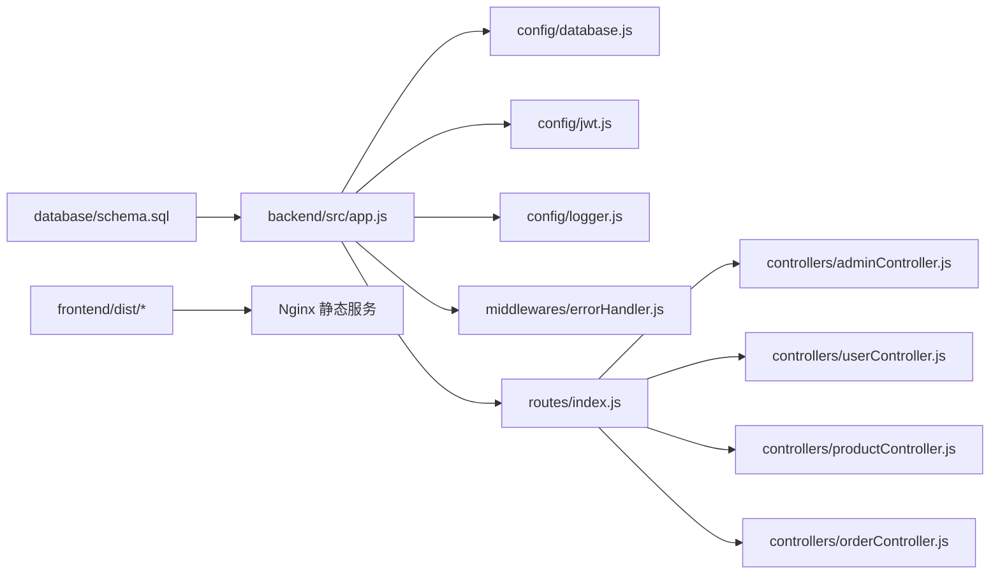

# 部署指南

<cite>
**本文引用的文件**
- [README.md](file://README.md)
- [docs/deploy.md](file://docs/deploy.md)
- [backend/package.json](file://backend/package.json)
- [backend/src/app.js](file://backend/src/app.js)
- [backend/src/init.js](file://backend/src/init.js)
- [backend/src/config/database.js](file://backend/src/config/database.js)
- [backend/src/config/jwt.js](file://backend/src/config/jwt.js)
- [backend/src/config/logger.js](file://backend/src/config/logger.js)
- [backend/src/middlewares/errorHandler.js](file://backend/src/middlewares/errorHandler.js)
- [backend/src/controllers/adminController.js](file://backend/src/controllers/adminController.js)
- [backend/src/controllers/userController.js](file://backend/src/controllers/userController.js)
- [backend/src/controllers/productController.js](file://backend/src/controllers/productController.js)
- [backend/src/controllers/orderController.js](file://backend/src/controllers/orderController.js)
- [backend/src/routes/index.js](file://backend/src/routes/index.js)
- [backend/src/utils/security.js](file://backend/src/utils/security.js)
- [frontend/package.json](file://frontend/package.json)
- [frontend/vite.config.js](file://frontend/vite.config.js)
- [frontend/dist/index.html](file://frontend/dist/index.html)
- [database/schema.sql](file://database/schema.sql)
- [start-backend.cmd](file://start-backend.cmd)
- [start-frontend.cmd](file://start-frontend.cmd)
- [backend/scripts/reset-admin-password.js](file://backend/scripts/reset-admin-password.js)
- [backend/check-users.js](file://backend/check-users.js)
- [backend/diagnose.js](file://backend/diagnose.js)
</cite>

## 目录
1. [简介](#简介)
2. [项目结构](#项目结构)
3. [核心组件](#核心组件)
4. [架构总览](#架构总览)
5. [详细组件分析](#详细组件分析)
6. [依赖关系分析](#依赖关系分析)
7. [性能考虑](#性能考虑)
8. [故障排除指南](#故障排除指南)
9. [结论](#结论)
10. [附录](#附录)

## 简介
本指南面向趣配鲜项目的生产环境部署，覆盖服务器与系统要求、Nginx反向代理、PM2进程管理、Docker容器化、数据库部署与备份、域名与DNS、监控与日志、CI/CD流水线、故障排除以及安全加固等完整环节。文档内容基于仓库中现有配置文件与脚本进行整理与扩展，帮助运维团队快速完成稳定可靠的上线部署。

## 项目结构
项目采用前后端分离架构：前端使用 Vite 构建产物，后端为 Node.js 应用，数据库初始化脚本位于 database 目录，部署相关文档位于 docs 目录，开发与调试脚本位于 backend/scripts 与根目录命令脚本中。

**图表来源**
- [frontend/package.json](file://frontend/package.json)
- [frontend/vite.config.js](file://frontend/vite.config.js)
- [frontend/dist/index.html](file://frontend/dist/index.html)
- [backend/package.json](file://backend/package.json)
- [backend/src/app.js](file://backend/src/app.js)
- [backend/src/init.js](file://backend/src/init.js)
- [backend/src/config/database.js](file://backend/src/config/database.js)
- [backend/src/config/jwt.js](file://backend/src/config/jwt.js)
- [backend/src/config/logger.js](file://backend/src/config/logger.js)
- [backend/src/middlewares/errorHandler.js](file://backend/src/middlewares/errorHandler.js)
- [backend/src/routes/index.js](file://backend/src/routes/index.js)
- [backend/src/utils/security.js](file://backend/src/utils/security.js)
- [database/schema.sql](file://database/schema.sql)
- [docs/deploy.md](file://docs/deploy.md)
- [start-backend.cmd](file://start-backend.cmd)
- [start-frontend.cmd](file://start-frontend.cmd)
- [backend/scripts/reset-admin-password.js](file://backend/scripts/reset-admin-password.js)
- [backend/check-users.js](file://backend/check-users.js)
- [backend/diagnose.js](file://backend/diagnose.js)

**章节来源**
- [README.md](file://README.md)
- [docs/deploy.md](file://docs/deploy.md)
- [backend/package.json](file://backend/package.json)
- [frontend/package.json](file://frontend/package.json)

## 核心组件
- 后端应用入口与路由：后端通过应用入口文件加载配置、中间件与路由，统一处理请求与响应。
- 数据库配置：集中管理数据库连接参数与连接池配置。
- JWT配置：定义令牌签发与校验策略。
- 日志配置：统一输出格式与级别控制。
- 错误处理中间件：标准化错误响应。
- 安全工具：提供通用安全相关辅助能力。
- 前端构建：Vite 生产构建产物用于静态资源分发。

**章节来源**
- [backend/src/app.js](file://backend/src/app.js)
- [backend/src/routes/index.js](file://backend/src/routes/index.js)
- [backend/src/config/database.js](file://backend/src/config/database.js)
- [backend/src/config/jwt.js](file://backend/src/config/jwt.js)
- [backend/src/config/logger.js](file://backend/src/config/logger.js)
- [backend/src/middlewares/errorHandler.js](file://backend/src/middlewares/errorHandler.js)
- [backend/src/utils/security.js](file://backend/src/utils/security.js)
- [frontend/vite.config.js](file://frontend/vite.config.js)

## 架构总览
生产环境推荐采用“Nginx 反向代理 + PM2 进程管理 + Docker 容器化”的组合方案。Nginx 负责静态资源与 HTTPS 终止，并将 API 请求转发至后端；后端通过 PM2 守护运行，支持多实例与自动重启；数据库独立部署或容器化；前端静态资源由 Nginx 提供；日志与监控分别在应用层与系统层落地。

**图表来源**
- [backend/src/app.js](file://backend/src/app.js)
- [backend/src/routes/index.js](file://backend/src/routes/index.js)
- [backend/src/config/logger.js](file://backend/src/config/logger.js)
- [frontend/dist/index.html](file://frontend/dist/index.html)

## 详细组件分析

### 服务器与系统要求
- 操作系统：Linux（推荐 Ubuntu 20.04+/CentOS 7+），Windows 不建议作为生产主机。
- CPU/内存：至少 2核CPU、4GB内存起步，根据并发量与业务规模扩容。
- 存储：SSD优先，预留数据库与日志空间；建议启用备份快照策略。
- 网络：开放 TCP 80/443（HTTP/HTTPS）与应用端口（如3000），限制不必要的入站访问。
- 时间同步：启用 NTP，确保证书时间验证有效。

### Nginx 反向代理配置要点
- 静态资源服务：将前端构建目录映射到根路径，开启 gzip 与缓存头，提升首屏加载速度。
- API 代理：将 /api 前缀转发至后端应用地址与端口，设置超时与缓冲区大小。
- SSL 证书：使用 Let’s Encrypt 或商业证书，启用 TLS 1.2+，禁用弱加密套件。
- 安全头：添加安全响应头（如 X-Frame-Options、X-Content-Type-Options、Strict-Transport-Security）。
- 访问控制：限制对敏感路径的直接访问，仅允许通过代理访问。

**图表来源**
- [frontend/dist/index.html](file://frontend/dist/index.html)
- [backend/src/app.js](file://backend/src/app.js)

### PM2 进程管理部署方案
- 启动模式：使用 ecosystem 文件定义应用路径、环境变量、日志与进程数（建议与 CPU 核数一致）。
- 自动重启：启用进程异常退出自动重启与内存阈值告警。
- 负载均衡：PM2 支持内置负载均衡（cluster mode），或结合 Nginx upstream 实现。
- 日志管理：统一输出到文件，按天切割，保留周期与轮转策略。
- 健康检查：结合探针接口定期检查应用状态。

**图表来源**
- [backend/src/app.js](file://backend/src/app.js)
- [backend/src/config/logger.js](file://backend/src/config/logger.js)

**章节来源**
- [backend/src/app.js](file://backend/src/app.js)
- [backend/src/config/logger.js](file://backend/src/config/logger.js)

### Docker 容器化部署方案
- 镜像基础：选择官方 Node LTS 镜像作为基础镜像，避免使用 root 用户运行。
- 多阶段构建：前端构建阶段产出静态资源，后端阶段安装依赖并复制构建产物。
- 环境隔离：通过环境变量注入数据库连接、JWT 密钥、日志级别等配置。
- 健康检查：在容器内暴露健康检查端点，配合 PM2/进程管理器共同保障可用性。
- 卷与持久化：数据库与日志目录映射到宿主机卷，确保数据持久化与可恢复。
- 编排：使用 docker-compose 管理后端、数据库与 Nginx 的编排关系。

**图表来源**
- [backend/package.json](file://backend/package.json)
- [frontend/package.json](file://frontend/package.json)
- [frontend/vite.config.js](file://frontend/vite.config.js)

**章节来源**
- [backend/package.json](file://backend/package.json)
- [frontend/package.json](file://frontend/package.json)
- [frontend/vite.config.js](file://frontend/vite.config.js)

### 数据库部署与备份策略
- MySQL 配置优化：设置合适的 innodb_buffer_pool_size、max_connections、innodb_log_file_size；启用慢查询日志与二进制日志。
- 初始化：使用 schema.sql 创建初始表结构与基础数据。
- 备份策略：每日全备 + 增量/二进制日志备份，异地存储；定期恢复演练验证备份有效性。
- 迁移方案：使用版本化的 SQL 脚本或迁移工具，灰度更新并回滚预案。

**图表来源**
- [database/schema.sql](file://database/schema.sql)

**章节来源**
- [database/schema.sql](file://database/schema.sql)

### 域名配置与 DNS 设置
- 域名解析：A/AAAA 记录指向服务器公网 IP；如需多实例，可使用 CNAME + 负载均衡。
- DNS 安全：启用 DNSSEC；限制区域传输；最小权限管理密钥。
- HTTPS：通过 ACME 或商业 CA 获取证书；在 Nginx 中正确配置证书链与私钥权限。
- 校验证书有效期：设置到期提醒与自动续期任务。

**章节来源**
- [docs/deploy.md](file://docs/deploy.md)

### 监控与日志管理
- 应用监控：采集 CPU、内存、QPS、错误率、响应时间等指标，结合告警规则。
- 日志管理：统一输出到 stdout/stderr，由系统日志收集器聚合；按天轮转与压缩；保留周期与索引策略。
- 性能分析：结合数据库慢查询日志与应用埋点，定位瓶颈。

**章节来源**
- [backend/src/config/logger.js](file://backend/src/config/logger.js)

### CI/CD 流水线配置
- 触发条件：push 到主分支或打标签触发构建。
- 步骤：代码检出 → 前端构建 → 后端依赖安装 → 单元测试 → 镜像构建 → 推送镜像 → 部署到预发布 → 自动化验收测试 → 发布到生产。
- 回滚：支持一键回滚至上一个版本镜像。
- 安全扫描：在流水线中集成依赖漏洞扫描与代码安全扫描。

**章节来源**
- [frontend/package.json](file://frontend/package.json)
- [backend/package.json](file://backend/package.json)

### 故障排除指南
- 启动失败：检查端口占用、环境变量、数据库连通性与权限；查看 PM2 日志与应用日志。
- 静态资源 404：确认 Nginx 配置中的路径映射与权限；检查构建产物是否存在。
- API 502/504：排查后端进程存活、超时设置与上游健康状态；必要时临时降级。
- 数据库异常：检查连接池上限、慢查询与锁等待；核对备份与恢复流程。
- 证书问题：验证证书链完整性与过期时间；确认私钥权限与 Nginx 重载。

**章节来源**
- [backend/src/middlewares/errorHandler.js](file://backend/src/middlewares/errorHandler.js)
- [backend/src/config/logger.js](file://backend/src/config/logger.js)
- [backend/diagnose.js](file://backend/diagnose.js)

### 安全加固建议
- 网络安全：最小化暴露面，仅开放必要端口；使用防火墙与 WAF；限制源 IP 访问。
- 应用安全：启用 HTTPS、安全响应头、CORS 策略；对输入进行严格校验与过滤；JWT 密钥妥善保管。
- 数据安全：数据库凭据加密存储；传输通道使用 TLS；备份数据加密与访问控制。
- 运维安全：非特权用户运行应用；定期更新依赖与系统补丁；审计日志与操作留痕。

**章节来源**
- [backend/src/utils/security.js](file://backend/src/utils/security.js)
- [backend/src/config/jwt.js](file://backend/src/config/jwt.js)

## 依赖关系分析
后端应用通过入口文件加载配置与中间件，路由模块组织控制器，数据库配置贯穿整个应用生命周期；前端构建产物由 Nginx 提供静态服务；部署文档与脚本为运维提供参考与自动化支持。

**图表来源**
- [backend/src/app.js](file://backend/src/app.js)
- [backend/src/config/database.js](file://backend/src/config/database.js)
- [backend/src/config/jwt.js](file://backend/src/config/jwt.js)
- [backend/src/config/logger.js](file://backend/src/config/logger.js)
- [backend/src/middlewares/errorHandler.js](file://backend/src/middlewares/errorHandler.js)
- [backend/src/routes/index.js](file://backend/src/routes/index.js)
- [backend/src/controllers/adminController.js](file://backend/src/controllers/adminController.js)
- [backend/src/controllers/userController.js](file://backend/src/controllers/userController.js)
- [backend/src/controllers/productController.js](file://backend/src/controllers/productController.js)
- [backend/src/controllers/orderController.js](file://backend/src/controllers/orderController.js)
- [frontend/dist/index.html](file://frontend/dist/index.html)
- [database/schema.sql](file://database/schema.sql)

**章节来源**
- [backend/src/app.js](file://backend/src/app.js)
- [backend/src/routes/index.js](file://backend/src/routes/index.js)
- [frontend/dist/index.html](file://frontend/dist/index.html)
- [database/schema.sql](file://database/schema.sql)

## 性能考虑
- 连接池：合理设置数据库连接池大小，避免过度连接导致资源耗尽。
- 缓存：对热点数据与接口结果进行缓存，降低数据库压力。
- 并发：根据 CPU 核数设置 PM2 进程数，避免上下文切换开销过大。
- 资源压缩：Nginx 开启 gzip/br 压缩，减少带宽消耗。
- 监控：建立关键指标阈值告警，提前发现性能退化。

[本节为通用指导，无需列出章节来源]

## 故障排除指南
- 启动失败：检查端口占用、环境变量、数据库连通性与权限；查看 PM2 日志与应用日志。
- 静态资源 404：确认 Nginx 配置中的路径映射与权限；检查构建产物是否存在。
- API 502/504：排查后端进程存活、超时设置与上游健康状态；必要时临时降级。
- 数据库异常：检查连接池上限、慢查询与锁等待；核对备份与恢复流程。
- 证书问题：验证证书链完整性与过期时间；确认私钥权限与 Nginx 重载。

**章节来源**
- [backend/src/middlewares/errorHandler.js](file://backend/src/middlewares/errorHandler.js)
- [backend/src/config/logger.js](file://backend/src/config/logger.js)
- [backend/diagnose.js](file://backend/diagnose.js)

## 结论
通过 Nginx 反向代理、PM2 进程管理与 Docker 容器化相结合的方案，可以实现高可用、易维护的生产部署。配合完善的数据库备份、域名与证书管理、监控与日志体系，以及安全加固措施，能够显著提升系统的稳定性与安全性。建议在预发布环境充分验证后再推进到生产。

[本节为总结性内容，无需列出章节来源]

## 附录

### 快速启动与常用脚本
- 后端启动脚本：用于本地开发或简单部署场景。
- 前端启动脚本：用于本地开发或简单部署场景。
- 管理脚本：重置管理员密码、检查用户、诊断问题等。

**章节来源**
- [start-backend.cmd](file://start-backend.cmd)
- [start-frontend.cmd](file://start-frontend.cmd)
- [backend/scripts/reset-admin-password.js](file://backend/scripts/reset-admin-password.js)
- [backend/check-users.js](file://backend/check-users.js)
- [backend/diagnose.js](file://backend/diagnose.js)