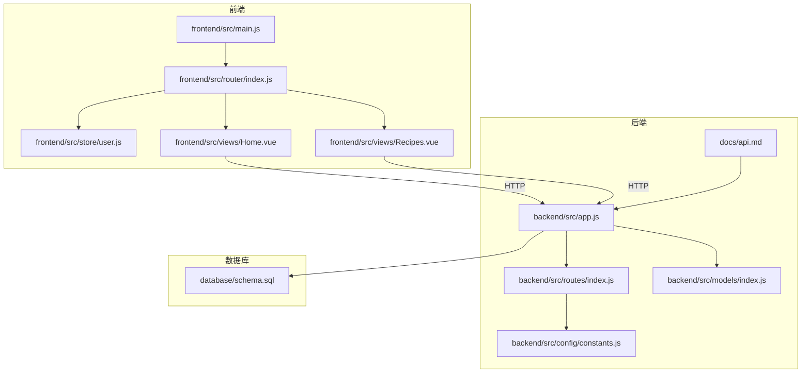
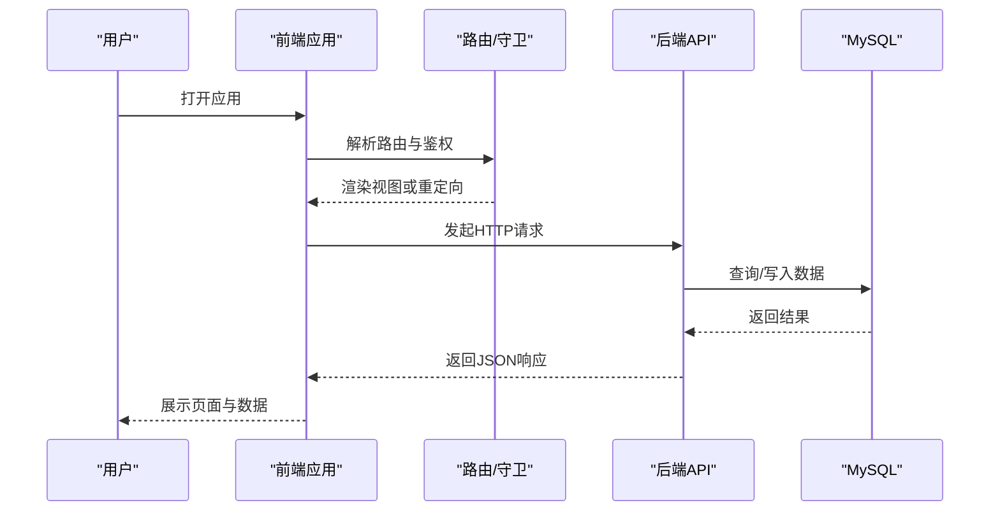
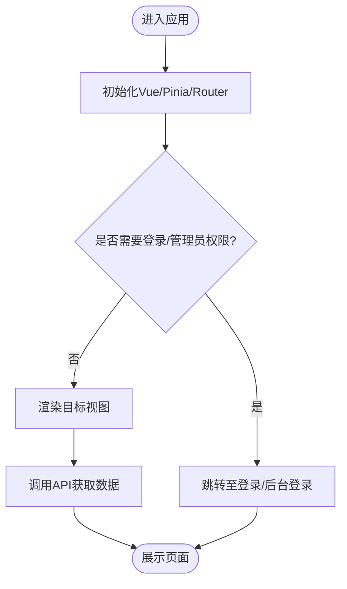
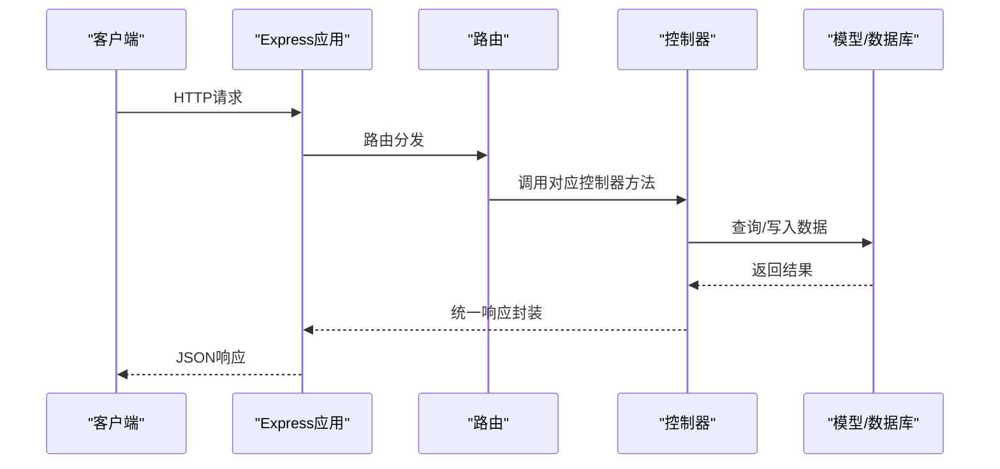
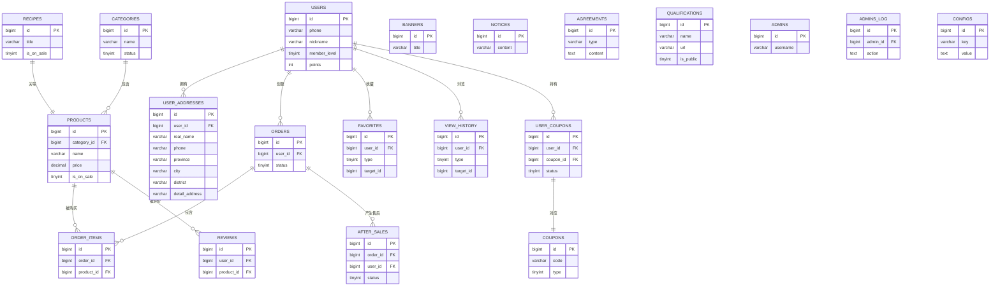
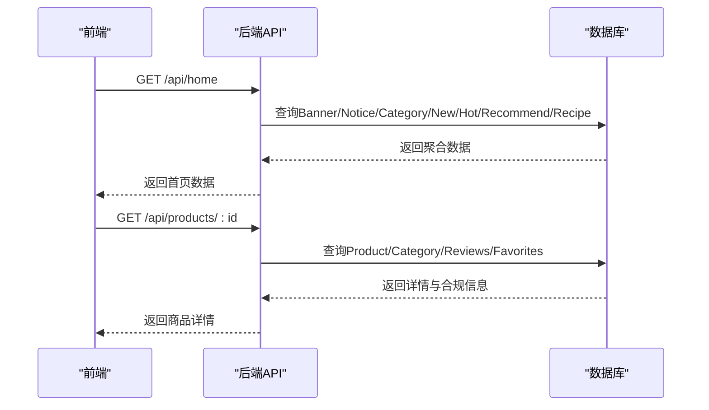
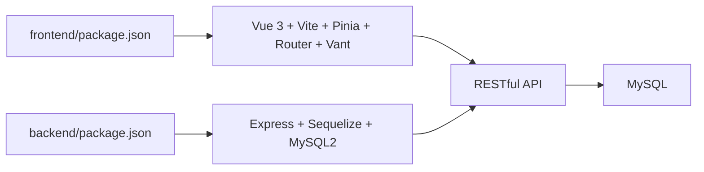

# 项目概述

<cite>
**本文引用的文件**
- [README.md](file://README.md)
- [backend/package.json](file://backend/package.json)
- [frontend/package.json](file://frontend/package.json)
- [backend/src/app.js](file://backend/src/app.js)
- [frontend/src/main.js](file://frontend/src/main.js)
- [backend/src/config/constants.js](file://backend/src/config/constants.js)
- [backend/src/models/index.js](file://backend/src/models/index.js)
- [backend/src/routes/index.js](file://backend/src/routes/index.js)
- [frontend/src/router/index.js](file://frontend/src/router/index.js)
- [database/schema.sql](file://database/schema.sql)
- [docs/api.md](file://docs/api.md)
- [backend/src/controllers/homeController.js](file://backend/src/controllers/homeController.js)
- [backend/src/controllers/productController.js](file://backend/src/controllers/productController.js)
- [backend/src/controllers/recipeController.js](file://backend/src/controllers/recipeController.js)
- [frontend/src/store/user.js](file://frontend/src/store/user.js)
- [frontend/src/views/Home.vue](file://frontend/src/views/Home.vue)
- [frontend/src/views/Recipes.vue](file://frontend/src/views/Recipes.vue)
</cite>

## 目录
1. [引言](#引言)
2. [项目结构](#项目结构)
3. [核心组件](#核心组件)
4. [架构总览](#架构总览)
5. [详细组件分析](#详细组件分析)
6. [依赖分析](#依赖分析)
7. [性能考虑](#性能考虑)
8. [故障排查指南](#故障排查指南)
9. [结论](#结论)
10. [附录](#附录)

## 引言
趣配鲜致力于“食材配齐，下锅即烹”的便民理念，为用户提供「预处理净菜 + 定量调料 + 烹饪教程」的一站式解决方案。项目以“食谱 + 净菜”为核心创新，通过清晰的前后端分离架构与标准化的 MVC 设计模式，实现从首页展示、商品浏览、购物车结算到订单售后的完整闭环；同时，平台强调“资质合规 + 技术安全”，在食品安全与用户信任层面建立稳固基础。

## 项目结构
项目采用前后端分离架构，后端基于 Node.js + Express，前端基于 Vue 3 + Vite，数据库采用 MySQL，并通过 Sequelize 实现 ORM 映射。整体目录组织清晰，职责边界明确：

- 后端 backend
  - src：控制器、模型、路由、中间件、配置、工具与校验器
  - scripts：运维辅助脚本
  - public/uploads：静态资源上传目录
  - logs：日志输出目录
- 前端 frontend
  - src/views：页面级组件
  - src/layouts：布局组件
  - src/router：路由配置与鉴权守卫
  - src/store：Pinia 状态管理
  - src/api：统一请求封装
  - src/data：地区数据等静态数据
- database：数据库初始化脚本
- docs：API 文档与部署指南
- 日志与二进制工具：logs、node

图表来源
- [frontend/src/main.js:1-56](file://frontend/src/main.js#L1-L56)
- [frontend/src/router/index.js:1-192](file://frontend/src/router/index.js#L1-L192)
- [frontend/src/store/user.js:1-96](file://frontend/src/store/user.js#L1-L96)
- [frontend/src/views/Home.vue:1-200](file://frontend/src/views/Home.vue#L1-L200)
- [frontend/src/views/Recipes.vue:1-200](file://frontend/src/views/Recipes.vue#L1-L200)
- [backend/src/app.js:1-84](file://backend/src/app.js#L1-L84)
- [backend/src/routes/index.js:1-27](file://backend/src/routes/index.js#L1-L27)
- [backend/src/config/constants.js:1-132](file://backend/src/config/constants.js#L1-L132)
- [backend/src/models/index.js:1-92](file://backend/src/models/index.js#L1-L92)
- [database/schema.sql:1-200](file://database/schema.sql#L1-L200)
- [docs/api.md:1-422](file://docs/api.md#L1-L422)

章节来源
- [README.md:46-83](file://README.md#L46-L83)
- [backend/src/app.js:17-54](file://backend/src/app.js#L17-L54)
- [frontend/src/main.js:10-56](file://frontend/src/main.js#L10-L56)

## 核心组件
- 前端核心
  - 应用入口：初始化 Vue、Pinia、路由与全局组件注册
  - 路由系统：基于 Vue Router 的多级嵌套路由与鉴权守卫，区分用户端与管理后台
  - 状态管理：Pinia Store 管理用户会话与本地持久化
  - 视图组件：首页、食谱专区、商品详情等页面组件
- 后端核心
  - 应用入口：Express 应用初始化、安全中间件、CORS、速率限制、日志与静态资源
  - 路由聚合：按模块划分路由前缀与子路由
  - 模型与关联：Sequelize 定义实体与关联关系
  - 常量与文案：统一的状态码、文案与品牌信息
- 数据库
  - 初始化脚本：涵盖用户、地址、分类、商品、食谱、订单、优惠券等核心表结构

章节来源
- [frontend/src/main.js:10-56](file://frontend/src/main.js#L10-L56)
- [frontend/src/router/index.js:150-192](file://frontend/src/router/index.js#L150-L192)
- [frontend/src/store/user.js:24-96](file://frontend/src/store/user.js#L24-L96)
- [backend/src/app.js:17-54](file://backend/src/app.js#L17-L54)
- [backend/src/routes/index.js:1-27](file://backend/src/routes/index.js#L1-L27)
- [backend/src/models/index.js:27-67](file://backend/src/models/index.js#L27-L67)
- [backend/src/config/constants.js:77-132](file://backend/src/config/constants.js#L77-L132)
- [database/schema.sql:14-170](file://database/schema.sql#L14-L170)

## 架构总览
项目采用典型的前后端分离架构，前端通过 HTTP 与后端交互，后端以 RESTful 风格提供 API，数据库采用 MySQL 并通过 Sequelize 进行对象映射。整体控制流如下：

图表来源
- [frontend/src/router/index.js:155-192](file://frontend/src/router/index.js#L155-L192)
- [docs/api.md:25-171](file://docs/api.md#L25-L171)
- [backend/src/app.js:49-53](file://backend/src/app.js#L49-L53)

## 详细组件分析

### 前端应用与路由
- 应用入口负责挂载 Vue 实例、注册 Pinia 与路由，并初始化用户会话
- 路由系统采用多级嵌套布局，区分 Tabbar 布局与独立页面；通过守卫实现登录态与管理员权限校验
- 视图组件通过 API 封装进行数据拉取，首页与食谱专区体现“食谱 + 净菜”的核心业务

图表来源
- [frontend/src/main.js:10-56](file://frontend/src/main.js#L10-L56)
- [frontend/src/router/index.js:155-192](file://frontend/src/router/index.js#L155-L192)
- [frontend/src/views/Home.vue:125-183](file://frontend/src/views/Home.vue#L125-L183)
- [frontend/src/views/Recipes.vue:85-151](file://frontend/src/views/Recipes.vue#L85-L151)

章节来源
- [frontend/src/main.js:10-56](file://frontend/src/main.js#L10-L56)
- [frontend/src/router/index.js:150-192](file://frontend/src/router/index.js#L150-L192)
- [frontend/src/views/Home.vue:107-183](file://frontend/src/views/Home.vue#L107-L183)
- [frontend/src/views/Recipes.vue:50-151](file://frontend/src/views/Recipes.vue#L50-L151)

### 后端应用与路由
- 应用入口集中配置安全中间件（CORS、Helmet、XSS 清理、MongoSanitize、速率限制）、日志与静态资源
- 路由按模块聚合，统一前缀 /api，便于扩展与维护
- 控制器层负责业务逻辑编排，模型层通过 Sequelize 完成数据库交互

图表来源
- [backend/src/app.js:17-54](file://backend/src/app.js#L17-L54)
- [backend/src/routes/index.js:1-27](file://backend/src/routes/index.js#L1-27)
- [backend/src/controllers/homeController.js:6-61](file://backend/src/controllers/homeController.js#L6-L61)
- [backend/src/controllers/productController.js:6-42](file://backend/src/controllers/productController.js#L6-L42)
- [backend/src/controllers/recipeController.js:5-31](file://backend/src/controllers/recipeController.js#L5-L31)

章节来源
- [backend/src/app.js:17-54](file://backend/src/app.js#L17-L54)
- [backend/src/routes/index.js:1-27](file://backend/src/routes/index.js#L1-L27)
- [backend/src/controllers/homeController.js:6-61](file://backend/src/controllers/homeController.js#L6-L61)
- [backend/src/controllers/productController.js:6-42](file://backend/src/controllers/productController.js#L6-L42)
- [backend/src/controllers/recipeController.js:5-31](file://backend/src/controllers/recipeController.js#L5-L31)

### 数据模型与关联
- 模型定义覆盖用户、地址、分类、商品、食谱、订单、购物车、收藏、浏览历史、优惠券、售后、公告、协议、资质、管理员等
- 关联关系清晰：用户与地址、订单、收藏、浏览历史、优惠券；商品与分类、订单项、评论；食谱与商品等

图表来源
- [backend/src/models/index.js:27-67](file://backend/src/models/index.js#L27-L67)
- [database/schema.sql:14-170](file://database/schema.sql#L14-L170)

章节来源
- [backend/src/models/index.js:27-67](file://backend/src/models/index.js#L27-L67)
- [database/schema.sql:14-170](file://database/schema.sql#L14-L170)

### 业务功能与API要点
- 首页数据：轮播图、公告、分类、新品/热销/推荐商品、食谱等聚合接口
- 商品管理：列表、详情、收藏、浏览历史、评价等
- 食谱专区：按菜系/难度/场景筛选，支持一键购买相关商品
- 管理后台：商品、订单、用户、营销、内容、系统设置等管理接口

图表来源
- [docs/api.md:316-335](file://docs/api.md#L316-L335)
- [docs/api.md:118-140](file://docs/api.md#L118-L140)
- [backend/src/controllers/homeController.js:6-61](file://backend/src/controllers/homeController.js#L6-L61)
- [backend/src/controllers/productController.js:44-108](file://backend/src/controllers/productController.js#L44-L108)

章节来源
- [docs/api.md:25-171](file://docs/api.md#L25-L171)
- [docs/api.md:283-341](file://docs/api.md#L283-L341)
- [backend/src/controllers/homeController.js:6-61](file://backend/src/controllers/homeController.js#L6-L61)
- [backend/src/controllers/productController.js:44-108](file://backend/src/controllers/productController.js#L44-L108)

## 依赖分析
- 技术选型
  - 前端：Vue 3 + Vite、Vant 4、TailwindCSS、Pinia、Vue Router
  - 后端：Node.js + Express、MySQL、Sequelize、JWT、bcrypt、Helmet、Rate Limit
- 依赖关系
  - 前端依赖 Vue 3、Pinia、Axios、Vant；后端依赖 Express、Sequelize、MySQL2、bcrypt、helmet、rate-limit 等
  - 前后端通过 RESTful API 通信，前端通过 Axios 发起请求，后端通过路由与控制器处理

图表来源
- [frontend/package.json:10-17](file://frontend/package.json#L10-L17)
- [backend/package.json:18-40](file://backend/package.json#L18-L40)

章节来源
- [frontend/package.json:10-17](file://frontend/package.json#L10-L17)
- [backend/package.json:18-40](file://backend/package.json#L18-L40)

## 性能考虑
- 前端
  - 使用 Vite 构建，开发体验与热更新友好；生产构建按需打包，减少首屏体积
  - 组件按需引入 Vant，避免全局引入导致的包体膨胀
- 后端
  - 采用速率限制中间件防止恶意请求；日志统一输出，便于监控与定位问题
  - 数据库查询使用索引与分页，避免一次性返回大量数据
- 数据库
  - 核心表建立必要索引，如用户手机号、商品分类、订单状态等，提升查询效率

章节来源
- [backend/src/app.js:32-39](file://backend/src/app.js#L32-L39)
- [database/schema.sql:40-68](file://database/schema.sql#L40-L68)

## 故障排查指南
- 启动失败
  - 检查数据库连接与初始化脚本是否执行；查看后端日志与环境变量配置
- 登录与鉴权
  - 前端路由守卫会拦截未登录访问，检查本地存储中的令牌与用户信息
- API 调用异常
  - 对照 API 文档核对请求参数与认证头；关注状态码与错误提示
- 数据一致性
  - 关注模型关联与外键约束，避免脏数据破坏业务完整性

章节来源
- [backend/src/app.js:57-81](file://backend/src/app.js#L57-L81)
- [frontend/src/router/index.js:155-192](file://frontend/src/router/index.js#L155-L192)
- [docs/api.md:386-421](file://docs/api.md#L386-L421)
- [backend/src/models/index.js:27-67](file://backend/src/models/index.js#L27-L67)

## 结论
趣配鲜以“食谱 + 净菜”的创新模式，结合完善的资质合规与技术安全体系，构建了从用户到运营的全链路电商系统。前后端分离与 MVC 设计模式使系统具备良好的可维护性与扩展性；MySQL + Sequelize 的数据层设计满足业务复杂度与性能需求。项目既适合初学者快速理解整体架构，也为有经验的开发者提供了清晰的实现路径与优化方向。

## 附录
- 快速开始与部署
  - 数据库初始化、环境变量配置、前后端依赖安装与开发服务器启动流程详见项目说明
- API 文档
  - 用户认证、商品管理、订单管理、营销管理、内容管理、系统管理等接口定义与示例

章节来源
- [README.md:91-184](file://README.md#L91-L184)
- [docs/api.md:1-422](file://docs/api.md#L1-L422)